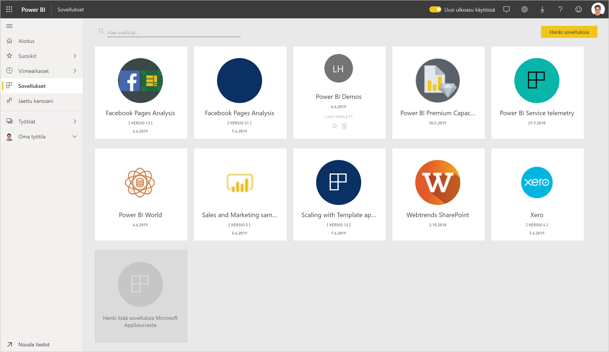
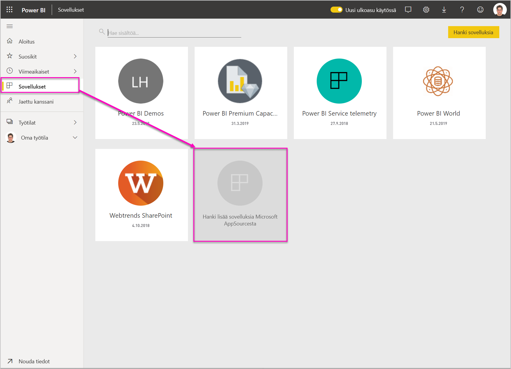

# Mallisovellusten asentaminen ja jakaminen organisaatiossa

Oletko Power BI -analyytikko? Jos olet, tässä artikkelissa kerrotaan, miten voit asentaa [mallisovelluksia](service-template-apps-overview.md), joiden avulla voit yhdistää moniin liiketoiminnassa käyttämiisi palveluihin. Tällaisia palveluita ovat esimerkiksi Salesforce, Microsoft Dynamics ja Google Analytics. Sitten voit muokata mallisovelluksen valmiiksi luotua raporttinäkymää ja raportteja organisaatiosi tarpeiden mukaiseksi ja jakaa ne työtovereillesi [sovelluksina](../consumer/end-user-apps.md). 

Jos olet kiinnostunut luomaan mallisovelluksia itse ja jakamaan niitä organisaatiosi ulkopuolella, katso [Mallisovelluksen luominen Power BI:ssä](service-template-apps-create.md). Power BI -kumppanit voivat muodostaa Power BI -sovelluksia ja ottaa ne käyttöön Power BI -asiakkaille. Koodausta tarvitaan hyvin vähän tai ei lainkaan. 

## Edellytykset  

Mallisovelluksen asentamiseen, mukauttamiseen ja jakamiseen tarvitset seuraavat asiat: 

* [Power BI Pro -käyttöoikeus](../fundamentals/service-self-service-signup-for-power-bi.md)
* oikeudet asentaa mallisovelluksia vuokraajaan
* sovelluksen kelvollinen asennuslinkki, jonka saat joko AppSourcesta tai sovelluksen luojalta
* [Power BI-peruskäsitteiden](../fundamentals/service-basic-concepts.md) hyvä tuntemus.

## Mallisovelluksen asentaminen

1. Valitse Power BI -palvelun siirtymisruudussa **Sovellukset** > **Hanki sovelluksia**.

    

1. Valitse näyttöön tulevassa AppSource-ikkunassa **Sovellukset**. Selaa haluamaasi sovellukseen tai hae sovellus ja valitse sitten **Hanki se nyt**.

    

1. Valitse avautuvassa valintaikkunassa **Asenna**.

    
    
    Sovellus asennetaan siihen liittyvän työtilan kanssa. **Jos päätät mukauttaa sovellusta, mukautus tehdään tässä liittyvässä työtilassa**.

    > [!NOTE]
    > Jos käytät sellaisen sovelluksen asennuslinkkiä, jota ei ole AppSourcessa, näyttöön tulee vahvistusvalintaikkuna, joka pyytää sinua vahvistamaan valintasi.
    >
    >Jotta voit asentaa mallisovelluksen, jota ei ole AppSourcessa, sinun on pyydettävä tarvittavat käyttöoikeudet järjestelmänvalvojaltasi. Lisätietoja on Power BI:n hallintaportaalin kohdassa [Mallisovelluksen asetukset](../admin/service-admin-portal.md#template-apps-settings).

    Kun asennus on valmis, ilmoitus kertoo, että uusi sovelluksesi on valmis.

    

## Tietoihin yhdistäminen

1. Valitse **Siirry sovellukseen**. Näkyviin tulee **Aloita uuden sovelluksesi käyttö** -ikkuna.

   

1. Napsauta **Yhdistä**.
    
    Tämä avaa yhden tai useita valintaikkunoita, joissa voit vaihtaa tietolähteen mallitiedoista omaan tietolähteeseesi. Tämä tarkoittaa yleensä tietojoukon parametrien ja tietolähteen tunnistetietojen määrittämistä uudelleen. Katso kohta [Tunnetut rajoitukset](service-template-apps-overview.md#known-limitations).
    
    Alla olevassa esimerkissä tietoihin yhdistäminen tuo esiin kaksi valintaikkunaa.

   

    Kun olet täyttänyt yhteyden valintaikkunat, yhteyden muodostamisprosessi alkaa. Ilmoituspalkissa ilmoitetaan, että tarkastelet mallitietoja.

    

    Odota, että tietojen yhdistäminen ja päivittäminen on valmis. Edistymisen ilmaisin tietojoukon rivillä (uusi ulkoasu) tai välilehdessä (vanha ulkoasu) kertoo, milloin prosessi on valmis.

   Kun yhteyksien ja tietojen päivittäminen on valmis, päivitä selaimesi. Ilmoituspalkissa ilmoitetaan nyt, että sinun on päivitettävä sovellus, jotta voit ottaa käyttöön sovellukseen tekemäsi muutokset ja jakaa sen.

    

## Sovelluksen mukauttaminen ja jakaminen

Kun olet päivittänyt selaimen tietojen yhdistämisen ja päivittämisen jälkeen, näet nyt sovellukseen liittyvän työtilan. Tässä vaiheessa voit muokata siellä olevia artefakteja samalla tavalla kuin missä tahansa työtilassa. Muista kuitenkin, että tekemäsi muutokset korvataan, kun päivität sovelluksen uuteen versioon, ellet tallenna muuttamiasi kohteita eri nimillä. [Katso lisätietoja korvaamisesta](#overwrite-behavior).

Lisätietoja artefaktien muokkaamisesta työtilassa on kohdassa
* [Power BI -raporttieditoriin tutustuminen](../create-reports/service-the-report-editor-take-a-tour.md)
* [Power BI -palvelun peruskäsitteitä suunnittelijoille](../fundamentals/service-basic-concepts.md)

Kun olet tehnyt haluamasi muutokset työtilassa oleviin artefakteihin, olet valmis julkaisemaan ja jakamaan sovelluksen. Lisätietoja on artikkelissa [Sovelluksen julkaiseminen](../collaborate-share/service-create-distribute-apps.md#publish-your-app).

## Mallisovelluksen päivittäminen

Mallisovellusten luojat julkaisevat ajoittain uusia parannettuja versioita mallisovelluksistaan joko AppSourcen, suoran linkin tai molempien kautta.

Jos olet alun perin ladannut sovelluksen Appsourcesta, kun mallisovelluksen uusi versio tulee saataville, saat ilmoituksen kahdella tavalla:
* Power BI -palvelussa näkyviin tulee päivityspalkki, jossa kerrotaan, että uusi sovellusversio on saatavilla.
  
* Saat ilmoituksen Power BI -ilmoitus ruudussa.

  

>[!NOTE]
>Jos olet alun perin hankkinut sovelluksen suoran linkin kautta AppSourcen sijaan, ainoa tapa saada tietää, milloin uusi versio on saatavilla, on ottaa yhteyttä mallisovelluksen luojaan.

  Jos haluat asentaa päivityksen, valitse ilmoituspalkissa tai ilmoituskeskuksesta **Hanki se** tai etsi sovellus uudelleen AppSourcesta ja valitse **Hanki se nyt**. Jos olet saanut suoran linkin päivitykseen mallinsovelluksen luojalta, napsauta linkkiä.
  
  Sinulta kysytään, haluatko korvata nykyisen version vai asentaa uuden version uuteen työtilaan. Korvaaminen on valittuna oletusarvoisesti.

  

- **Korvaa olemassa oleva versio:** Korvaa olemassa olevan työtilan mallisovelluksen päivitetyllä versiolla. [Katso lisätietoja korvaamisesta](#overwrite-behavior).

- **Asenna uuteen työtilaan:** Asentaa työtilan ja sovelluksen uuden version, joka on määritettävä uudelleen (eli tietoihin yhdistäminen, siirtymisen ja käyttöoikeuksien määrittäminen).

### Korvaamisen toiminta

* Korvaaminen päivittää raportit, koontinäytöt ja työtilassa olevan tietojoukon, ei sovellusta. Korvaaminen ei muuta sovelluksen siirtymistä, asennusta ja käyttöoikeuksia.
* Kun olet päivittänyt työtilan, sinun on **päivitettävä sovellus, jotta muutokset otetaan käyttöön työtilasta sovellukseen**.
* Korvaaminen säilyttää määritetyt parametrit ja todentamisen. Päivityksen jälkeen automaattinen tietojoukon päivitys alkaa. **Tämän päivityksen aikana sovelluksessa, raporteissa ja koontinäytöissä näkyvät mallitiedot**.

  

* Korvaaminen esittää aina mallitiedot, kunnes päivitys on valmis. Jos mallisovelluksen tekijä on tehnyt muutoksia tietojoukkoon tai parametreihin, työtilan ja sovelluksen käyttäjät eivät näe uusia tietoja ennen päivityksen valmistumista. Niiden sijaan he näkevät edelleen mallitiedot.
* Korvaaminen ei koskaan poista uusia raportteja eikä koontinäyttöjä, jotka olet lisännyt työtilaan. Se korvaa ainoastaan alkuperäiset raportit ja koontinäytöt ja alkuperäisen tekijän tekemät muutokset.

>[!IMPORTANT]
>Muista [päivittää sovellus](#customize-and-share-the-app) korvaamisen jälkeen, jotta muutokset tulevat voimaan organisaation sovelluksen käyttäjien raporteissa ja koontinäytössä.

## Seuraavat vaiheet

[Työtilojen luominen työtovereiden kanssa Power BI:ssä](../collaborate-share/service-create-workspaces.md)
