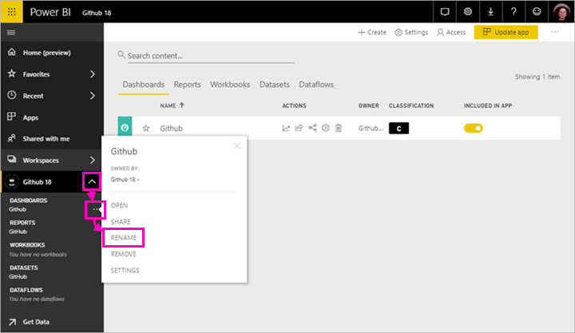
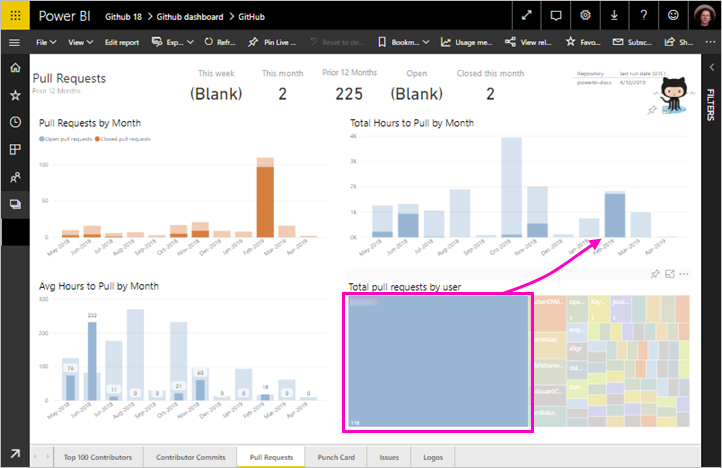

# Opetusohjelma: Yhteyden muodostaminen GitHub-säilöön Power BI:llä
Tässä opetusohjelmassa yhdistät Power BI:n GitHub-palvelun oikeisiin tietoihin, jolloin Power BI luo automaattisesti koontinäyttöjä ja raportteja. Muodostat yhteyden Power BI:n sisällön julkiseen säilöön (eli *säilöön*) ja näet vastauksen seuraavanlaisiin kysymyksiin: kuinka moni henkilö osallistuu Power BI:n julkiseen sisältöön? Kuka osallistuu eniten? Minä viikonpäivänä on eniten osallistumisia? Ja muita kysymyksiä. 

Tässä opetusohjelmassa käyt läpi seuraavat vaiheet:

> [!div class="checklist"]
> * Rekisteröi GitHub-tili, jos sinulla ei ole sellaista vielä 
> * Kirjaudu sisään Power BI -tilillesi tai rekisteröi tili, jos sinulla ei ole sellaista vielä
> * Avaa Power BI -palvelu
> * Etsi GitHub-sovellus
> * Anna Power BI:n julkisen GitHub-säilön tiedot
> * Tarkastele GitHub-tiedot sisältävää koontinäyttöä ja raporttia
> * Tyhjennä resursseja poistamalla sovellus

Jos et ole rekisteröitynyt Power BI:hin, [rekisteröidy ilmaiseen kokeiluversioon](https://app.powerbi.com/signupredirect?pbi_source=web) ennen aloittamista.

## Edellytykset

Tarvitset tämän opetusohjelman suorittamiseen GitHub-tilin, jos sinulla ei ole vielä sellaista. 

- Rekisteröi [GitHub-tili](https://docs.microsoft.com/contribute/get-started-setup-github).

## Yhteyden muodostaminen
1. Kirjaudu sisään Power BI -palveluun (`https://app.powerbi.com`). 
2. Valitse siirtymisruudussa **Sovellukset** ja sitten **Hanki sovelluksia**.
   
    

3. Valitse **Sovellukset**, kirjoita **GitHub** hakuruutuun > **Hanki se nyt**.
   
    

4. Valitse **Asennetaanko tämä Power BI -sovellus?** -kohdassa **Asenna**.
5. Valitse **Siirry sovellukseen** kohdassa **Uusi sovelluksesi on valmis**.
6. Valitse **Aloita uuden sovelluksesi käyttö** -kohdassa **Yhdistä tiedot**.

    

7. Kirjoita säilön nimi ja omistaja. Tämän säilön URL-osoite on https://github.com/MicrosoftDocs/powerbi-docs, joten **Säilön omistaja** on **MicrosoftDocs** ja **Säilö** on **powerbi-docs**. 
   
    

5. Anna luomasi GitHub-tunnistetiedot. Power BI saattaa ohittaa tämän vaiheen, jos olet jo kirjautuneena GitHubiin selaimessa. 

6. Pidä valittuna **todennusmenetelmänä** **oAuth2** ja\> **Kirjaudu sisään**.

7. Noudata GitHubin todennusnäyttöjä. Anna Power BI:lle GitHub-tietojen käyttöoikeus.
   
   Nyt Power BI voi muodostaa yhteyden GitHubiin ja tietoihin.  Tiedot päivitetään kerran päivässä.

8. Kun Power BI on tuonut tiedot, näet uuden GitHub-työtilasi sisällön. 
9. Valitse siirtymisruudussa työtilan nimen vieressä oleva nuoli. Näet, että työtila sisältää koontinäytön ja raportin. 

    

10. Valitse **Enemmän vaihtoehtoja** (...) koontinäytön nimen vierestä > **Nimeä uudelleen** > kirjoita **GitHub-koontinäyttö**.
 
     

8. Pienennä siirtymisruutu valitsemalla yleinen siirtymiskuvake, jotta saat enemmän tilaa.

    

10. Valitse GitHub-koontinäyttösi.
    
    GitHub-koontinäyttö sisältää reaaliaikaisia tietoja, joten näkemäsi arvot voivat olla erilaisia.

    

    

## Esitä kysymys

1. Siirrä kohdistin **Esitä tietojasi koskeva kysymys** -kohtaan. Power BI tarjoaa **Kysymyksiä, joiden avulla pääset alkuun**. 

1. Valitse, **kuinka monta käyttäjää on olemassa**.
 
    

13. Kirjoita **noutopyyntöä** **kuinka monta** ja **käyttäjää kohden on**. 

     Power BI luo palkkikaavion, joka näyttää noutopyyntöjen määrän henkilöä kohden.

    

13. Kiinnitä se koontinäyttöösi valitsemalla PIN-tunnus ja **Sulje UKK.**

## GitHub-raportin tarkasteleminen 

1. Avaa raportti valitsemalla GitHub-koontinäytössä sarakekaavio **Noutopyynnöt kuukauden mukaan**.

    

2. Valitse käyttäjänimi **Noutopyyntöjen kokonaismäärä käyttäjää kohden** -kaaviosta. Tässä esimerkissä näemme suurimman osa heidän työtunneistaan helmikuussa.

    

3. Näytä raportin seuraava sivu valitsemalla **Pistekortti**-välilehti. 
 
    

    Ilmeisesti tiistai kello 15 on yleisin viikonpäivä ja aika *vahvistuksille*, kun käyttäjät kuittaavat työnsä.

## Puhdista resurssit

Nyt kun olet suorittanut opetusohjelman, voit poistaa GitHub-sovelluksen. 

1. Valitse siirtymisruudussa **Sovellukset**.
2. Siirrä hiiren osoitin GitHub-ruudun päälle ja valitse **Poista**-roskakori.

    

## Seuraavat vaiheet

Tässä opetusohjelmassa olet muodostanut yhteyden GitHubin julkiseen säilöön ja saanut tiedot, jotka Power BI on muotoillut koontinäytöksi ja raportiksi. Olet vastannut joihinkin tietoja koskeviin kysymyksiin tutkimalla koontinäyttöä ja raporttia. Nyt voi lukea lisää yhteyden muodostamisesta muihin palveluihin, kuten Salesforceen, Microsoft Dynamicsiin ja Google Analyticsiin. 
 
> [!div class="nextstepaction"]
> [Käyttämiisi verkkopalveluihin yhdistäminen](service-connect-to-services.md)

