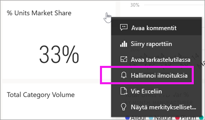
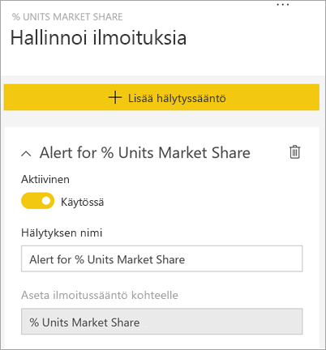
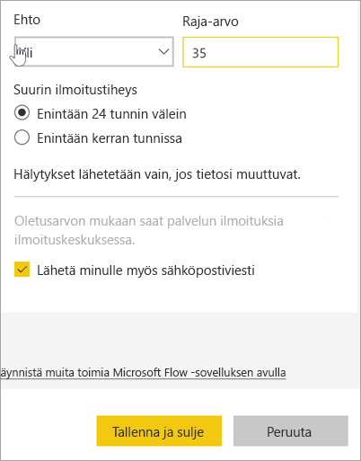
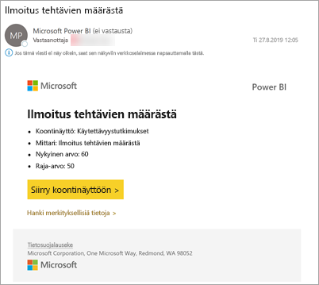
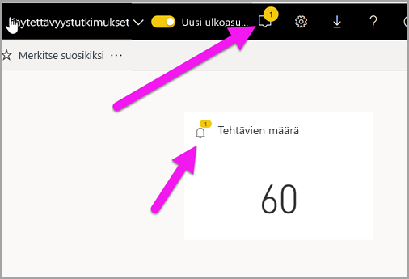
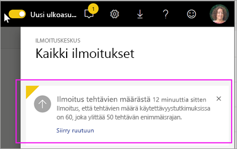
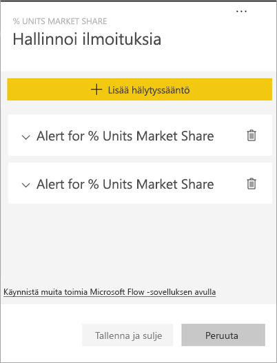
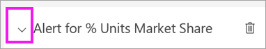
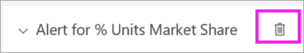
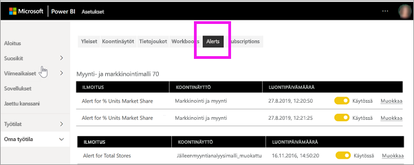

# Opetusohjelma: Koontinäytön hälytysten määrittäminen Power BI -koontinäytöissä
Aseta hälytyksiä ilmoittamaan sinulle, kun koontinäyttösi tiedot muuttuvat asettamiesi rajojen ylä- tai alapuolelle. Hälytykset toimivat mittareissa, suorituskykyilmaisimissa ja korteissa. Tämä ominaisuus on vielä kehitteillä, joten katso lisätietoja [alla olevasta Vihjeet ja vianmääritys -kohdasta](#tips-and-troubleshooting).

Vain sinä näet asettamasi hälytykset, vaikka jakaisit koontinäyttösi. Tietoilmoitukset synkronoidaan täysin kaikissa ympäristöissä. Määritä ja tarkastele tietoilmoituksia [Power BI -mobiilisovelluksissa](mobile/mobile-set-data-alerts-in-the-mobile-apps.md) ja Power BI -palvelussa. 

> [!WARNING]
> Näistä ilmoituksista saat tietoja tiedoistasi. Jos tarkastelet Power BI -tietojasi mobiililaitteella ja laite varastetaan, suosittelemme kaikkien hälytysten poistamista käytöstä Power BI -palvelulla.
> 

Tässä artikkelissa käsitellään seuraavat asiat.
> [!div class="checklist"]
> * Kuka voi asettaa hälytyksiä
> * Mitkä visualisoinnit tukevat hälytyksiä
> * Kuka voi nähdä hälytyksiä
> * Toimivatko hälytykset Power BI Desktopissa ja -mobiilisovelluksessa
> * Miten hälytys luodaan
> * Minne vastaanotan hälytykset

Jos et ole rekisteröitynyt Power BI:hin, [rekisteröidy ilmaiseen kokeiluversioon](https://app.powerbi.com/signupredirect?pbi_source=web) ennen aloittamista.

Tässä esimerkissä käytetään Myynti- ja markkinointi -mallisovelluksen koontinäytön korttiruutua. Tämä sovellus on käytettävissä [Microsoft AppSourcessa](https://appsource.microsoft.com). Katso lisätietoja sovelluksen käyttämisestä kohdasta [Asenna ja käytä sovelluksia Power BI:ssä](end-user-app-view.md).

1. Valitse koontinäytön mittarista, suorituskykyilmaisimesta tai korttiruudusta kolme pistettä.
   
   
2. Lisää yksi tai useampia hälytyksiä **Myymälöitä yhteensä** -ruudulle valitsemalla kellokuvake  tai **Hälytysten hallinta**.

   

   
1. Valitse **Hälytysten hallinta** -ruudussa **+ Lisää hälytyssääntö**.  Varmista, että liukusäädin on asennossa **Käytössä**, ja anna hälytykselle nimi. Nimet helpottavat ilmoitusten tunnistamista.
   
   
4. Vieritä alas ja anna hälytyksen tiedot.  Luomme tässä esimerkissä hälytyksen, joka ilmoittaa meille kerran päivässä, jos markkinaosuutemme nousee yli 35. Ilmoitukset näkyvät ilmoituskeskuksessa. Myös Power BI lähettää meille sähköpostia.
   
   
5. Valitse **Tallenna ja sulje**.
 
   > [!NOTE]
   > Ilmoitukset toimivat vain tiedoissa, joita päivitetään. Kun tiedot päivitetään, Power BI tarkistaa, onko tiedoille määritetty ilmoitus. Jos tiedot saavuttavat ilmoituksen raja-arvon, aktivoidaan ilmoitus. 
   > 

## Ilmoitusten vastaanottaminen
Kun seuratut tiedot saavuttavat jonkin määrittämistäsi raja-arvoista, tapahtuu useita asioita. Power BI tarkistaa ensin, onko edellisen ilmoituksen lähettämisestä yli tunti tai yli 24 tuntia (valitsemasi vaihtoehdon mukaan). Kunhan tiedot ylittävät raja-arvon, saat ilmoituksen.

Power BI lähettää seuraavaksi ilmoituksen ilmoituskeskukseen ja valinnaisesti myös sähköpostiin. Kussakin ilmoituksessa on suora linkki tietoihin. Valitse linkki nähdäksesi asianmukaisen ruudun.  

1. Jos olet määrittänyt ilmoitukset lähettämään sinulle sähköpostia, Saapuneet-kansiossasi näkyy jotain seuraavanlaista. Tämä on ilmoitus, jonka asetimme eri koontinäytössä. Tämä koontinäyttö seuraa Käytettävyystiimin suorittamia tehtäviä.
   
   
2. Power BI lisää viestin **ilmoituskeskukseesi** ja lisää uuden ilmoituksen kuvakkeen kyseiseen ruutuun.
   
   
3. Näytä ilmoituksen tiedot avaamalla ilmoituskeskus.
   
    
   
  

## Ilmoitusten hallinta

Voit hallita ilmoituksia usealla tavalla: suoraan raporttinäkymän ruudusta, Power BI -asetukset -valikosta, ruudusta [iPhonen Power BI -mobiilisovelluksessa](mobile/mobile-set-data-alerts-in-the-mobile-apps.md) tai [Windows 10:n Power BI -mobiilisovelluksessa](mobile/mobile-set-data-alerts-in-the-mobile-apps.md).

### Suoraan ruudusta

1. Jos haluat muuttaa tai poistaa ruudun ilmoituksen, avaa **Hallitse ilmoituksia** -ikkuna uudelleen valitsemalla kellokuvakkeen . Kaikki kyseiselle ruudulle määrittämäsi ilmoitukset tulevat näyttöön.
   
    .
2. Jos haluat muuttaa ilmoitusta, valitse haluamasi ilmoituksen nimen vasemmalla puolella oleva nuoli.
   
    .
3. Poista ilmoitus valitsemalla ilmoituksen nimen oikealla puolella oleva roskakori.
   
      

### Power BI:n Asetukset-valikosta

1. Valitse Power BI -valikkopalkin rataskuvake.
   
    .
2. Valitse kohdasta **Asetukset** komento **Ilmoitukset**.
   
    
3. Täällä voit ottaa hälytyksiä käyttöön ja poistaa niitä käytöstä, avata **Ilmoitusten hallinta** -ikkunan, jos haluat muuttaa tai poistaa hälytyksen.

## Vihjeet ja vianmääritys 

* Hälytyksiä voi asettaa vain mittareihin, suorituskykyilmaisimiin ja kortteihin.
* Jos et pysty asettamaan hälytystä mittarille, suorituskykyilmaisimelle tai kortille, pyydä apua järjestelmänvalvojalta. Joskus hälytykset on poistettu käytöstä tai ne eivät ole käytettävissä koontinäytössäsi tai tietyntyyppisissä koontinäytön ruuduissa.
* Ilmoitukset toimivat vain tiedoissa, joita päivitetään. Ne eivät toimi staattisissa tiedoissa. Useimmat Microsoftin toimittamista malleista ovat staattisia. 

## Resurssien tyhjentäminen
Ohjeet hälytysten poistamiseen on annettu edellä. Lyhyesti sanottuna valitse Power BI -valikkopalkin rataskuvake. Valitse **Asetukset**-kohdassa **Hälytykset** ja poista hälytys.

> [!div class="nextstepaction"]
> [Määritä tietoilmoitukset mobiililaitteellasi](mobile/mobile-set-data-alerts-in-the-mobile-apps.md)

