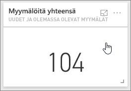

# Opetusohjelma: Power BI -palvelun tietoilmoitusten määrittäminen
Aseta ilmoituksia ilmoittamaan sinulle, kun koontinäyttösi tiedot muuttuvat asettamiesi rajojen ulkopuolelle. 

Voit asettaa ruutujen ilmoituksia, jos sinulla on Power BI Pro - käyttöoikeus tai jos koontinäyttö on jaettu kanssasi [Premium-kapasiteetista](../service-premium.md). Ilmoitukset voidaan määrittää vain ruuduille, jotka on kiinnitetty raportin visualisoineista, ja vain mittareissa, suorituskykyilmaisimissa ja korteissa. Ilmoitukset voidaan määrittää visualisoinneille, jotka on luotu virtautustietojoukoista, jotka on kiinnitetty koontinäyttöön raportista, mutta niitä ei voi määrittää virtautusruuduille, jotka on luotu suoraan koontinäytöstä valitsemalla **Lisää ruutu**  >  **Mukautetut virtautettavat tiedot** . 

Vain sinä näet asettamasi hälytykset, vaikka jakaisit koontinäyttösi. Tietoilmoitukset synkronoidaan täysin kaikissa ympäristöissä. Määritä ja tarkastele tietoilmoituksia [Power BI -mobiilisovelluksissa](mobile/mobile-set-data-alerts-in-the-mobile-apps.md) ja Power BI -palvelussa. 

> [!WARNING]
> Aineistoperäisen ilmoitukset antavat on tietoja lähdetiedoistasi. Jos tarkastelet Power BI -tietojasi mobiililaitteella ja laite varastetaan, suosittelemme kaikkien tietopohjaisten hälytysten poistamista käytöstä Power BI -palvelulla.
> 

Tässä artikkelissa käsitellään seuraavat asiat.
> [!div class="checklist"]
> * Kuka voi asettaa hälytyksiä
> * Mitkä visualisoinnit tukevat hälytyksiä
> * Kuka voi nähdä hälytyksiä
> * Toimivatko hälytykset Power BI Desktopissa ja -mobiilisovelluksessa
> * Hälytyksen luominen
> * Minne vastaanotan hälytykset

Jos et ole rekisteröitynyt Power BI:hin, [rekisteröidy ilmaiseen kokeiluversioon](https://app.powerbi.com/signupredirect?pbi_source=web) ennen aloittamista.

## Power BI -palvelun tietoilmoitusten määrittäminen
Katsele, kuinka Amanda lisää joitakin ilmoituksia hänen koontinäyttönsä ruutuihin. Kokeile sitten itse noudattamalla videon alapuolella olevia vaiheittaisia ohjeita.

<iframe width="560" height="315" src="https://www.youtube.com/embed/JbL2-HJ8clE" frameborder="0" allowfullscreen></iframe>

Tässä esimerkissä käytetään [jälleenmyyntianalyysimallin koontinäytön](http://go.microsoft.com/fwlink/?LinkId=529778) korttiruutua.

1. Valitse koontinäytön mittarista, suorituskykyilmaisimesta tai korttiruudusta kolme pistettä.
   
   
2. Lisää yksi tai useampia hälytyksiä **Myymälöitä yhteensä** -ruudulle valitsemalla kellokuvake  tai **Hälytysten hallinta**.
   
1. Valitse **Hälytysten hallinta** -ruudussa **+ Lisää hälytyssääntö**.  Varmista, että liukusäädin on asennossa **Käytössä**, ja anna hälytykselle nimi. Nimet helpottavat ilmoitusten tunnistamista.
   
   
4. Vieritä alas ja anna hälytyksen tiedot.  Luomme tässä esimerkissä ilmoituksen, joka ilmoittaa meille kerran päivässä, jos kauppojen kokonaismäärä ylittää sadan. Ilmoitukset näkyvät ilmoituskeskuksessa. Myös Power BI lähettää meille sähköpostia.
   
   
5. Valitse **Tallenna ja sulje**.

## Ilmoitusten vastaanottaminen
Kun seuratut tiedot saavuttavat jonkin määrittämistäsi raja-arvoista, tapahtuu useita asioita. Power BI tarkistaa ensin, onko edellisen ilmoituksen lähettämisestä yli tunti tai yli 24 tuntia (valitsemasi vaihtoehdon mukaan). Kunhan tiedot ylittävät raja-arvon, saat ilmoituksen.

Power BI lähettää seuraavaksi ilmoituksen ilmoituskeskukseen ja valinnaisesti myös sähköpostiin. Kussakin ilmoituksessa on suora linkki tietoihin. Valitse linkki nähdäksesi asianmukaisen ruudun.  

1. Jos olet määrittänyt ilmoitukset lähettämään sinulle sähköpostia, Saapuneet-kansiossasi näkyy jotain seuraavanlaista.
   
   
2. Power BI lisää viestin **ilmoituskeskukseesi** ja lisää uuden ilmoituksen kuvakkeen kyseiseen ruutuun.
   
   
3. Näytä ilmoituksen tiedot avaamalla ilmoituskeskus.
   
    
   
   > [!NOTE]
   > Ilmoitukset toimivat vain tiedoissa, joita päivitetään. Kun tiedot päivitetään, Power BI tarkistaa, onko tiedoille määritetty ilmoitus. Jos tiedot saavuttavat ilmoituksen raja-arvon, aktivoidaan ilmoitus.
   > 
   > 

## Ilmoitusten hallinta
Voit hallita ilmoituksia usealla tavalla: suoraan koontinäytön ruudusta, Power BI -asetukset -valikosta, ruudusta [iPhonen Power BI -mobiilisovelluksessa](mobile/mobile-set-data-alerts-in-the-mobile-apps.md) tai [Windows 10:n Power BI -mobiilisovelluksessa](mobile/mobile-set-data-alerts-in-the-mobile-apps.md).

### Suoraan ruudusta
1. Jos haluat muuttaa tai poistaa ruudun ilmoituksen, avaa **Hallitse ilmoituksia** -ikkuna uudelleen valitsemalla kellokuvakkeen . Kaikki kyseiselle ruudulle määrittämäsi ilmoitukset tulevat näyttöön.
   
    .
2. Jos haluat muuttaa ilmoitusta, valitse haluamasi ilmoituksen nimen vasemmalla puolella oleva nuoli.
   
    .
3. Poista ilmoitus valitsemalla ilmoituksen nimen oikealla puolella oleva roskakori.
   
      

### Power BI:n Asetukset-valikosta
1. Valitse Power BI -valikkopalkin rataskuvake.
   
    .
2. Valitse kohdasta **Asetukset** komento **Ilmoitukset**.
   
    
3. Täällä voit ottaa hälytyksiä käyttöön ja poistaa niitä käytöstä, avata **Ilmoitusten hallinta** -ikkunan, jos haluat muuttaa tai poistaa hälytyksen.

## Vihjeet ja vianmääritys
* Hälytyksiä ei tällä hetkellä tueta Bing-ruuduissa tai korttiruuduissa, joissa on päivämäärä/aika-mittayksiköitä.
* Hälytykset toimivat vain numeerisissa tietotyypeissä.
* Ilmoitukset toimivat vain tiedoissa, joita päivitetään. Ne eivät toimi staattisissa tiedoissa.
* Ilmoitukset toimivat virtautustietojoukoissa vain, jos luot suorituskykyilmaisimen, kortin tai mittarin raportin visualisoinnin ja kiinnität kyseisen visualisoinnin koontinäyttöön.

## Resurssien tyhjentäminen
Ohjeet hälytysten poistamiseen on annettu edellä. Lyhyesti sanottuna valitse Power BI -valikkopalkin rataskuvake. Valitse **Asetukset**-kohdassa **Hälytykset** ja poista hälytys.

> [!div class="nextstepaction"]
> [Määritä tietoilmoitukset mobiililaitteellasi](mobile/mobile-set-data-alerts-in-the-mobile-apps.md)

