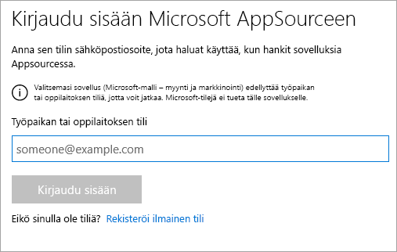

# Myynti- ja markkinointimallisovelluksen asentaminen ja käyttäminen Power BI -palvelussa
Nyt kun sinulla on [perustiedot Power BI -sisällön saamisesta](end-user-app-view.md), haetaan markkinointi- ja myyntisovellus Microsoft AppSourcesta (appsource.com). 

## Microsoft AppSource (appsource.com)
Tässä on linkki sovellukseen: [Markkinointi- ja myyntisovellus](https://appsource.microsoft.com/product/power-bi/microsoft-retail-analysis-sample.salesandmarketingsample?tab=Overview). Kun valitset tämän linkin, sovelluksen lataussivu avautuu Microsoft AppSourcessa. 

1. Sinua saatetaan pyytää kirjautumaan sisään ennen kuin voit saada sovelluksen. Kirjaudu sisään käyttämällä Power BI:ssä käyttämääsi sähköpostiosoitetta. 

    

2. Valitse **Hanki se nyt**. 

    

3. Jos kirjaudut AppSourceen ensimmäistä kertaa, sinun on hyväksyttävä käyttöehdot. 

    

4. Power BI -palvelu avautuu. Vahvista, että haluat asentaa tämän sovelluksen.

    

5. Power BI -palvelu näyttää onnistumisilmoituksen, kun sovellus on asennettu. Avaa sovellus valitsemalla **Siirry sovellukseen**. Näkyviin tulee joko sovelluksen koontinäyttö tai sovelluksen raportti riippuen siitä, miten suunnittelija on luonut sovelluksen.

    

    Voit avata sovelluksen myös suoraan sovelluksen sisältöluettelosta valitsemalla **Sovellukset** ja **Myynti ja markkinointi**.

    

6. Valitse, haluatko tutustua uuteen sovellukseen tai mukauttaa ja jakaa sen. Valitsimme Microsoft-mallisovelluksen, joten aloitetaan tutustumalla siihen. 

    

7.  Uusi sovelluksesi avautuu koontinäytössä. Sovelluksen *suunnittelija* olisi vaihtoehtoisesti voinut määrittää sovelluksen avautumaan raportissa.  

    

## Koontinäyttöjen ja raporttien käsitteleminen sovelluksessa
Tutustu rauhassa sovelluksen muodostavien koontinäyttöjen ja raporttien tietoihin. Voit käyttää kaikkia Power BI:n vakiotoimia, kuten suodatusta, korostusta, lajittelua ja porautumista.  Vaikuttaako koontinäyttöjen ja raporttien välinen ero vieläkin hieman sekavalta?  Lue [koontinäyttöjä koskeva artikkeli](end-user-dashboards.md) ja [raportteja koskeva artikkeli](end-user-reports.md).  

## Seuraavat vaiheet
* [Takaisin sovellusten yleiskatsaukseen](end-user-apps.md)
* [Power BI -raportin tarkasteleminen](end-user-report-open.md)
* [Muita sisällön jakamistapoja](end-user-shared-with-me.md)
