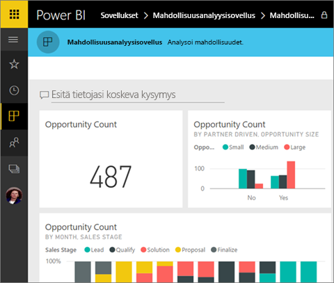
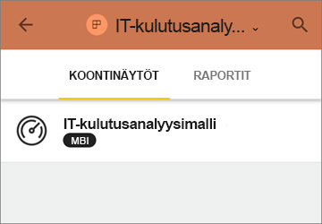
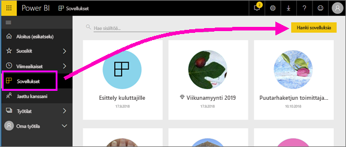
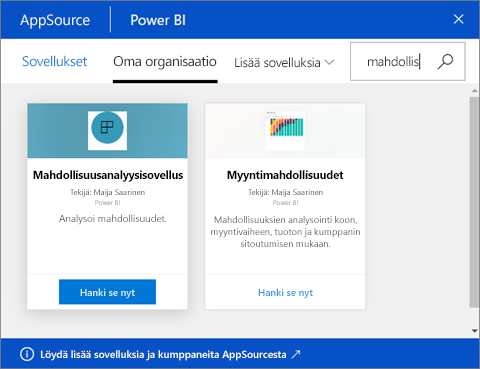
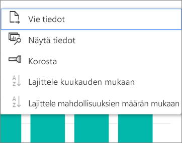

# Koontinäyttöjä ja raportteja hyödyntävien sovellusten asentaminen ja käyttäminen Power BI:ssä
Nyt sinulla on [perustiedot sovelluksista](end-user-apps.md), joten voimme opetella niiden avaamista ja käyttämistä. 

## Uuden sovelluksen hankkiminen
Muista, että voit hankkia uuden sovelluksen usealla eri tavalla. Raportin suunnittelija voi asentaa sovelluksen automaattisesti Power BI -tilillesi tai lähettää sinulle suoran linkin sovellukseen. Vaihtoehtoisesti voit siirtyä AppSourceen ja etsiä sieltä käytettävissä olevia, yrityksen sisäisiä tai ulkopuolisia sovelluksia. 

Jos käytät Power BI:tä mobiililaitteella, et voi asentaa sovellusta AppSourcen kautta vaan tarvitset suoran linkin. Jos sovelluksen tekijä asentaa sovelluksen automaattisesti, näet sen sovellusluettelossa.

## Sovelluksen asentaminen suoran linkin kautta
Helpoin tapa asentaa uusi sovellus omatoimisesti on saada sovelluksen tekijältä sähköpostitse suora linkki.  

**Tietokone** 

Kun napsautat sähköpostissa olevaa linkkiä, Power BI -palvelu ([https://powerbi.com](https://powerbi.com)) avautuu selaimessa. Vahvista, että haluat asentaa sovelluksen, jolloin Power BI avautuu sovelluksen aloitussivulle.

**iOS-tai Android-mobiililaite** 

Kun napsautat sähköpostissa olevaa linkkiä mobiililaitteessa, sovellus asentuu automaattisesti ja avaa sovelluksen sisältöluettelon mobiilisovelluksessa. 

## Sovelluksen hakeminen Microsoft AppSourcesta
Voit etsiä ja asentaa sovelluksia myös Microsoft AppSourcesta. Näet vain ne sovellukset, joihin sinulla on käyttöoikeus (eli joihin sovelluksen tekijä on antanut sinulle tai kaikille käyttöoikeuden).

1. Valitse **Sovellukset**  > **Hanki sovelluksia**. 
   
     
2. AppSourcen **Oma organisaatio** -osiossa voit tehdä hakuja rajataksesi tuloksia ja löytääksesi haluamasi sovelluksen.
   
     
3. Lisää sovellus Sovellukset-sisältöluetteloon valitsemalla **Hanki se nyt**. 

## Koontinäyttöjen ja raporttien käsitteleminen sovelluksessa
Nyt voit tutkia koontinäyttöjen ja raporttien tietoja sovelluksessa. Voit käyttää kaikkia Power BI:n vakiotoimia, kuten suodatusta, korostusta, lajittelua ja porautumista. Voit myös [viedä tietoja Exceliin ](end-user-export-data.md) taulukosta tai muusta raportin visualisoinnista. Lue [Power BI-raporteissa käytettävissä olevista toimista](end-user-reading-view.md). 

## Seuraavat vaiheet
* [Power BI -sovellukset ulkoisille palveluille](end-user-connect-to-services.md)
* Ilmenikö kysyttävää? [Voit esittää kysymyksiä Power BI -yhteisössä](http://community.powerbi.com/)

