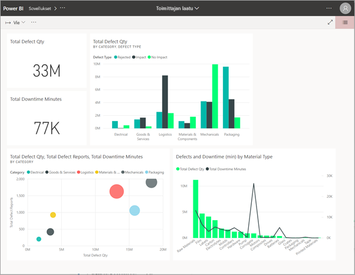
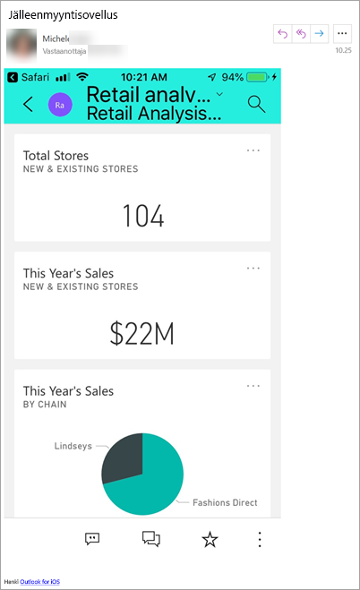
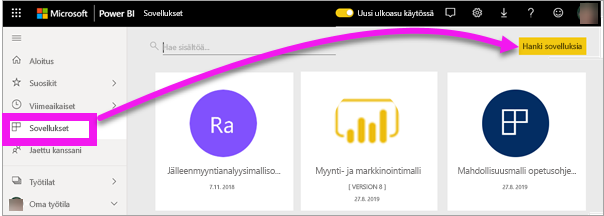
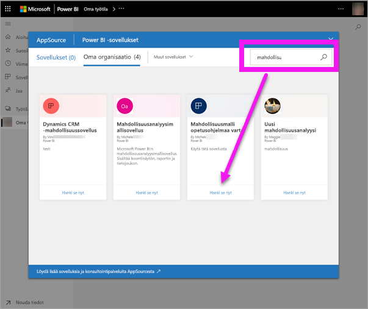
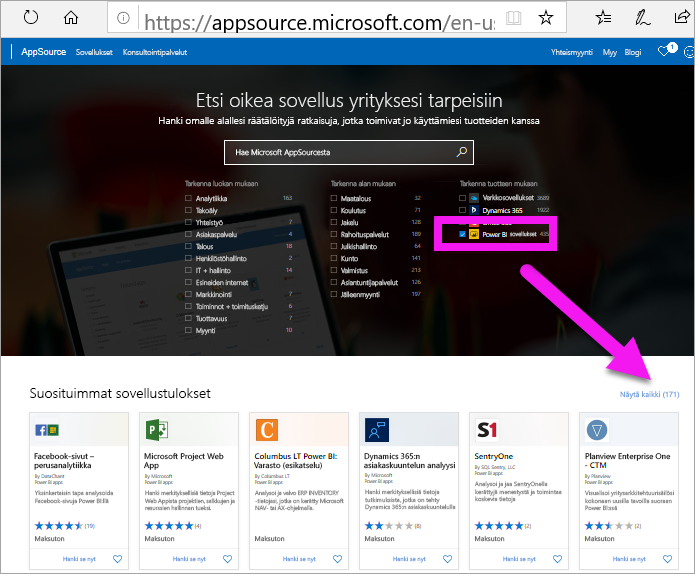
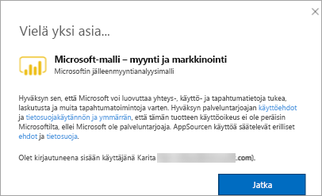

# Koontinäyttöjä ja raportteja hyödyntävien sovellusten asentaminen ja käyttäminen Power BI:ssä

[!INCLUDE [power-bi-service-new-look-include](../includes/power-bi-service-new-look-include.md)]

Nyt sinulla on [perustiedot sovelluksista](end-user-apps.md), joten voimme opetella niiden avaamista ja käyttämistä. 

## Uuden sovelluksen hankkiminen
Voit hankkia uuden sovelluksen usealla eri tavalla. Raportin suunnittelija voi asentaa sovelluksen automaattisesti Power BI -tilillesi tai lähettää sinulle suoran linkin sovellukseen. Vaihtoehtoisesti voit siirtyä AppSourceen ja etsiä sieltä käytettävissä olevia, yrityksen sisäisten tai ulkopuolisten suunnittelijoiden luomia sovelluksia. 

Jos käytät Power BI:tä mobiililaitteella, et voi asentaa sovellusta AppSourcen kautta vaan tarvitset suoran linkin. Jos sovelluksen suunnittelija asentaa sovelluksen automaattisesti, näet sen sovellusluettelossa.

## Sovelluksen asentaminen suoran linkin kautta
Helpoin tapa asentaa uusi sovellus omatoimisesti on saada sovelluksen suunnittelijalta sähköpostitse suora linkki.  

**Tietokone** 

Kun napsautat sähköpostissa olevaa linkkiä, Power BI -palvelu ([https://powerbi.com](https://powerbi.com)) avaa sovelluksen selaimessasi. 

**iOS-tai Android-mobiililaite** 

Kun napsautat sähköpostissa olevaa linkkiä mobiililaitteessa, sovellus asentuu automaattisesti ja mobiilisovellus avautuu. Sinun on ehkä kirjauduttava ensin sisään. 

## Sovelluksen hakeminen Microsoft AppSourcesta
Voit etsiä ja asentaa sovelluksia myös Microsoft AppSourcesta. Näet vain ne sovellukset, joihin sinulla on käyttöoikeus (eli joihin sovelluksen tekijä on antanut sinulle tai kaikille käyttöoikeuden).

1. Valitse **Sovellukset**  > **Hanki sovelluksia**. 
   
        
2. AppSourcen **Oma organisaatio** -osiossa voit tehdä hakuja rajataksesi tuloksia ja löytääksesi haluamasi sovelluksen.
   
    
3. Lisää sovellus Sovellukset-sisältöluetteloon valitsemalla **Hanki se nyt**. 

## Hae sovellus Microsoft AppSource -sivustosta (https://appsource.microsoft.com)
Tässä esimerkissä avataan jokin Microsoft-mallisovelluksista. AppSourcesta löydät sovelluksia moniin liiketoiminnassasi käyttämiin palveluihin.  Tällaisia palveluja ovat esimerkiksi Salesforce, Microsoft Dynamics, Google Analytics, GitHub, Zendesk, Marketo ja monet muut. Lisätietoja on kohdassa [Power BI:ssä käyttämiesi palvelujen sovellukset](../service-connect-to-services.md). 

1. Mene selaimessa osoitteeseen https://appsource.microsoft.com, ja valitse **Power BI -sovellukset**.

    

2. Valitse **Näytä kaikki**, jos haluat nähdä luettelon kaikista AppSourcessa tällä hetkellä käytettävissä olevista Power BI -sovelluksista. Etsi sovellus nimeltä **Microsoft-malli – myynti ja markkinointi**.

    

3. Valitse **Hanki se nyt**, ja hyväksy käyttöehdot.

    

4. Vahvista, että haluat asentaa tämän sovelluksen.

    

5. Power BI -palvelu näyttää onnistumisilmoituksen, kun sovellus on asennettu. Avaa sovellus valitsemalla **Siirry sovellukseen**. Näkyviin tulee joko sovelluksen koontinäyttö tai sovelluksen raportti riippuen siitä, miten suunnittelija on luonut sovelluksen.

    

    Voit avata sovelluksen myös suoraan sovelluksen sisältöluettelosta valitsemalla **Sovellukset** ja **Myynti ja markkinointi**.

    

6. Valitse, haluatko tutustua uuteen sovellukseen tai mukauttaa ja jakaa sen. Valitsimme Microsoft-mallisovelluksen, joten aloitetaan tutustumalla siihen. 

    

7.  Uusi sovelluksesi avautuu koontinäytössä. Sovelluksen *suunnittelija* olisi vaihtoehtoisesti voinut määrittää sovelluksen avautumaan raportissa.  

    

## Koontinäyttöjen ja raporttien käsitteleminen sovelluksessa
Tutustu rauhassa sovelluksen muodostavien koontinäyttöjen ja raporttien tietoihin. Voit käyttää kaikkia Power BI:n vakiotoimia, kuten suodatusta, korostusta, lajittelua ja porautumista.  Vaikuttaako koontinäyttöjen ja raporttien välinen ero vieläkin hieman sekavalta?  Lue [koontinäyttöjä koskeva artikkeli](end-user-dashboards.md) ja [raportteja koskeva artikkeli](end-user-reports.md).  

## Seuraavat vaiheet
* [Takaisin sovellusten yleiskatsaukseen](end-user-apps.md)
* [Power BI -raportin tarkasteleminen](end-user-report-open.md)
* [Muita sisällön jakamistapoja](end-user-shared-with-me.md)
