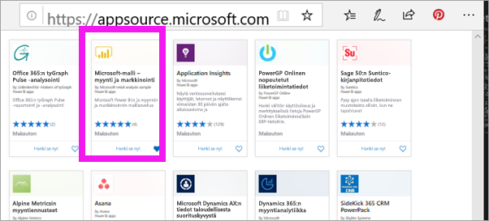
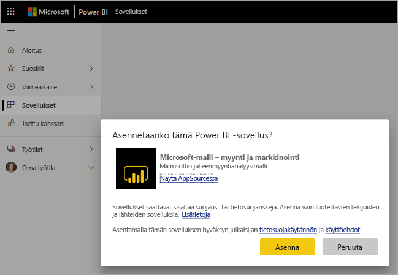
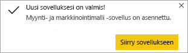
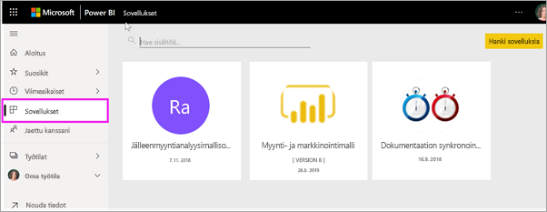
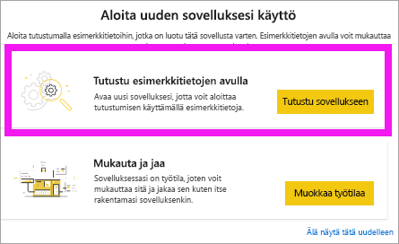
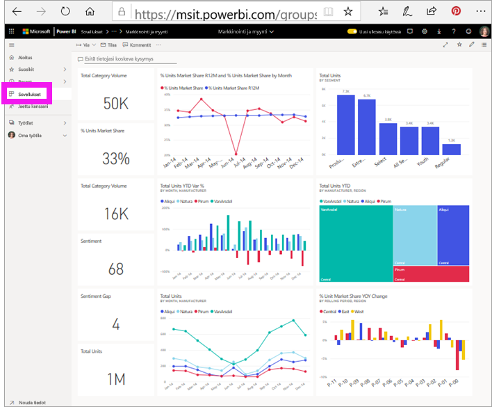

# Koontinäyttöjä ja raportteja hyödyntävien sovellusten asentaminen ja käyttäminen Power BI:ssä

[!INCLUDE[consumer-appliesto-ynny](../includes/consumer-appliesto-ynny.md)]

[!INCLUDE [power-bi-service-new-look-include](../includes/power-bi-service-new-look-include.md)]

Nyt sinulla on [perustiedot sovelluksista](end-user-apps.md), joten voimme opetella niiden avaamista ja käyttämistä. 

## Uuden sovelluksen hankkiminen
Voit hankkia uuden sovelluksen usealla eri tavalla. Raportin suunnittelija voi asentaa sovelluksen automaattisesti Power BI -tilillesi tai lähettää sinulle suoran linkin sovellukseen. Vaihtoehtoisesti voit siirtyä AppSourceen ja etsiä sieltä käytettävissä olevia, yrityksen sisäisten tai ulkopuolisten suunnittelijoiden luomia sovelluksia. 

Jos käytät Power BI:tä mobiililaitteella, et voi asentaa sovellusta AppSourcen kautta vaan tarvitset suoran linkin. Jos sovelluksen suunnittelija asentaa sovelluksen automaattisesti, näet sen sovellusluettelossa.

## Sovellukset ja käyttöoikeudet
Kaikki Power BI -käyttäjät eivät voi tarkastella ja käsitellä sovelluksia. 
- Jos sinulla on maksuton käyttöoikeus, voit avata sovelluksia, jotka on jaettu kanssasi ja jotka on tallennettu Premium-kapasiteetin työtilaan.
- Jos sinulla on Pro-käyttöoikeus, voit avata sovelluksia, jotka on jaettu kanssasi.

## Sovelluksen asentaminen suoran linkin kautta
Helpoin tapa asentaa uusi sovellus omatoimisesti on saada sovelluksen suunnittelijalta sähköpostitse suora linkki.  

**Tietokone** 

Kun napsautat sähköpostissa olevaa linkkiä, Power BI -palvelu ([https://powerbi.com](https://powerbi.com)) avaa sovelluksen selaimessasi. 

**iOS-tai Android-mobiililaite** 

Kun napsautat sähköpostissa olevaa linkkiä mobiililaitteessa, sovellus asentuu automaattisesti ja mobiilisovellus avautuu. Sinun on ehkä kirjauduttava ensin sisään. 

## Sovelluksen hakeminen Microsoft AppSourcesta
Voit etsiä ja asentaa sovelluksia myös Microsoft AppSourcesta. Näet vain ne sovellukset, joihin sinulla on käyttöoikeus (eli joihin sovelluksen tekijä on antanut sinulle tai kaikille käyttöoikeuden). 

> [!NOTE]
> Jos käytät maksutonta käyttöoikeutta, voit ladata sovelluksia, mutta et voi tarkastella niitä, ellet päivitä tiliäsi Power BI Pro -tiliksi tai ellei sovellusta tallenneta Premium-kapasiteettiin. Lisätietoja on artikkelissa [Kuluttajien käyttöoikeudet](end-user-license.md).

1. Valitse **Sovellukset**  > **Hanki sovelluksia**. 
   
        
2. AppSourcen **Oma organisaatio** -osiossa voit tehdä hakuja rajataksesi tuloksia ja löytääksesi haluamasi sovelluksen.
   
    
3. Lisää sovellus Sovellukset-sisältöluetteloon valitsemalla **Hanki se nyt**. 

## Hanki sovellus Microsoft AppSource -verkkosivustosta 

Tässä esimerkissä avataan jokin Microsoft-mallisovelluksista. AppSourcesta löydät sovelluksia moniin liiketoiminnassasi käyttämiin palveluihin.  Tällaisia palveluja ovat esimerkiksi Salesforce, Microsoft Dynamics, Google Analytics, GitHub, Zendesk, Marketo ja monet muut. Lisätietoja on kohdassa [Power BI:ssä käyttämiesi palvelujen sovellukset](../service-connect-to-services.md). 

1. Siirry selaimessa osoitteeseen [https://appsource.microsoft.com](https://appsource.microsoft.com) ja valitse **Power BI -sovellukset**.

    

2. Valitse **Näytä kaikki**, jos haluat nähdä luettelon kaikista AppSourcessa tällä hetkellä käytettävissä olevista Power BI -sovelluksista. Etsi sovellus nimeltä **Microsoft-malli – myynti ja markkinointi**.

    

3. Valitse **Hanki se nyt**, ja hyväksy käyttöehdot.

    

4. Vahvista, että haluat asentaa tämän sovelluksen.

    

5. Power BI -palvelu näyttää onnistumisilmoituksen, kun sovellus on asennettu. Avaa sovellus valitsemalla **Siirry sovellukseen**. Näkyviin tulee joko sovelluksen koontinäyttö tai sovelluksen raportti riippuen siitä, miten suunnittelija on luonut sovelluksen.

    

    > [!NOTE]
    > Jos käytät maksutonta käyttöoikeutta, voit ladata sovelluksia, mutta et voi tarkastella niitä, ellet päivitä tiliäsi Power BI Pro -tiliksi. 

    Voit avata sovelluksen myös suoraan sovelluksen sisältöluettelosta valitsemalla **Sovellukset** ja **Myynti ja markkinointi**.

    

6. Valitse, haluatko tutustua uuteen sovellukseen tai mukauttaa ja jakaa sen. Valitsimme Microsoft-mallisovelluksen, joten aloitetaan tutustumalla siihen. 

    

7.  Uusi sovelluksesi avautuu koontinäytössä. Sovelluksen *suunnittelija* olisi vaihtoehtoisesti voinut määrittää sovelluksen avautumaan raportissa.  

    

## Koontinäyttöjen ja raporttien käsitteleminen sovelluksessa
Tutustu rauhassa sovelluksen muodostavien koontinäyttöjen ja raporttien tietoihin. Voit käyttää kaikkia Power BI:n vakiotoimia, kuten suodatusta, korostusta, lajittelua ja porautumista.  Vaikuttaako koontinäyttöjen ja raporttien välinen ero vieläkin hieman sekavalta?  Lue [koontinäyttöjä koskeva artikkeli](end-user-dashboards.md) ja [raportteja koskeva artikkeli](end-user-reports.md).  

## Päivitä sovellus 

Sovellusten luojat voivat ajoittain julkaista sovelluksistaan uusia versioita. Uuden version hankinta riippuu siitä, miten sait alkuperäisen version. 

* Jos sait sovelluksen organisaatiostasi, uuden version päivitys on hyvin helppoa eli sinun ei tarvitse tehdä mitään. 

* Jos sait sovelluksen AppSourcesta, näkyviin tulee ilmoituspalkki, kun avaat sovelluksen seuraavan kerran. Ilmoituksen avulla tiedät, että uusi versio on saatavilla. 

    1. Päivitä valitsemalla **Hanki se nyt**.  

        <!-- -->

    2. Kun sinua kehotetaan asentamaan päivitetty sovellus, valitse **Asenna**. 

         

    3. Koska sinulla on jo tämän sovelluksen versio, voit valita, haluatko korvata aiemman version vai asentaa päivitetyn sovelluksen uuteen työtilaan.   

         

    > [!NOTE] 
    > Uuden version asentaminen korvaa raportteihin ja koontinäyttöihin mahdollisesti tekemäsi muutokset. Jos haluat säilyttää päivitetyt raporttisi ja koontinäyttösi, voit tallentaa ne eri nimellä tai eri sijaintiin ennen asentamista. 

    4. Kun olet asentanut päivitetyn version, viimeistele päivitysprosessi valitsemalla **Päivitä sovellus**. 

## Seuraavat vaiheet
* [Takaisin sovellusten yleiskatsaukseen](end-user-apps.md)
* [Power BI -raportin tarkasteleminen](end-user-report-open.md)
* [Muita sisällön jakamistapoja](end-user-shared-with-me.md)
