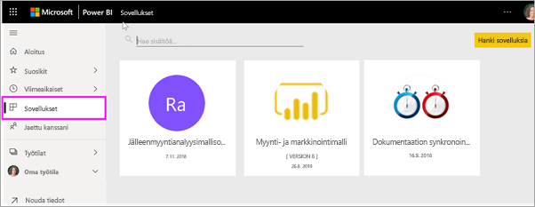

# Sovellukset Power BI:ssä
## Mikä Power BI -sovellus on?
*Sovellus* on Power BI:n sisältötyyppi, joka kokoaa toisiinsa liittyvät koontinäytöt ja raportit yhteen paikkaan. Sovelluksessa voi olla yksi tai useampia koontinäyttöjä ja yksi tai useampia raportteja, jotka on koottu yhteen. Power BI:n *suunnittelijat* luovat sovellukset ja jakavat ne sinun kaltaisillesi *kuluttajille*. 

Sovellukset on järjestetty **Sovellukset**-sisältöluetteloon. Näytä sovellukset valitsemalla **Sovellukset**. Pidä hiiren osoitinta sovelluksen päällä, niin näet viimeisimmän päivityspäivämäärän ja omistajan. 

> [!NOTE]
> Sovellusominaisuuden käyttö edellyttää Power BI Pro -käyttöoikeutta. <!-- add link to how to figure out your license -->

## Sovelluksen ***suunnittelijat*** ja sovelluksen ***kuluttajat***
Roolistasi riippuen saatat olla henkilö, joka luo sovelluksia (*suunnittelija*) omaan käyttöönsä tai jakaa niitä työtovereidensa kanssa. Vaihtoehtoisesti voit olla henkilö, joka vastaanottaa ja lataa muiden luomia sovelluksia (*kuluttaja*). Tämä artikkeli on tarkoitettu sovellusten *kuluttajille*.

## Sovellusten edut
Sovellukset ovat helppo tapa jakaa erityyppisiä sisältöjä yhdellä kerralla. Sovellusten *suunnittelijat* luovat koontinäyttöjä ja raportteja ja kokoavat ne yhteen sovellukseksi. *Suunnittelijat* jakavat tai julkaisevat sovelluksen sellaisessa sijainnissa, jossa sinä voit *kuluttajana* käyttää sitä. Koska toisiinsa liittyvät koontinäytöt ja raportit kootaan yhteen, sinun on helppo löytää ja asentaa ne sekä Power BI -palvelussa ([https://powerbi.com](https://powerbi.com)) että mobiililaitteessa. Kun olet asentanut sovelluksen, sinun ei tarvitse muistaa monien eri koontinäyttöjen tai raporttien nimiä, sillä ne ovat kaikki yhdessä sovelluksessa, selaimessa tai mobiililaitteessa.

Kun käytät sovelluksia,näet muutokset automaattisesti aina, kun sovelluksen tekijä julkaisee päivityksiä. Tekijä määrittää myös, kuinka usein tiedot ajoitetaan päivittymään, joten sinun ei tarvitse huolehtia niiden pitämisestä ajan tasalla. 

<!-- add conceptual art -->
## Uuden sovelluksen hankkiminen
Voit hankkia sovelluksia muutamilla eri tavoilla. Joitakin tapoja on lueteltu alla.  Yksityiskohtaiset ohjeet sovelluksen hakemiseen ja käyttämiseen on artikkelissa [Sovelluksen avaaminen ja käyttäminen](end-user-app-view.md).

- Sovelluksen suunnittelija voi asentaa sovelluksen automaattisesti Power BI -tilillesi, jolloin näet uuden sovelluksen **Sovellukset**-sisältöluettelossa, kun avaat Power BI:n seuraavan kerran. 
- Sovelluksen suunnittelija voi lähettää sinulle sähköpostilla suoran linkin sovellukseen. Kun valitset linkin, sovellus avautuu Power BI:ssä.
- Jos käytät Power BI:tä mobiililaitteella, et voi asentaa sovellusta AppSourcen kautta vaan tarvitset suoran linkin. Jos sovelluksen tekijä asentaa sovelluksen automaattisesti, näet sen sovellusluettelossa.
- Voit hakea sovelluksia [AppSourcesta](https://appsource.microsoft.com). AppSourcessa on yrityksen sisäisten ja ulkopuolisten raporttien suunnittelijoiden julkaisemia sovelluksia. AppSourcessa voi esimerkiksi olla jo käyttämäsi palvelun sovellus, kuten Google Analytics, GitHub tai Microsoft Dynamics. Siellä on myös sovelluksia, jotka ovat malleja, joiden avulla voit opetella Power BI:n käyttöä.  

## Seuraava vaihe
* [Sovelluksen avaaminen ja käyttäminen](end-user-app-view.md)
* [Muita sisällön jakamistapoja](end-user-shared-with-me.md)

