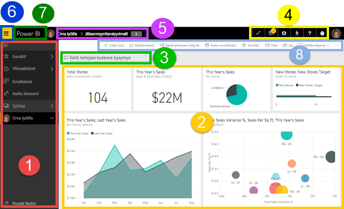
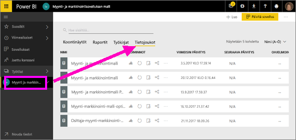
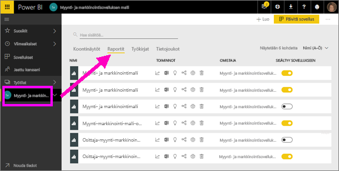
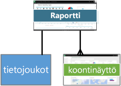
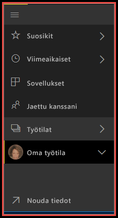

# Power BI – Power BI -palvelun peruskäsitteet

Tässä artikkelissa oletetaan, että olet jo [rekisteröitynyt Power BI -palvelun käyttäjäksi](../service-self-service-signup-for-power-bi.md) ja [lisännyt palveluun joitakin tietoja](../service-get-data.md).

Kun avaat Power BI -palvelun, näet ***koontinäytön***. Koontinäytöt erottavat Power BI -palvelun Power BI Desktopista.

Power BI-palvelun käyttöliittymän tärkeimmät ominaisuudet ovat seuraavat:

1. siirtymisruutu (vasen siirtymispalkki)
2. kangas (tässä tapauksessa koontinäyttö, jossa on ruutuja)
3. Q&A-kysymysruutu
4. kuvakepainikkeet esimerkiksi ohjeille ja palautteelle
5. koontinäytön otsikko (navigointipolku)
6. Office 365 -sovellusten käynnistystoiminto
7. Power BI:n aloituspainike
8. Nimetyt kuvakepainikkeet

Tutustumme näihin lähemmin myöhemmin, mutta käydään ensin läpi muutamia Power BI:n peruskäsitteitä.

Voit myös katsoa tämän videon ennen artikkelin lukemista.  Videolla Will kertoo peruskäsitteistä ja esittelee Power BI -palvelua.

<iframe width="560" height="315" src="https://www.youtube.com/embed/B2vd4MQrz4M" frameborder="0" allowfullscreen></iframe>

## Power BI:n käsitteet
Power BI:n neljä peruselementtiä ovat ***koontinäytöt***, ***raportit***, ***työkirjat*** ja ***tietojoukot***. Ne on kaikki järjestetty ***työtiloiksi***. Työtilojen käsite on tärkeä ymmärtää ennen peruselementteihin tutustumista, joten aloitetaan siitä. 

## Työtilat
Työtilat ovat Power BI:ssä olevia säilöjä koontinäytöille, raporteille, työkirjoille ja tietojoukoille. Työtiloja on kahdenlaisia: *Oma työtila* ja *sovellustyötilat*. Entä mitä tarkoitetaan *sovelluksella*? Power BI -*sovellus* on kokoelma koontinäyttöjä ja raportteja, joiden avulla voit kuvata organisaatiosi keskeisiä mittalukuja. Sovellukset ovat vuorovaikutteisia, mutta niitä ei voi muokata. 

- *Oma työtila* on jokaisen Power BI -asiakkaan henkilökohtainen työtila oman sisällön käsittelyyn. Vain sinulla on käyttöoikeus omaan työtilaasi. Oman työtilan kautta voi jakaa raporttinäkymiä ja raportteja. Jos haluat käsitellä koontinäyttöjä ja raportteja yhteistyössä tai luoda sovelluksen, sinun kannattaa käyttää sovellustyötilaa.      
-  *Sovellustyötiloja* käytetään yhteistyöhön ja sisällön jakamiseen kollegoiden kanssa. Niissä voi myös luoda, julkaista ja hallita sovelluksia organisaatiollesi. Niitä voi ajatella tietynlaisina valmisteluympäristöinä ja säilöinä sisällölle, josta muodostuu Power BI -sovellus. Voit lisätä kollegoita sovellustyötilan käyttäjiksi ja käsitellä koontinäyttöjä, raportteja, työkirjoja ja tietojoukkoja yhteistyössä. Kaikki sovellustyötilan jäsenet tarvitsevat Power BI Pro -käyttöoikeudet, mutta sovelluksen kuluttajilla (sovelluksen käyttöoikeuden saaneilla kollegoilla) ei välttämättä tarvitse olla Pro-käyttöoikeuksia.  

Lisätietoja on sisällysluettelon **Työn jakaminen** -osiossa, jonka ensimmäisenä aiheena on [Miten voin jakaa koontinäyttöjä ja raportteja sekä työstää niitä yhdessä muiden kanssa?](../service-how-to-collaborate-distribute-dashboards-reports.md)

Siirrytään nyt Power BI:n peruselementteihin. Koontinäyttöjä tai raportteja ei voi olla ilman tietoja – tai tyhjinä niistä ei ainakaan ole suurta hyötyä –, joten aloitetaan **tietojoukoista**.

## Tietojoukot
*Tietojoukko* on kokoelma tietoja, jotka voit *tuoda* tai joihin voit *muodostaa yhteyden*. Power BI:n avulla voit koota yhteen kaikenlaisia tietojoukkoja muodostamalla niihin yhteyden ja tuomalla niitä.  

Tietojoukot liittyvät *työtiloihin*, ja yksi tietojoukko voi olla osa useita työtiloja. Kun avaat työtilan, siihen liittyvät tietojoukot luetellaan **Tietojoukot**-välilehdellä. Jokainen luettelon tietojoukko edustaa yhtä tietolähdettä, kuten Excel-laskentataulukkoa OneDrivessa, paikallista taulukkomuotoista SSAS-tietojoukkoa tai Salesforce-tietojoukkoa. Tuettuja tietolähteitä on monenlaisia, ja uusia lisätään koko ajan. [Katso luettelo Power BI:n kanssa käytettävistä tietojoukkotyypeistä](../service-get-data.md).

Alla olevassa esimerkissä olen valinnut Myynti ja markkinointi -sovellustyötilan ja napsauttanut **Tietojoukot**-välilehteä.

**YHTÄ** tietojoukkoa...

* voi käyttää yhä uudelleen yhdessä tai useissa työtiloissa.
* voi käyttää useissa erilaisissa raporteissa.
* Tämän yhden tietojoukon visualisointeja voi näyttää useissa eri koontinäytöissä.
  
  

Voit [yhdistää tietojoukkoon tai tuoda tietojoukon](../service-get-data.md) valitsemalla **Nouda tiedot** (vasemman siirtymisruudun alareunassa) tai valitsemalla **+ Luo > Tietojoukko** (oikeassa yläkulmassa). Noudata ohjeita yhteyden muodostamiseen tiettyyn lähteeseen tai lähteen tuomiseen. Lisää tietojoukko aktiiviseen työtilaan. Uudet tietojoukot on merkitty keltaisella tähdellä. Power BI:ssä tekemäsi työ ei muuta pohjana olevaa tietojoukkoa.

Jos olet [osa ***sovellustyötilaa***](../service-collaborate-power-bi-workspace.md), yhden työtilan jäsenen lisäämät tietojoukot ovat työtilan muiden jäsenten käytettävissä.

Tietojoukkoja voi päivittää, nimetä uudelleen, tarkastella ja poistaa. Tietojoukon avulla voit luoda raportin alusta alkaen tai [Nopeat merkitykselliset tiedot](end-user-insights.md) -toiminnolla.  Valitsemalla **Näytä aiheeseen liittyvät** voit nähdä, mitkä raportit ja koontinäytöt käyttävät jo tietojoukkoa. Voit tutustua tietojoukkoon valitsemalla sen. Silloin käytännössä avaat tietojoukon raporttieditorissa, jossa voit aloittaa tietoihin pureutumisen ja visualisointien luomisen. Siirrytään siis seuraavaan aiheeseen eli raportteihin.

### Pureudu syvemmälle
* [Power BI Premium – mikä se on?](../service-premium.md)
* [Tietojen noutaminen Power BI:hin](../service-get-data.md)
* [Mallitietojoukkoja Power BI:lle](../sample-datasets.md)

## Raportit
Power BI -raportti on yksi tai useampi sivu visualisointeja (eli kaavioita ja kuvaajia, kuten viiva- ja ympyräkaavioita, puukarttoja ja monia muita). Visualisointeja saatetaan kutsua myös ***graafeiksi***. Kaikki raportin visualisoinnit ovat peräisin yhdestä tietojoukosta. Raportteja voi luoda alusta alkaen Power BI:ssä, tai niitä voi tuoda koontinäytöillä, joita kollegat jakavat kanssasi. Niitä voi myös luoda muodostamalla yhteyden tietojoukkoihin Excelissä, Power BI Desktopissa, tietokannoissa, SaaS-sovelluksissa ja [sovelluksissa](../service-get-data.md).  Kun esimerkiksi muodostat yhteyden Power View -taulukoita sisältävään Excel-työkirjaan, Power BI luo raportin näiden taulukoiden perusteella. Ja kun muodostat yhteyden SaaS-sovellukseen, Power BI tuo valmiiksi luodun raportin.

Voit tarkastella ja käsitellä raportteja kahdessa tilassa: [lukunäkymässä ja muokkausnäkymässä](end-user-reading-view.md).  Vain raportin luonut henkilö, sen muut omistajat ja siihen käyttöoikeuden saaneet saavat käyttöönsä kaikki tutustumis-, suunnittelu-, luomis- ja jakamistoiminnot raportin ***muokkausnäkymässä***. Ne, joille raportti jaetaan, voivat tutkia ja käsitellä sitä ***lukunäkymässä***.   

Kun avaat työtilan, siihen liittyvät raportit luetellaan **Raportit**-välilehdellä. Jokainen luettelon raportti edustaa yhtä tai useampaa visualisointien sivua, joka perustuu vain yhteen pohjana olevista tietojoukoista. Avaa raportti valitsemalla se. 

Kun avaat sovelluksen, näet koontinäytön.  Voit käyttää sen pohjana olevaa raporttia valitsemalla koontinäytön ruudun (näistä lisää myöhemmin), joka oli kiinnitetty raportista. Pidä mielessä, että kaikkia ruutuja ei ole kiinnitetty raporteista, joten saatat joutua napsauttamaan useita ruutuja, ennen kuin löydät raportin. 

Raportti avautuu oletusarvoisesti lukunäkymässä.  Valitse **Muokkaa raporttia**, niin se avautuu muokkausnäkymässä, jos sinulla on tarvittavat oikeudet. 

Alla olevassa esimerkissä olen valinnut Myynti ja markkinointi -sovellustyötilan ja napsauttanut **Raportit**-välilehteä.

**YKSI** raportti...

* sisältyy yhteen työtilaan
* voi liittyä useisiin koontinäyttöihin kyseisessä työtilassa (tästä yhdestä raportista kiinnitettyjä ruutuja voi olla useissa koontinäytöissä).
* voidaan luoda käyttämällä yhden tietojoukon tietoja. (Pieniä poikkeuksena tähän on se, että Power BI Desktopissa on mahdollista yhdistää useampia kuin yksi tietojoukko yhteen raporttiin ja että raportti voidaan tuoda Power BI:hin.)
  
  

### Pureudu syvemmälle
* [Raportit Power BI -palvelussa ja Power BI Desktopissa](end-user-reports.md)
* [Raportit Power BI -mobiilisovelluksissa](mobile/mobile-reports-in-the-mobile-apps.md)

## Koontinäytöt
*Koontinäytön* voit luoda itse **Power BI -palvelussa**, tai vaihtoehtoisesti kollega luo sen **Power BI -palvelussa** ja jakaa kanssasi. Se on yksittäinen kangas, joka sisältää ruutuja ja pienoissovelluksia – tai voi olla myös tyhjä. Jokainen raportista tai [Q&A](end-user-q-and-a.md)-tuloksista kiinnitetty ruutu näyttää yksittäisen [visualisoinnin](../visuals/power-bi-report-visualizations.md), jotka on luotu tietojoukosta ja kiinnitetty koontinäyttöön. Myös raportin kokonaisia sivuja voi kiinnittää koontinäyttöön yksittäisenä ruutuna. Ruutuja voi lisätä koontinäyttöön monella tavalla, joista kaikkia ei käsitellä tässä yleiskatsauksessa. Lisätietoja on artikkelissa [Koontinäyttöruudut Power BI:ssä](end-user-tiles.md). 

Miksi koontinäyttöjä luodaan?  Tässä on vain muutamia syitä:

* Voit nähdä kaikki tarvittavat tiedot päätöksenteon tueksi yhdellä silmäyksellä.
* Voit valvoa liiketoimintasi tärkeimpiä tietoja.
* Voit varmistaa, että kollegat näkevät ja käyttävät samoja, ajantasaisia tietoja.
* Voit valvoa yrityksen, liiketoimintayksikön, tuotteen tai markkinointikampanjan menestymistä.
* Voit luoda itsellesi mukautetun näkymän suuremmasta koontinäytöstä ja valita siihen itsellesi tärkeimmät mittarit.

Kun avaat työtilan, siihen liittyvät koontinäytöt luetellaan **Koontinäytöt**-välilehdellä. Avaa koontinäyttö valitsemalla se. Kun avaat sovelluksen, näet koontinäytön.  Jokainen koontinäyttö edustaa mukautettua näkymää pohjana olevan tietojoukon tai tietojoukkojen tietystä alijoukosta.  Jos omistat koontinäytön, sinulla on myös muokkausoikeus pohjana oleviin tietojoukkoihin ja raportteihin.  Jos koontinäyttö jaettiin kanssasi, pystyt käyttämään sitä ja pohjana olevia raportteja, mutta et voi tallentaa tekemiäsi muutoksia.

[Koontinäytön voi jakaa](../service-share-dashboards.md) monilla eri tavoilla. Koontinäytön jakamiseen ja mahdollisesti myös jaetun koontinäytön tarkasteluun vaaditaan Power BI Pro.

> [!NOTE]
> Kiinnittämistä ja ruutuja käsitellään tarkemmin alla kohdassa Ruutuja sisältävä koontinäyttö.
> 

**YKSI** koontinäyttö...

* liittyy yksittäiseen työtilaan
* voi näyttää visualisointeja monista eri tietojoukoista
* voi näyttää visualisointeja monista eri raporteista
* voi näyttää visualisointeja, jotka on kiinnitetty muista työkaluista (esimerkiksi Excelistä)
  
  

### Pureudu syvemmälle
* [Luo uusi tyhjä koontinäyttö ja hae siihen tietoja](../service-dashboard-create.md).
* [Koontinäytön monistaminen](../service-dashboard-copy.md) 
* [Koontinäytön puhelinnäkymän luominen](../service-create-dashboard-mobile-phone-view.md)

## Työkirjat
Työkirjat ovat omanlaisensa tietojoukkotyyppi. Jos luit yllä olevan **Tietojoukot**-osion, tiedät jo työkirjoistakin melkein kaiken tarvittavan. Saatat kuitenkin ihmetellä, miksi Power BI joskus luokittelee Excel-työkirjan **tietojoukoksi** ja joskus taas **työkirjaksi**. 

Kun käytät **Nouda tiedot** -toimintoa Excel-tiedostoihin, voit joko *tuoda tiedot* tai *muodostaa yhteyden* tiedostoon. Kun valitset Muodosta yhteys, työkirjasi näkyy Power BI:ssä aivan samalla tavalla kuin se näkyisi Excel Onlinessa. Mutta toisin kuin Excel Onlinessa, käytettävissäsi on käteviä ominaisuuksia, joilla voit kiinnittää laskentataulukoiden elementtejä suoraan koontinäyttöihin.

Työkirjaa ei voi muokata Power BI:ssä. Jos muutoksia on tehtävä, voit valita Muokkaa-vaihtoehdon ja sitten työkirjan muokkaamisen joko Excel Onlinessa tai tietokoneesi Excelissä. Tekemäsi muutokset tallennetaan työkirjaan OneDrivessa.

### Pureudu syvemmälle
* [Tietojen hakeminen Excel-työkirjatiedostoista](../service-excel-workbook-files.md)
* [Julkaiseminen Excelistä Power BI:hin](../service-publish-from-excel.md)

## Oma työtila
Olemme nyt käsitelleet työtilat ja Power BI:n elementit. Tutustutaan nyt lähemmin Power BI:n käyttöliittymään ja niihin osiin, jotka muodostavat Power BI -palvelun aloitussivun.

### 1. **Siirtymisruutu** (vasen siirtymispalkki)
Siirtymisruudun avulla voit etsiä työtiloja ja Power BI:n elementtejä sekä siirtyä niiden välillä. Elementtejä ovat koontinäytöt, raportit, työkirjat ja tietojoukot.  

  

* Valitse **Nouda tiedot**, kun haluat [lisätä tietojoukkoja, raportteja ja koontinäyttöjä Power BI:hin](../service-get-data.md).
* Laajenna ja kutista siirtymispalkki tällä kuvakkeella .
* Avaa tai hallitse suosikkisisältöäsi valitsemalla **Suosikit**.
* Tarkastele ja avaa viimeksi käytettyä sisältöä valitsemalla **Viimeaikaiset**
* Tarkastele, avaa tai poista sovelluksia valitsemalla **Sovellukset**.
* Jakoiko kollega sisältöä kanssasi? Valitse **Jaettu kanssani**, niin voit hakea ja lajitella jaettua sisältöä.
* Näytä ja avaa työtiloja valitsemalla **Työtilat**.

Napsauta kerran

* kuvaketta tai otsikkoa, niin avaat kohteen sisältönäkymässä
* oikeaa nuolta (>), niin avaat pikaikkunan, jossa valittavina ovat Suosikit, Viimeaikaiset ja Työtilat. 
* alanuolta (), niin näet vieritettävän **Oma työtila** -luettelon, joka sisältää koontinäytöt, raportit, työkirjat ja tietojoukot.
* tietojoukkoa, niin voit tutustua siihen.

### 2. **Kangas** 
Koska olemme olet avanneet koontinäytön, kangasalue näyttää visualisointien ruudut. Jos olisimme avanneet esimerkiksi raporttieditorin, kankaalla näkyisi raporttisivu. 

Koontinäytöt koostuvat [ruuduista](end-user-tiles.md).  Ruudut luodaan raportin muokkausnäkymässä, Q&A-kysymysruudussa tai muissa koontinäytöissä. Niitä voi liittää Excelistä, SSRS:stä ja muista lähteistä. [Pienoissovelluksiksi](../service-dashboard-add-widget.md) kutsutut erikoisruudut lisätään suoraan koontinäyttöön. Koontinäytössä näkyvät ruudut ovat raportin tekijän tai omistajan siihen varta vasten lisäämiä.  Ruudun lisäämistä koontinäyttöön kutsutaan *kiinnittämiseksi*.

Lisätietoja on ohjeaiheessa **Koontinäytöt** (yllä).

### 3. **Q&A-kysymysruutu**
Yksi tapa tarkastella tietoja on kysyä kysymyksiä ja antaa Power BI:n Q&A-toiminnon antaa vastaukset visualisoinnin muodossa. Q&A-kysymyksillä voidaan lisätä sisältöä koontinäyttöön tai raporttiin.

Q&A-toiminto etsii vastausta koontinäyttöön yhdistetyistä tietojoukoista.  Yhdistetty tietojoukko on tietojoukko, jolla on vähintään yksi kiinnitetty ruutu koontinäytössä.

Kun alat kirjoittaa kysymystä, siirryt Q&A-sivulle. Kirjoittaessasi Q&A-toiminto auttaa oikean kysymyksen kysymisessä ja parhaan vastauksen löytämisessä. Se esimerkiksi ehdottaa kysymyksen uudelleenmuotoilua sekä tarjoaa automaattista täyttöä ja ehdotuksia. Kun olet saanut haluamasi visualisoinnin, kiinnitä se koontinäyttöön. Lisätietoja on artikkelissa [Power BI:n Q&A-toiminto](end-user-q-and-a.md).

### 4. **Kuvakepainikkeet** 
Oikeassa yläkulmassa olevilla kuvakkeiden kautta voit säätää asetuksia, tarkastella ilmoituksia, ladata sisältöä, hankkia ohjeita ja antaa palautetta Power BI -tiimille. Kaksoisnuolella voit avata koontinäytön **koko näytön** tilassa.  

### 5. **Koontinäytön otsikko** (navigointipolku)
Aina ei ole helppo selvittää, mikä työtila ja koontinäyttö ovat aktiivisina. Siinä auttaa Power BI:n luoma navigointipolku.  Tässä esimerkissä näemme työtilan (Oma työtila) ja koontinäytön otsikon (Jälleenmyyntianalyysimalli).  Jos avaamme raportin, raportin nimi liitetään navigointipolun loppuun.  Jokainen polun osa on aktiivinen hyperlinkki.  

Huomaa C-kuvake koontinäytön otsikon perässä. Tällä koontinäytöllä [tietojen luokitustunniste](../service-data-classification.md) C, joka tarkoittaa luottamuksellista. Tunniste ilmoittaa tietojen luottamuksellisuus- ja suojaustason. Jos järjestelmänvalvoja on ottanut tietojen luokituksen käyttöön, jokaisella koontinäytöllä on oletusarvoinen tunnistejoukko. Koontinäytön omistajien tulisi muuttaa tunnistetta vastaamaan koontinäytön todellista suojaustasoa.

### 6. **Office 365 -sovellusten käynnistystoiminto**
Käynnistystoiminnon ansiosta kaikki Office 365 -sovelluksesi ovat helposti käytettävissä yhdellä napsautuksella. Täältä voit nopeasti käynnistää sähköpostin, tiedostot, kalenterin ja paljon muuta. 

### 7. **Power BI:n aloitussivu**
Aloitussivun valitseminen avaa [suositellun koontinäyttösi](end-user-featured.md), jos olet sellaisen määrittänyt. Muussa tapauksessa avautuu viimeisin tarkastelemasi koontinäyttö.

   

### 8. **Nimetyt kuvakepainikkeet**
Tämä näytön alue sisältää lisävaihtoehtoja vuorovaikutukseen sisällön eli tässä tapauksessa koontinäytön kanssa.  Nimettyjen kuvakkeiden lisäksi näet pistekuvakkeita napsauttamalla vaihtoehtoja koontinäytön monistamiseen, tulostamiseen, päivittämiseen ja muihin toimintoihin.

   

## Seuraavat vaiheet
[Mikä on Power BI?](../power-bi-overview.md)  
[Navigointi: Power BI -palvelussa siirtyminen](end-user-experience.md)
[Power BI -videot](../videos.md)  
[Raporttieditorin esittely](../service-the-report-editor-take-a-tour.md)

Onko sinulla muuta kysyttävää? [Voit esittää kysymyksiä Power BI -yhteisössä](http://community.powerbi.com/)

