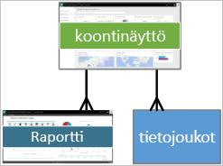

# Peruskäsitteet Power BI -palvelun kuluttajille

[!INCLUDE[consumer-appliesto-ynnm](../includes/consumer-appliesto-ynnm.md)]

[!INCLUDE [power-bi-service-new-look-include](../includes/power-bi-service-new-look-include.md)]

Tässä artikkelissa oletetaan, että olet jo lukenut [Power BI:n yleiskatsauksen](../fundamentals/power-bi-overview.md) ja tunnistat olevasi [Power BI **_-kuluttaja_** ](end-user-consumer.md). Kuluttajat saavat Power BI -sisältöä, kuten koontinäyttöjä ja raportteja, työtovereiltaan. Kuluttajat käyttävät Power BI -palvelua, joka on Power BI:n sivustopohjainen versio.

Sisällön vastaanottaminen muilta edellyttää Power BI Pro -käyttöoikeuden tai Power BI Premium -kapasiteetin käyttöoikeuden. [Tarkista käyttöoikeustyyppisi](end-user-license.md)

Olet varmasti jo kuullut termin ”Power BI Desktop” tai pelkkä ”Desktop”. Se on *suunnittelijoiden*, jotka luovat ja jakavat koontinäyttöjä kanssasi, käyttämä erillinen työkalu. On tärkeää tietää, että saatavilla on myös muita Power BI -työkaluja. Niin kauan kuin olet kuluttaja, käytät vain Power BI-palvelua. Tämä artikkeli koskee vain Power BI -palvelua.

## Terminologia ja käsitteet

Tämä artikkeli ei sisällä Power BI:hin liittyviä esittelykuvia, eikä tämä myöskään ole käytännönläheinen opas. Se on sijaan yleiskatsauksen sisältävä artikkeli, jonka avulla voit tutustua Power BI:n terminologiaan ja käsitteisiin. Opit näin tarvittavan sanaston ja saat tietoa Power BI:n toiminnasta. Voit tutustua Power BI -palveluun ja siinä siirtymiseen artikkelissa [Pikaopas – Power BI -palvelussa siirtyminen](end-user-experience.md).

## Power BI -palvelun avaaminen ensimmäistä kertaa

Useimmat Power BI -kuluttajat saavat Power BI -palvelun käyttöönsä, koska 1) heidän yrityksensä ostaa käyttöoikeuksia ja 2) järjestelmänvalvoja määrittää käyttöoikeudet kaltaisillesi työntekijöille.

Aloita avaamalla selain ja syötä **app.powerbi.com**. Kun avaat Power BI -palvelun ensimmäistä kertaa, näet jotain tämän kaltaista:

Käyttäessäsi Power BI:tä voit mukauttaa, mitä näet, kun avaat sivuston. Voit esimerkiksi määrittää, että Power BI avaa ensiksi **aloitussivun** tai suosikkikoontinäyttösi. Älä huolestu, tässä artikkelissa opetetaan, miten voit mukauttaa kokemustasi.

- [Esittelyssä Power BI:n aloitussivu ja yleinen haku](https://powerbi.microsoft.com/blog/introducing-power-bi-home-and-global-search)

- [Power BI -palvelun suositellut koontinäytöt](end-user-featured.md)

Mutta ennen kuin siirrymme eteenpäin, palataanpa takaisin Power BI -palvelun peruselementteihin.

_______________________________________________________

## Power BI -sisältö

### Peruselementtien esittely

Power BI:n viisi peruselementtiä kuluttajille ovat: **_visualisoinnit_** , **_koontinäytöt_** , **_raportit_** , **_sovellukset_** ja **_tietojoukot_** . Näihin viitataan joskus myös nimellä *Power BI* **_-sisältö_** . Tämä *sisältö* löytyy **_työtiloista_** . Tavallinen työnkulku sisältää kaikki peruselementit: Power BI -*suunnittelija* (keltaisella alla olevassa kaaviossa) kerää tietoja *tietojoukoista*, tuo ne Power BI:hin analyysia varten, luo  *raportteja*, jotka ovat täynnä kiinnostavia faktoja ja merkityksellisiä tietoja korostavia *visualisointeja*, kiinnittää raporttien visualisointeja koontinäyttöön ja jakaa raportit ja koontinäytöt kaltaisillesi *kuluttajille* (mustalla alla olevassa kaaviossa). *Suunnittelija* jakaa ne *sovellusten* tai muuntyyppisen jaetun sisällön muodossa.

Kaikista yksinkertaisimmillaan:

-  **_Visualisointi_** (tai *visuaali*) on Power BI *-suunnittelijoiden* luoma kaaviotyyppi. Visualisoinnit näyttävät tiedot *raporteista* ja *tietojoukoista*. *Suunnittelijat* luovat visualisointinsa yleensä Power BI Desktopissa.

    Katso lisätietoja artikkelista [Visualisointien käyttö raporteissa, koontinäytöissä ja sovelluksissa](end-user-visualizations.md).

-  *Tietojoukko* on tietojen säilö. Se voi olla esimerkiksi Maailman terveysjärjestön luoma Excel-tiedosto. Se voi olla myös yrityksen omistama asiakastietokanta tai vaikkapa Salesforce-tiedosto.  

-  *Koontinäyttö* on yksittäinen näyttö, joka sisältää vuorovaikutteisia visualisointeja, tekstiä ja kuvia. Koontinäyttö kerää sinulle tärkeimmät mittarit yhteen näyttöön, jotta voit löytää laajempia asiayhteyksiä tai vastauksia kysymyksiisi. Koontinäytön sisältö on peräisin yhdestä tai useammasta raportista sekä yhdestä tai useammasta tietojoukosta.

    Katso lisätietoja artikkelista [Koontinäytöt Power BI -palvelun kuluttajille](end-user-dashboards.md).

-  *Raportti* sisältää yhden tai useamman sivun vuorovaikutteisia visualisointeja, tekstiä ja kuvia, jotka yhdessä muodostavat yksittäisen raportin. Power BI -raportti perustuu yhteen tietojoukkoon. Palvelu järjestää raporttisivut usein siten, että ne käsittelevät keskeistä kiinnostavaa aihetta tai vastaavat yhteen kysymykseen.

    Katso lisätietoja artikkelista [Raportit Power BI:ssä](end-user-reports.md).

-  *Sovelluksen* avulla *suunnittelijat* voivat koota yhteen ja jakaa toisiinsa liittyviä koontinäyttöjä ja raportteja. *Kuluttajat* saavat osan sovelluksistaan automaattisesti, mutta he voivat myös hakea työtovereiden ja yhteisön luomia sovelluksia. Esimerkiksi käytössäsi mahdollisesti jo olevat ulkoiset palvelut, kuten Google Analytics ja Microsoft Dynamics CRM, tarjoavat Power BI -sovelluksia.

Tarkennuksena vielä, että kun olet uusi käyttäjä ja kirjaudut sisään Power BI:hin ensimmäistä kertaa, et vielä näe koontinäyttöjä, sovelluksia tai raportteja.

_______________________________________________________

## Tietojoukot

*Tietojoukko* on kokoelma tietoja, jotka *suunnittelijat* tuovat tai joihin he muodostavat yhteyden ja käyttävät sitten raporttien ja koontinäyttöjen luomiseen. Kuluttajana et voi käsitellä tietojoukkoja suoraan, mutta on silti hyvä ymmärtää, miten ne vaikuttavat palvelun yleiseen toimintaan.  

Jokainen tietojoukko edustaa yhtä tietolähdettä. Lähde voi olla esimerkiksi OneDriven Excel-työkirja, paikallisen SQL Server Analysis Servicesin taulukkomuotoinen tietojoukko tai Salesforce-tietojoukko. Power BI -palvelu tukee monia erilaisia tietolähteitä.

Kun suunnittelija jakaa sovelluksen kanssasi, näet, mitkä tietojoukot suunnittelija on sisällyttänyt sovellukseen.

Yhtä tietojoukkoa...

- raportin suunnittelija voi käyttää tietojoukkoa kerta toisensa jälkeen koontinäyttöjen ja raporttien luomiseksi

- tietojoukkoa voidaan käyttää monien erilaisten raporttien luomiseen

- tämän yhden tietojoukon visualisointeja voi näyttää useissa eri koontinäytöissä

  

Siirrytään seuraavaan peruselementtiin – visualisointeihin.

_______________________________________________________

## Visualisoinnit

Visualisoinnit (tunnetaan myös visuaaleina) näyttävät merkityksellisiä tietoja, jotka Power BI on löytänyt tiedoista. Visualisoinnit helpottavat merkityksellisen tiedon tulkitsemista, koska aivosi pystyy tulkitsemaan kuvaa nopeammin kuin esimerkiksi lukuja sisältävää laskentataulukkoa.

Power BI:ssa on esimerkiksi seuraavia visualisointeja: vesiputous, nauhakaavio, puukartta, ympyräkaavio, suppilo, kortti, pistekaavio ja mittari.

   

Tutustu [Power BI:hin sisältyvien visualisointien täydelliseen luetteloon](../visuals/power-bi-visualization-types-for-reports-and-q-and-a.md).

Myös yhteisösi voi luoda visualisointeja, joita kutsutaan *Power BI -visualisoinneiksi*. Jos et tunnista raportissa olevaa visualisointia, se on todennäköisesti mukautettu visualisointi. Jos et osaa tulkita mukautettua visualisointia, etsi raportin tai koontinäytön *suunnittelijan* yhteystiedot ja ota häneen yhteyttä.

Yksi raportin visualisointi...

- voi esiintyä useita kertoja samassa raportissa

- voi esiintyä useissa erilaisissa koontinäytöissä

_______________________________________________________

## Raportit

Power BI -raportti sisältää yhden tai useamman sivun verran visualisointeja, kuvia ja tekstiä. Kaikki raportin visualisoinnit ovat peräisin yhdestä tietojoukosta. *Suunnittelijat* jakavat raportteja *kuluttajien* kanssa, jotka [käsittelevät raportteja *lukunäkymässä*](end-user-reading-view.md).

Yksi raportti...

- voi liittyä useisiin koontinäyttöihin (tästä yhdestä raportista kiinnitettyjä ruutuja voi olla useissa koontinäytöissä).

- voidaan luoda käyttämällä vain yhden tietojoukon tietoja  

- voi olla osa useampia sovelluksia

  

_______________________________________________________

## Koontinäytöt

Koontinäyttö edustaa mukautettua näkymää pohjana olevan tietojoukon tai tietojoukkojen tietystä alijoukosta. *Suunnittelijat* luovat koontinäyttöjä ja jakavat ne *kuluttajien* kanssa joko sellaisenaan tai osana sovellusta. Koontinäyttö on yksittäinen piirtoalusta, joka sisältää *ruutuja*, kuvia ja tekstiä.

  

Ruutu on visualisoinnin hahmonnus, jonka *suunnittelija* *kiinnittää* esimerkiksi raportista koontinäyttöön. Jokainen kiinnitetty ruutu näyttää [visualisoinnin](end-user-visualizations.md), jonka suunnittelija on luonut tietojoukosta ja kiinnittänyt tähän koontinäyttöön. Ruutu voi myös sisältää kokonaisen raporttisivun, suoratoistotietoja tai videon. *Suunnittelijat* voivat lisätä ruutuja koontinäyttöihin monin tavoin. Niitä on liian monta, jotta voisimme käsitellä niitä kaikkia tässä yleiskatsauksen sisältävässä artikkelissa. Lisätietoja on artikkelissa [Koontinäyttöruudut Power BI:ssä](end-user-tiles.md).

Kuluttajat eivät voi muokata koontinäyttöjä. Voit kuitenkin lisätä kommentteja, tarkastella liittyviä tietoja, asettaa koontinäytön suosikiksi, tilata koontinäytön ja paljon muuta.

Mihin koontinäyttöjä käytetään?  Tässä on muutama esimerkki:

- Voit nähdä kaikki tarvittavat tiedot päätöksenteon tueksi yhdellä silmäyksellä.

- Voit valvoa liiketoimintasi tärkeimpiä tietoja.

- Voit varmistaa, että kaikki kollegat näkevät ja käyttävät samalla sivulla samoja tietoja.

- Voit valvoa esimerkiksi yrityksen, tuotteen, liiketoimintayksikön tai markkinointikampanjan menestymistä.

- Voit luoda itsellesi mukautetun näkymän suuremmasta koontinäytöstä ja valita siihen itsellesi tärkeimmät mittarit.

**YKSI** koontinäyttö...

- voi näyttää visualisointeja monista eri tietojoukoista

- voi näyttää visualisointeja monista eri raporteista

- voi näyttää visualisointeja, jotka on kiinnitetty muista työkaluista (esimerkiksi Excelistä)

  

_______________________________________________________

## Sovellukset

Nämä koontinäyttöjen ja raporttien kokoelmat auttavat järjestämään toisiinsa liittyvää sisältöä yhteen pakettiin. Power BI -*suunnittelijat* luovat ja jakavat niitä yksilöille, ryhmille, kokonaisille organisaatioille tai suuremmalle yleisölle. Kuluttajana voit olla varma siitä, että sinä ja työtoverisi käsittelette samoja tietoja – yhtä luotettavaa versiota totuudesta.

> [!NOTE]
> Sovellusten käyttäminen edellyttää Power BI Pro- tai Premium-käyttöoikeuden. 

Sovellukset on helppo löytää ja asentaa[Power BI -palvelussa](https://powerbi.com) ja mobiililaitteessa. Kun olet asentanut sovelluksen, sinun ei tarvitse muistaa monien erilaisten koontinäyttöjen nimiä. Ne löytyvät kaikki yhdestä sovelluksesta, selaimesta tai mobiililaitteesta.

Tämä sovellus sisältää kolme toisiinsa liittyvää koontinäyttöä ja kolme toisiinsa liittyvää raporttia, jotka yhdessä muodostavat yksittäisen sovelluksen.

Kun käytät sovelluksia,näet muutokset automaattisesti aina, kun sovelluksen tekijä julkaisee päivityksiä. Tekijä valvoo myös, kuinka usein Power BI päivittää tietoja. Sinun ei tarvitse huolehtia niiden pitämisestä ajan tasalla.

Voit hankkia sovelluksia parilla eri tavalla:

- Sovelluksen suunnittelija voi asentaa sovelluksen automaattisesti Power BI -tilillesi.

- Sovelluksen suunnittelija voi lähettää sinulle suoran linkin sovellukseen.

- Voit etsiä sovelluksia [Microsoft AppSourcesta](https://appsource.microsoft.com/marketplace/apps?product=power-bi), jossa näet kaikki käytettävissä olevat sovellukset.

Jos käytät Power BI:tä mobiililaitteella, et voi asentaa sovelluksia AppSourcen kautta vaan tarvitset suoran linkin. Jos sovelluksen suunnittelija asentaa sovelluksen automaattisesti, näet sen sovellusluettelossa.

Kun sovellus on asennettu, valitse se sovellusluettelosta ja valitse sitten koontinäyttö tai raportti, jonka haluat avata ja johon haluat tutustua ensin.

Toivottavasti tämä artikkeli on auttanut sinua ymmärtämään ne peruselementit, jotka muodostavat Power BI -palvelun kuluttajille.

## Seuraavat vaiheet

- Tutustu [sanastoon](end-user-glossary.md) ja lisää se kirjamerkkeihin

- [Tutustu Power BI -palveluun](end-user-experience.md)

- Lue [Power BI:n yleiskatsaus, joka on kirjoitettu erityisesti kuluttajia varten](end-user-consumer.md)

- Katso video, jossa Will kertoo peruskäsitteistä ja esittelee Power BI -palvelua.

    <iframe width="560" height="315" src="https://www.youtube.com/embed/B2vd4MQrz4M" frameborder="0" allowfullscreen></iframe>
