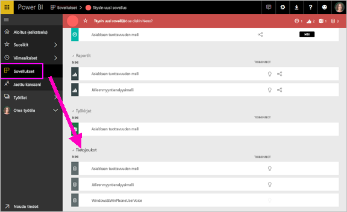
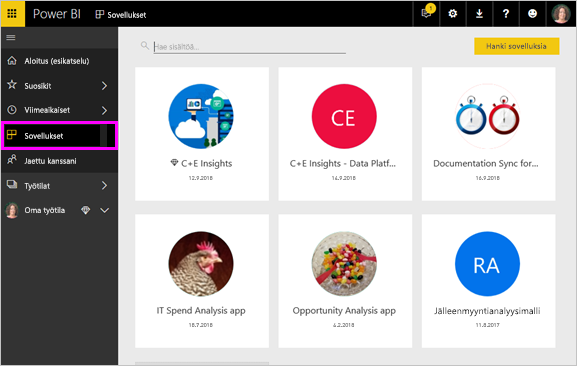

# Peruskäsitteet Power BI -palvelun ***kuluttajille***

## Power BI:n *kuluttajat* ja *suunnittelijat*
Tässä artikkelissa oletetaan, että olet jo lukenut kohdan [Power BI yleiskatsaus](../power-bi-overview.md) ja tunnistat olevasi Power BI -***kuluttaja***. Kuluttajat saavat Power BI -sisältöä, kuten koontinäyttöjä ja raportteja, työtovereiltaan. Kuluttajat käyttävät Power BI -palvelua, joka on Power BI:n sivustopohjainen versio. 

Jossain vaiheessa tulet näkemään termin ”Power BI Desktop” tai vain ”Desktop”. Tämä on erillinen työkalu, jota *suunnittelijat* käyttävät koontinäyttöjen ja raporttien luomiseen ja jakamiseen kanssasi. Sinun on hyvä tietää, että on olemassa muita Power BI -työkaluja, mutta niin kauan kuin olet kuluttaja, tulet työskentelemään vain Power BI -palvelun kanssa. Ja tämä artikkeli koskee vain Power BI -palvelua. 

## Terminologia ja käsitteet
Tämä artikkeli ei sisällä Power BI:hin liittyviä esittelykuvia, eikä tämä myöskään ole käytännönläheinen opas. Tämä artikkeli sisältää sen sijaan yleiskatsauksen, jonka avulla voit tutustua Power BI:n käsitteisiin ja terminologiaan. Opit tarvittavan sanaston ja saat tietoa siitä, kuinka Power BI toimii. Jos haluat tutustua Power BI -palveluun ja siinä siirtymiseen, tutustu kohtaan [Aloita esittely](end-user-experience.md).

## Power BI -palvelun avaaminen ensimmäistä kertaa
Useimmat Power BI -kuluttajat saavat Power BI -palvelun käyttöönsä, kun 1) heidän työnantajansa ostavat käyttöoikeuksia ja 2) järjestelmänvalvoja määrittää nämä käyttöoikeudet kaltaisillesi työntekijöille. 

Aloita avaamalla selain ja siirtymällä osoitteeseen **app.powerbi.com**. Kun avaat Power BI -palvelun ensimmäistä kertaa, tulet näkemään jotain tämän kaltaista.

Käyttäessäsi Power BI:tä voit mukauttaa, mitä näet, kun avaat sivuston.  Voit esimerkiksi määrittää, että Power BI avaa aloitussivun tai suosikkikoontinäyttösi. Ei kannata huolestua – kohta tiedät, miten tämä onnistuu. 
- [Aloituksen esikatselu](https://powerbi.microsoft.com/en-us/blog/introducing-power-bi-home-and-global-search)    
- [Sisällön määrittäminen **suositelluksi**](end-user-featured.md) 

Mutta ennen kuin siirrymme eteenpäin, palataan takaisin Power BI -palvelun peruselementteihin.

## Power BI -***sisältö***
### Peruselementtien esittely
Power BI:n viisi peruselementtiä kuluttajille ovat: ***visualisoinnit***, ***koontinäytöt***, ***raportit***, ***sovellukset*** ja  ***tietojoukot***. Näihin viitataan joskus myös nimellä *Power BI* -***sisältö***. Ja tämä *sisältö* löytyy ***työtiloista***. Tavallinen työnkulku sisältää kaikki nämä peruselementit:  Power BI -*suunnittelija* (keltaiset kohdat alla olevassa kaaviossa) kerää tietoja *tietojoukoista*, tuo ne Power BI:hin analyysia varten, luo  *raportteja*, jotka ovat täynnä kiinnostavia faktoja ja merkityksellisiä tietoja korostavia *visualisointeja*, kiinnittää raporttien visualisointeja raporttinäkymään ja jakaa raportit ja raporttinäkymät sinunlaisillesi *kuluttajille* (musta kohta alla olevassa kaaviossa) *sovellusten* ja muiden jaettujen sisältötyyppien avulla. 

Kaikista yksinkertaisimmillaan. 
*  ***visualisointi*** (tai *visual*) on Power BI -*suunnittelijan* luoma kaaviotyyppi, jossa on hyödynnetty *raporttien* ja *tietojoukkojen* tietoja. *Suunnittelijat* luovat visualisointinsa yleensä Power BI Desktopissa. 

    Katso lisätietoja artikkelista [Visualisoinnit Power BI:n *kuluttajille*](end-user-visualizations.md)

*  *Tietojoukko* on tiedolle tarkoitettu säilö. Se voi esimerkiksi olla Maailman terveysjärjestöltä peräisin oleva Excel-tiedosto, yrityksen omistama asiakastietokanta tai Salesforce-tiedosto.  

*  *Koontinäyttö* on yksittäinen näyttö, joka sisältää vuorovaikutteisia visualisointeja, tekstiä ja kuvia. Koontinäyttö kerää sinulle tärkeimmät mittarit yhteen näyttöön, jotta voit löytää laajempia asiayhteyksiä tai vastauksia kysymyksiisi. Koontinäytön sisältö on peräisin yhdestä tai useammasta raportista sekä yhdestä tai useammasta tietojoukosta.

    Katso lisätietoja artikkelista [Koontinäytöt Power BI:n *kuluttajille*](end-user-dashboards.md)

*  *Raportti* sisältää yhden tai useamman sivun sekä vuorovaikutteisia visualisointeja, tekstiä ja kuvia, jotka yhdessä muodostavat yksittäisen raportin. Raportti perustuu yhteen tietojoukkoon. Tyypillisesti raportissa olevat sivut järjestetään niin, että jokainen sivu keskittyy yhteen keskeiseen asiaan tai antaa vastauksen yksittäiseen kysymykseen.

    Katso lisätietoja artikkelista [Raportit Power BI:n *kuluttajille*](end-user-reports.md)

*  *Sovelluksien* avulla *suunnittelijat* voivat koota yhteen ja jakaa toisiinsa liittyviä koontinäyttöjä ja raportteja. *Kuluttajat* saavat osan sovelluksistaan automaattisesti, mutta he voivat myös hakea työtovereiden ja yhteisön luomia sovelluksia. Esimerkiksi käytössäsi mahdollisesti jo olevat ulkoiset palvelut, kuten Google Analytics ja Microsoft Dynamics CRM, tarjoavat Power BI -sovelluksia.

Tarkennuksena vielä, että kun olet uusi käyttäjä ja kirjaudut Power BI:hin ensimmäistä kertaa, sinulla ei ole koontinäyttöjä, sovelluksia tai raportteja. 
_______________________________________________________

## tietojoukot
*Tietojoukko* on kokoelma tietoja, jotka *suunnittelijat* tuovat tai joihin he muodostavat yhteyden ja käyttävät sitten raporttien ja koontinäyttöjen luomiseen. Kuluttajana et voi käsitellä tietojoukkoja suoraan, mutta on silti hyvää ymmärtää, miten ne vaikuttavat palvelun toimintaan.  

Jokainen tietojoukko edustaa yhtä tietolähdettä, kuten Excel-laskentataulukkoa OneDrivessa, paikallista taulukkomuotoista SSAS-tietojoukkoa tai Salesforce-tietojoukkoa. Palvelu tukee monia erilaisia tietolähteitä.

Kun suunnittelija jakaa sovelluksen kanssasi, näet, mitkä tietojoukot sisältyvät sovellukseen. 

**YHTÄ** tietojoukkoa...

* voi käyttää uudelleen ja uudelleen
* voi käyttää useissa erilaisissa raporteissa
* Tämän yhden tietojoukon visualisointeja voi näyttää useissa eri koontinäytöissä
  
  

Siirrytään seuraavaan peruselementtiin – visualisointeihin.
__________________________________________________________

## Visualisoinnit
Visualisoinnit näyttävät merkityksellisiä tietoja datasta. Visualisointi helpottaa merkityksellisen tiedon tulkitsemista, koska aivosi pystyy tulkitsemaan kuvaa nopeammin kuin esimerkiksi lukuja täynnä olevaa laskentataulukkoa.

Power BI:ssa visualisointeja voi järjestää esimerkiksi seuraavanlaisiin muotoihin: vesiputous, nauhakaavio, puukartta, ympyräkaavio, suppilo, kortti, pistekaavio ja mittari. Tutustu [Power BI:hin sisältyvien visualisointien täydelliseen luetteloon](../power-bi-visualization-types-for-reports-and-q-and-a.md).

   

Myös yhteisösi voi luoda omia visualisointeja, joita kutsutaan *mukautetuiksi visualisoinneiksi*. Jos et tunnista raportissa olevaa visualisointia, se on todennäköisesti mukautettu visualisointi. Jos et osaa tulkita saamaasi mukautettua visualisointia, <!--[look up the name of the report or dashboard *designer*](end-user-owner.md)-->etsi raportin tai koontinäytön *suunnittelijan* yhteystiedot ja ota häneen yhteyttä.

**YHTÄ** visualisointia raportissa...

* voi kopioida ja liittää uudelleen ja uudelleen saman raportin sisällä.
* voi käyttää useissa erilaisissa koontinäytöissä
__________________________________________________
## Raportit
Power BI -raportti sisältää yhden tai useamman sivun verran visualisointeja, kuvia ja tekstiä. Kaikki raportin visualisoinnit ovat peräisin yhdestä tietojoukosta. *Suunnittelijat* jakavat raportteja *kuluttajien* kanssa, jotka [käsittelevät raportteja *lukunäkymässä*](end-user-reading-view.md).

**YKSI** raportti...

* voi liittyä useisiin koontinäyttöihin (tästä yhdestä raportista kiinnitettyjä ruutuja voi olla useissa koontinäytöissä).
* luodaan käyttämällä vain yhden tietojoukon tietoja.  
* voi olla osa useampia sovelluksia
  
  

________________________________________________

## koontinäytöt
Koontinäyttö edustaa mukautettua näkymää pohjana olevan tietojoukon tai tietojoukkojen tietystä alijoukosta. *Suunnittelijat* luovat koontinäyttöjä ja jakavat ne *kuluttajien* kanssa joko sellaisenaan tai osana sovellusta. Koontinäyttö on yksittäinen kangas, joka sisältää *ruutuja*, kuvia ja tekstiä. 

  

Ruutu on visualisoinnin hahmonnus, jonka *suunnittelija* *kiinnittää* esimerkiksi raportista koontinäyttöön.  Jokainen kiinnitetty ruutu näyttää [visualisoinnin](end-user-visualizations.md), joka on luotu tietojoukosta ja kiinnitetty kyseiseen koontinäyttöön. Ruutu voi myös sisältää kokonaisen raporttisivun, suoratoistotietoja tai videon. *Suunnittelijat* voivat lisätä ruutuja koontinäyttöihin monella tavalla, joista kaikkia ei käsitellä tässä yleiskatsauksessa. Lisätietoja on artikkelissa [Koontinäyttöruudut Power BI:ssä](end-user-tiles.md). 

Kuluttajat eivät voi muokata koontinäyttöjä. Voit kuitenkin lisätä kommentteja, tarkastella liittyviä tietoja, asettaa koontinäytön suosikiksi, tilata koontinäytön ja paljon muuta. 

Mihin koontinäyttöjä käytetään?  Tässä on muutama esimerkki:

* Voit nähdä kaikki tarvittavat tiedot päätöksenteon tueksi yhdellä silmäyksellä.
* Voit valvoa liiketoimintasi tärkeimpiä tietoja.
* Voit varmistaa, että kollegat näkevät ja käyttävät samoja, ajantasaisia tietoja.
* Voit valvoa yrityksen, liiketoimintayksikön, tuotteen tai markkinointikampanjan menestymistä.
* Voit luoda itsellesi mukautetun näkymän suuremmasta koontinäytöstä ja valita siihen itsellesi tärkeimmät mittarit.

**YKSI** koontinäyttö...

* voi näyttää visualisointeja monista eri tietojoukoista
* voi näyttää visualisointeja monista eri raporteista
* voi näyttää visualisointeja, jotka on kiinnitetty muista työkaluista (esimerkiksi Excelistä)
  
  

________________________________________________

## Sovellukset
Nämä koontinäyttöjen ja raporttien kokoelmat auttavat järjestämään toisiinsa liittyvää sisältöä yhteen pakettiin. Power BI -*suunnittelijat* luovat ja jakavat niitä yksilöille, ryhmille, kokonaisille organisaatioille tai suuremmalle yleisölle. Kuluttajana voit olla varma siitä, että sinä ja työtoverisi käsittelette samoja tietoja – yhtä luotettavaa versiota totuudesta. 

Sovelluksia on helppo löytää ja asentaa Power BI -palveluun (https://powerbi.com) ja mobiililaitteeseen. Kun olet asentanut sovelluksen, sinun ei tarvitse muistaa monien eri raporttinäkymien nimiä, sillä ne ovat kaikki yhdessä sovelluksessa, selaimessa tai mobiililaitteessa. 

Tämä sovellus sisältää kolme toisiinsa liittyvää koontinäyttöä ja kolme toisiinsa liittyvää raporttia, jotka yhdessä muodostavat yksittäisen sovelluksen.

Kun käytät sovelluksia,näet muutokset automaattisesti aina, kun sovelluksen tekijä julkaisee päivityksiä. Tekijä määrittää myös, kuinka usein tiedot ajoitetaan päivittymään, joten sinun ei tarvitse huolehtia niiden pitämisestä ajan tasalla.

Voit hankkia sovelluksia muutamilla eri tavoilla. Sovelluksen suunnittelija voi asentaa sovelluksen automaattisesti Power BI -tiliisi tai lähettää sinulle suoran linkin sovellukseen. Voit myös etsiä sovellusta Microsoft AppSourcessa, jossa näet kaikki käytettävissäsi olevat sovellukset. Jos käytät Power BI:tä mobiililaitteella, et voi asentaa sovelluksia AppSourcen kautta vaan tarvitset suoran linkin. Jos sovelluksen suunnittelija asentaa sovelluksen automaattisesti, näet sen sovellusluettelossa.

Kun sovellus on asennettu, valitse se sovellusluettelosta ja valitse sitten koontinäyttö tai raportti, johon haluat tutustua ensin.   

Toivottavasti tämä artikkeli on auttanut sinua ymmärtämään ne peruselementit, jotka muodostavat Power BI -palvelun kuluttajille. 

## Seuraavat vaiheet
- Tutustu [sanastoon](end-user-glossary.md) ja lisää se kirjamerkkeihin    
- Tutustu [Power BI -palveluun](end-user-experience.md)
- Lue [Power BI:n yleiskatsaus, joka on kirjoitettu erityisesti kuluttajia varten](end-user-consumer.md)    
- Katso video, jossa Will kertoo peruskäsitteistä ja esittelee Power BI -palvelua. <iframe width="560" height="315" src="https://www.youtube.com/embed/B2vd4MQrz4M" frameborder="0" allowfullscreen></iframe>