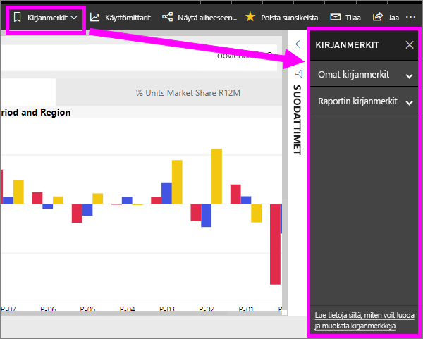
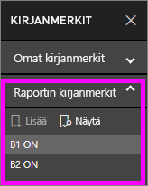
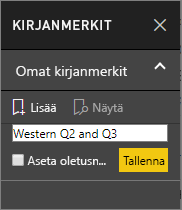
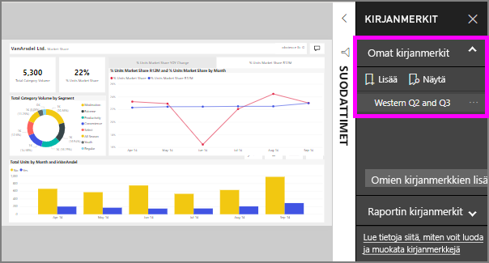

# Mitä ovat kirjanmerkit?
Kirjanmerkkien siepata määritetyn näkymän raportin sivun, mukaan lukien suodattimet, osittajat ja visualisointien tila. Kun valitset kirjanmerkin, Power BI Vie sinut takaisin sitä. Kirjanmerkkien kahdenlaisia – ne, voit luoda itsellesi ja raportin luomia *suunnittelijat*.

## Kirjanmerkkien avulla voit jakaa merkityksellisiä tietoja ja koostaa tarinoita Power BI:ssä 
Kirjanmerkeille on useita kirjanmerkkien. Oletetaan, että mielenkiintoisia merkityksellisiä tietoja mielenkiintoisten ne olisivat – Luo kirjanmerkin, jotta voit palauttaa myöhemmin. Jätä ja haluat säilyttää nykyisen, kirjanmerkin luominen uudelleen. Voit tehdä raportin, niin aina, kun oletusnäkymä palauttaa, Näytä raporttisivu avautuu ensin kirjanmerkin. 

Voit myös luoda kokoelman kirjanmerkkejä ja järjestää ne haluamaasi järjestykseen ja myöhemmin käydä läpi jokaisen kirjanmerkin esitystä ja korostaa merkityksellisiä tietoja, jotka Tarinan kertomiseen.  

## Kirjanmerkkien käyttäminen
Avaa kirjanmerkit-ruutu valitsemalla **kirjanmerkit** valikkoriviltä. Voit palata alkuperäiseen julkaistun näkymää raportista, valitse **Palauta oletukset**.

### Raportin kirjanmerkit
Jos raportti *suunnittelutyökalu* sisällyttää raportin kirjanmerkit, löydät ne kohtaan **raportin kirjanmerkit** otsikon. 

Valitse kirjanmerkki muuttamiseksi kyseisen raporttinäkymään. 

### Omat kirjanmerkit

Kun luot kirjanmerkin, seuraavat elementit tallennetaan sen mukana:

* Nykyinen sivu
* Suodattimet
* Osittajat, mukaan lukien osittajan tyyppi (esimerkiksi avattava luettelo tai luettelo) ja osittajan tila
* Visualisoinnin valinnan tila (kuten ristiinkorostussuodattimet)
* Lajittelujärjestys
* Porautumissijainti
* Näkyvyys (objektin näkyvyys **Valinta**-ruutua käyttämällä)
* Näkyvien objektien kohdistus- tai **korostus**-tilat

Määritä raporttisivu sellaiseksi kuin haluat sen näkyvän kirjanmerkissä. Kun raporttisivu ja visualisoinnit ovat sellaisessa järjestyksessä kuin haluat, lisää kirjanmerkki valitsemalla **Kirjanmerkit**-ruudusta **Lisää**. Tässä esimerkissä Olemme lisänneet joitakin suodattimia alue ja päivämäärä. 

**Power BI** Luo kirjanmerkin ja antaa sille yleisen nimen tai voit antaa nimi. Voit myös *nimeä*, *poistaa*, tai *päivittää* valitsemalla kirjanmerkin nimen vieressä kolme pistettä, valitse sitten haluamasi toiminto avautuvasta valikosta.

Kun olet lisännyt kirjanmerkin, voit näyttää sen valitsemalla kirjanmerkin- **kirjanmerkit** ruudussa. 

<!--
## Arranging bookmarks
As you create bookmarks, you might find that the order in which you create them isn't necessarily the same order you'd like to present them to your audience. No problem, you can easily rearrange the order of bookmarks.

In the **Bookmarks** pane, simply drag-and-drop bookmarks to change their order, as shown in the following image. The yellow bar between bookmarks designates where the dragged bookmark will be placed.

The order of your bookmarks can become important when you use the **View** feature of bookmarks, as described in the next section. 

-->

## Kirjanmerkit diaesityksenä
Voit esittää tai tarkastele kirjanmerkit, järjestyksessä valitsemalla **Näytä** - **kirjanmerkit** ruudussa voit aloittaa diaesityksen.

**Näytä**-tilassa on tiettyjä merkille pantavia ominaisuuksia:

1. Kirjanmerkin nimi näkyy kankaan alareunan otsikkorivillä.
2. Kirjanmerkin otsikkorivillä on nuolia, joilla siirtyä seuraavaan tai edelliseen kirjanmerkkiin.
3. Voit poistua **Näytä**-tilasta valitsemalla **Kirjanmerkit**-ruudusta **Lopeta** tai **X**-kuvake kirjanmerkin otsikkoriviltä. 

Kun olet **Näytä**-tilassa, voit sulkea **Kirjanmerkit**-ruudun napsauttamalla X-kuvaketta, niin saat enemmän tilaa esitykselle. **Näytä**-tilassa kaikki visualisoinnit ovat vuorovaikutteisia ja käytettävissä ristiinkorostukseen samalla tavalla kuin muutoinkin niitä käsiteltäessä. 

<!--
## Visibility - using the Selection pane
With the release of bookmarks, the new **Selection** pane is also introduced. The **Selection** pane provides a list of all objects on the current page and allows you to select the object and specify whether a given object is visible. 

You can select an object using the **Selection** pane. Also, you can toggle whether the object is currently visible by clicking the eye icon to the right of the visual. 

When a bookmark is added, the visible status of each object is also saved based on its setting in the **Selection** pane. 

It's important to note that **slicers** continue to filter a report page, regardless of whether they are visible. As such, you can create many different bookmarks, with different slicer settings, and make a single report page appear very different (and highlight different insights) in various bookmarks.

## Bookmarks for shapes and images
You can also link shapes and images to bookmarks. With this feature, when you click on an object, it will show the bookmark associated with that object. This can be especially useful when working with buttons; you can learn more by reading the article about [using buttons in Power BI](desktop-buttons.md). 

To assign a bookmark to an object, select the object, then expand the **Action** section from the **Format Shape** pane, as shown in the following image.

Once you turn the **Action** slider to **On** you can select whether the object is a back button, a bookmark, or a Q&A command. If you select bookmark, you can then select which of your bookmarks the object is linked to.

There are all sorts of interesting things you can do with object-linked bookmarking. You can create a visual table of contents on your report page, or you can provide different views (such as visual types) of the same information, just by clicking on an object.

When you are in editing mode you can use ctrl+click to follow the link, and when not in edit mode, simply click the object to follow the link. 

## Bookmark groups

Beginning with the August 2018 release of **Power BI Desktop**, you can create and use bookmark groups. A bookmark group is a collection of bookmarks that you specify, which can be shown and organized as a group. 

To create a bookmark group, hold down the CTRL key and select the bookmarks you want to include in the group, then click the ellipses beside any of the selected bookmarks, and select **Group** from the menu that appears.

**Power BI Desktop** automatically names the group *Group 1*. Fortunately, you can just double-click on the name and rename it to whatever you want.

With any bookmark group, clicking on the bookmark group's name only expands or collapses the group of bookmarks, and does not represent a bookmark by itself. 

When using the **View** feature of bookmarks, the following applies:

* If the selected bookmark is in a group when you select **View** from bookmarks, only the bookmarks *in that group* are shown in the viewing session. 

* If the selected bookmark is not in a group, or is on the top level (such as the name of a bookmark group), then all bookmarks for the entire report are played, including bookmarks in any group. 

To ungroup bookmarks, just select any bookmark in a group, click the ellipses, and then select **Ungroup** from the menu that appears. 

Note that selecting **Ungroup** for any bookmark from a group takes all bookmarks out of the group (it deletes the group, but not the bookmarks themselves). So to remove a single bookmark from a group, you need to **Ungroup** any member from that group, which deletes the grouping, then select the members you want in the new group (using CTRL and clicking each bookmark), and select **Group** again. 
-->

## Rajoitukset ja huomioitavat asiat
Tähän versioon **kirjanmerkkitoiminnosta** liittyy tiettyjä rajoituksia ja huomioitavia asioita.

* Useimmat mukautetut visualisoinnit toimivat yleensä hyvin kirjanmerkeissä. Jos kohtaat ongelmia kirjanmerkkien ja mukautetun visualisoinnin kanssa, ota yhteyttä kyseisen visualisoinnin tekijään ja pyydä häntä lisäämään kirjanmerkkituen visualisointiin. 
* Jos lisäät visualisoinnin raporttisivulle kirjanmerkin luomisen jälkeen, visualisointi näkyy oletustilassaan. Tämä tarkoittaa myös sitä, että jos lisäät osittajan sivulle, jolle on aiemmin luotu kirjanmerkkejä, osittaja toimii oletustilassaan.
* Visualisointien siirtely kirjanmerkin luomisen jälkeen näkyy kirjanmerkissä. 
* Yleensä kirjanmerkit tämä ei vaikuta Jos raportin *suunnittelutyökalu* päivittää tai julkaisee raportin kirjan uudelleen. Kuitenkin jos suunnittelutoiminnon tekee merkittäviä muutoksia raporttiin, kuten poistamalla kenttiä kirjanmerkin, käyttää sitten näyttöön tulee virhesanoma seuraavan kerran yrität avata kyseisen kirjanmerkin. 

<!--
## Next steps
spotlight?
-->
