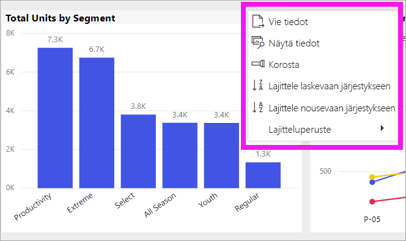
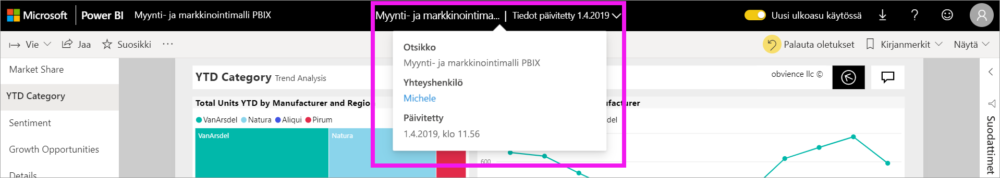

# Power BI -raportin kaavion lajittelutavan vaihtaminen

[!INCLUDE[consumer-appliesto-ynny](../includes/consumer-appliesto-ynny.md)]

> [!IMPORTANT]
> **Tämä artikkeli on tarkoitettu Power BI -käyttäjille, joilla ei ole raportin tai tietojoukon muokkausoikeuksia ja jotka käyttävät vain Power BI:n verkkoversiota (Power BI -palvelu). Jos olet raportin *suunnittelija* tai *järjestelmänvalvoja* tai *omistaja*, tässä artikkelissa ei välttämättä ole kaikkia tarvitsemiasi tietoja. Tutustu siinä tapauksessa artikkeliin [Sarakkeen perusteella lajittelu Power BI Desktopissa](../desktop-sort-by-column.md)** .

Voit muuttaa visualisoinnin ulkoasua Power BI -palvelussa lajittelemalla sen eri tietokenttien mukaan. Muuttamalla visualisoinnin lajittelua voit korostaa välitettäviä tietoja. Voit lajitella visualisoinnit haluamallasi tavalla, olipa käytössä siten numeerisia tietoja (kuten myyntilukuja) tai tekstiä (kuten osavaltioiden nimiä). Power BI tarjoaa käyttöösi joustavat lajitteluvaihtoehdot ja pikavalikot. 

Koontinäytön visualisointeja ei voi lajitella, mutta Power BI -raportissa voit lajitella useimmat visualisoinnit 

## Aloittaminen

Aloita avaamalla sinulle jaettu raportti. Valitse visualisointi (joka voidaan lajitella) ja sitten **Lisää toimintoja** (...).  Lajitteluvaihtoehtoja on kolme: **Lajittele laskevaan järjestykseen**, **Lajittele nousevaan järjestykseen** ja **Lajitteluperuste**. 
    

### Lajittele aakkosjärjestykseen tai numeerisesti

Visualisoinnit voidaan lajitella aakkosjärjestykseen visualisoinnin luokkien tekstimuotoisten nimien tai kunkin luokan numeroiden mukaan. Tässä esimerkissä kaavio on lajiteltu aakkosjärjestykseen myymälän **nimi** -X-akselin mukaan.

Lajittelu on helppo vaihtaa luokasta (myymälän nimi) arvoon (myynti/neliöjalka). Valitse **Lisää toimintoja** (...) ja valitse **Lajitteluperuste**. Valitse visualisoinnissa käytettävä lukuarvo.  Tässä esimerkissä olemme valinneet arvon **Sales per sq ft**.

Muuta tarvittaessa lajittelujärjestystä nousevaksi tai laskevaksi.  Valitse uudelleen **Lisää toimintoja** (...) ja valitse sitten **Lajittele laskevaan järjestykseen** tai **Lajittele nousevaan järjestykseen**. Lajitteluperusteena oleva kenttä näkyy lihavoituna ja siinä on keltainen palkki.

   

> [!NOTE]
> Kaikki visualisoinnit eivät ole lajiteltavissa. Esimerkiksi seuraavia visualisointeja ei voi lajitella: Puukartta, Kartta, Täytetty kartta, Pistekaavio, Mittari, Kortti, Vesiputous.

## Lajittelujärjestyksen muutosten tallentaminen
Power BI -raportit säilyttävät suodattimet, osittajat, lajittelun ja muut tietojen näyttötapaan tekemäsi muutokset, vaikka työskentelet [lukunäkymässä](end-user-reading-view.md). Jos poistut raportista ja palaat myöhemmin takaisin, lajittelua koskevat muutoksesi pysyvät voimassa.  Jos haluat palauttaa raportin *suunnittelijan* asetukset takaisin käyttöön, valitse **Palauta oletukset** ylemmältä valikkoriviltä. 

Jos **Palauta oletukseksi** -painike on harmaana, raportin *suunnittelija* on poistanut käytöstä mahdollisuuden tallentaa (pysyvät) muutokset.

## Huomioon otettavat seikat ja vianmääritys

### Lajittelu muilla ehdoilla
Joskus visualisoinnin lajittelussa on käytettävä toista kenttää (joka ei sisälly visualisointiin) tai ehtoa.  Tarpeena voi olla esimerkiksi tietojen lajittelu kuukauden mukaisessa järjestyksessä (eikä aakkosjärjestyksessä) tai vaikkapa koko numerojonon mukaan luvun sijasta (esimerkiksi 0, 1, 9, 20 eikä 0, 1, 20, 9).  

Vain raportin luonut henkilö voi tehdä nämä muutokset puolestasi. *Suunnittelijan* yhteystiedot löytyvät valitsemalla raportin nimen otsikkoriviltä.

Jos olet *suunnittelija*  ja sinulla on sisällön muokkausoikeudet, lue [Sarakkeen perusteella lajittelu Power BI Desktopissa](../desktop-sort-by-column.md), niin opit päivittämään tietojoukon ja ottamaan käyttöön tämän tyyppisen lajittelun.

## Seuraavat vaiheet
Lue lisätietoja [Power BI -raporttien visualisoinneista](end-user-visualizations.md).

[Power BI:n peruskäsitteet](end-user-basic-concepts.md)
