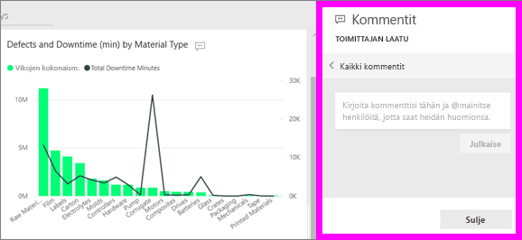
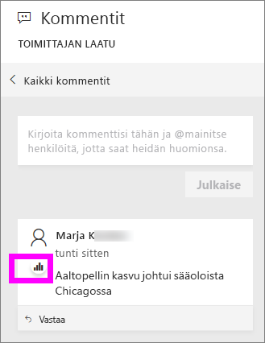
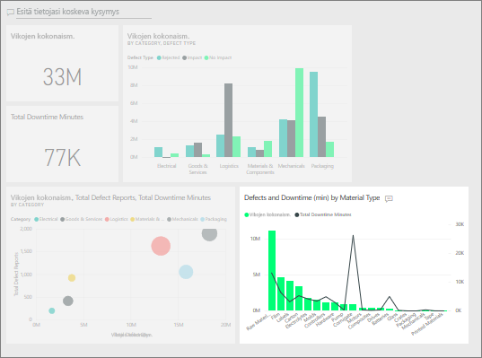

# Kommenttien lisääminen koontinäyttöön
Lisää henkilökohtainen kommentti tai aloita keskustelu koontinäytöstä työtovereidesi kanssa. **Kommentti**-ominaisuus on vain yksi tapa, jolla *kuluttaja* voi tehdä yhteistyötä muiden kanssa. 

## Kommentti-toiminnon käyttäminen
Voit lisätä kommentteja koko koontinäyttöön tai koontinäytön yksittäisiin visualisointeihin. Voit lisätä yleisen kommentin tai tietyille työtovereille tarkoitetun kommentin.  

### Yleisen kommentin lisääminen koontinäyttöön
1. Avaa Power BI -koontinäyttö ja valitse **Kommentit**-kuvake. Kommentit-valintaikkuna avautuu.

    

    Tässä näemme, että koontinäytön tekijä on jo lisännyt yleisen kommentin.  Kuka tahansa koontinäytön käyttöoikeudet omaava voi nähdä tämän kommentin.

    

2. Jos haluat vastata, valitse **Vastaa**, kirjoita vastauksesi ja valitse **Julkaise**.  

    

    Power BI ohjaa vastauksesi oletusarvoisesti sille työtoverillesi, joka on aloittanut kommenttiketjun eli tässä tapauksessa Aaron F:lle. 

    

 3. Jos haluat lisätä koontinäyttöön kommentin, joka ei kuulu olemassa olevaan ketjuun, kirjoita kommenttisi ylempään tekstikenttään.

    

    Tämän koontinäytön kommentit näyttävät nyt tältä.

    

### Kommentin lisääminen koontinäytön tiettyyn visualisointiin
1. Osoita visualisointia ja napsauta kolmea pistettä (...).    
2. Valitse avattavasta valikosta **Lisää kommentti**.

      

3.  **Kommentit**-valintaikkuna avautuu. Tässä visualisoinnissa ei ole vielä kommentteja. 

      

4. Kirjoita kommenttisi ja valitse **Julkaise**.

      

    Kaaviokuvake  kertoo meille, että tämä kommentti liittyy tiettyyn visualisointiin. Korosta kyseinen visualisointi koontinäytössä valitsemalla kuvake.

    

5. Palaa koontinäyttöön tai raporttiin valitsemalla **Sulje**.

### Käytä @-merkkiä työtovereiden huomion saamiseksi
Kun lisäät kommentin koontinäyttöön tai kommentoit tiettyä visualisointia, käytä @-merkkiä työtovereiden huomion saamiseksi.  Kun kirjoitat @-merkin, Power BI:ssä avautuu avattava valikko, josta voit etsiä ja valita organisaatiosi henkilöitä. @-merkin perässä olevat vahvistetut nimet näkyvät sinisinä. 

Tässä on keskusteluni visualisoinnin *suunnittelijan* kanssa. Hän käyttää @-merkkiä, jotta varmasti näen kommentin. Tiedän, että tämä kommentti on minulle. Kun avaan tämän sovelluksen koontinäytön Power BI:ssä, valitsen **Kommentit** otsikosta. Keskustelumme on näkyvissä **Kommentit**-ruudulla.

  

## Seuraavat vaiheet
Takaisin [kuluttajien visualisointeihin](end-user-visualizations.md)    
<!--[Select a visualization to open a report](end-user-open-report.md)-->