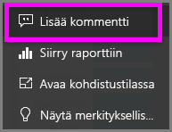
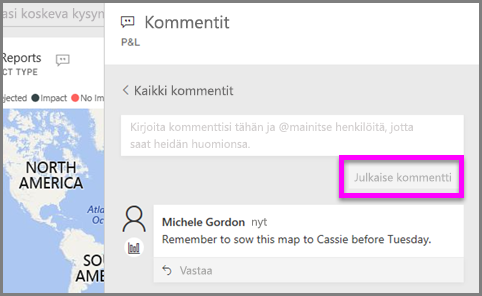
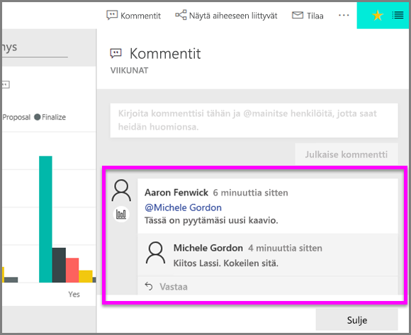

# Kommenttien lisääminen visualisointiin
Lisää henkilökohtainen kommentti tai aloita keskustelu visualisoinnista työtovereidesi kanssa. **Kommentti**-ominaisuus on vain yksi tapa, jolla *kuluttaja* voi käsitellä visualisointia. 

## Kommentti-toiminnon käyttäminen

1. Osoita visualisointia ja napsauta kolmea pistettä (...).    
2. Valitse avattavasta valikosta **Lisää kommentti**.

      

3.  Kirjoita kommenttisi ja valitse **Julkaise kommentti**. Tämä on kommentti itselleni, kirjoitusvirheillä.

      

4. Tässä on keskusteluni visualisoinnin *suunnittelijan* kanssa. Hän käyttää @-merkkiä, jotta varmasti näen kommentin. Tiedän, että tämä kommentti on minulle. Kun avaan tämän sovelluksen koontinäytön Power BI:ssä, valitsen **Kommentit** otsikosta. Keskustelumme on näkyvissä **Kommentit**-ruudulla. 

      

5. Palaa koontinäyttöön tai raporttiin valitsemalla **Sulje**.

## Seuraavat vaiheet
Takaisin [kuluttajien visualisointeihin](end-user-visualizations.md)    
<!--[Select a visualization to open a report](end-user-open-report.md)-->