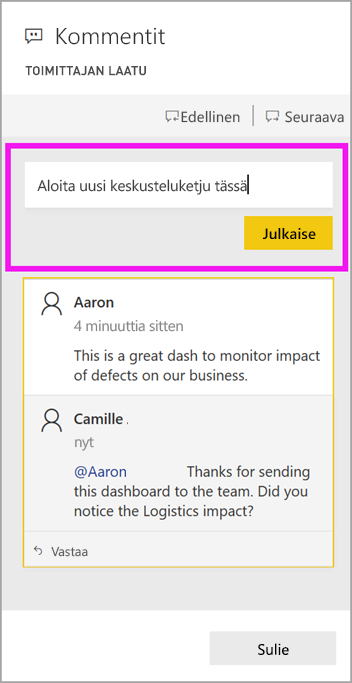
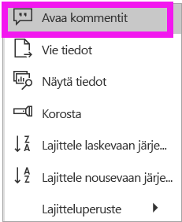

# Kommenttien lisääminen koontinäyttöön tai raporttiin

[!INCLUDE[consumer-appliesto-ynny](../includes/consumer-appliesto-ynny.md)]

[!INCLUDE [power-bi-service-new-look-include](../includes/power-bi-service-new-look-include.md)]

Lisää henkilökohtainen kommentti tai aloita keskustelu koontinäytöstä tai raportista työtovereidesi kanssa. **Kommentti**-ominaisuus on vain yksi tapa, jolla *kuluttaja* voi tehdä yhteistyötä muiden kanssa. 

> [!NOTE]
> Yhteistyön tekeminen muiden kanssa, mukaan lukien kommenttien lisääminen jaettuihin raportteihin, edellyttää Power BI Pro- tai Premium-käyttöoikeuden. [Mikä tyyppinen käyttöoikeus minulla on?](end-user-license.md)

## Kommentti-toiminnon käyttäminen
Voit lisätä kommentteja koko koontinäyttöön, koontinäytön yksittäisiin visualisointeihin, raporttisivulle, sivutettuun raporttiin ja raporttisivun yksittäisiin visualisointeihin. Voit lisätä yleisen kommentin tai tietyille työtovereille tarkoitetun kommentin.  

Kun lisäät kommentin raporttiin, Power BI tallentaa nykyiset suodatin- ja osittaja-arvot. Tämä tarkoittaa sitä, että kun valitset kommentin tai vastaat siihen, raporttisivu tai raportin visualisointi voi muuttua näyttämään suodatus- ja osittajavalinnat, jotka olivat aktiivisia, kun kommentti lisättiin ensimmäistä kertaa.  

Miksi tämä on tärkeää? Oletetaan, että työtoveri on käyttänyt suodatinta, joka paljasti mielenkiintoisen merkityksellisen tiedon, jonka hän haluaa jakaa työryhmän kanssa. Jos tätä suodatinta ei ole valittu, kommentissa ei ehkä ole järkeä.

Jos käytät sivutettua raporttia, voit lisätä vain raporttiasi koskevan yleisen kommentin.  Sivutetun raportin yksittäisiä visualisointeja koskeville kommenteille ei ole saatavissa tukea.

### Yleisen kommentin lisääminen koontinäyttöön tai raporttiin
Prosessit kommenttien lisäämiseksi koontinäyttöön tai raporttiin muistuttavat toisiaan.  Tässä esimerkissä käytetään koontinäyttöä. 

1. Avaa Power BI -koontinäyttö tai raportti ja valitse **Kommentit**-kuvake. Kommentit-valintaikkuna avautuu.

    

    Tässä näemme, että koontinäytön tekijä on jo lisännyt yleisen kommentin.  Kuka tahansa koontinäytön käyttöoikeudet omaava voi nähdä tämän kommentin.

    

2. Jos haluat vastata, valitse **Vastaa**, kirjoita vastauksesi ja valitse **Julkaise**.  

    

    Power BI ohjaa vastauksesi oletusarvoisesti sille työtoverillesi, joka on aloittanut kommenttiketjun eli tässä tapauksessa Aaronille. 

    

 3. Jos haluat lisätä kommentin, joka ei kuulu olemassa olevaan ketjuun, kirjoita kommenttisi ylempään tekstikenttään.

    

    Tämän koontinäytön kommentit näyttävät nyt tältä.

    

### Kommentin lisääminen koontinäytön tai raportin tiettyyn visualisointiin
Sen lisäksi, että voit lisätä kommentteja koko koontinäyttöön tai koko raporttisivulle, voit lisätä kommentteja koontinäytön yksittäisiin ruutuihin ja raportin yksittäisiin visualisointeihin. Prosessit ovat samankaltaisia, ja tässä esimerkissä käytetään raporttia.

1. Osoita visualisointia ja valitse **Lisää vaihtoehtoja** (...).    
2. Valitse avattavasta valikosta **Avaa kommentit**.

      

3.  **Kommentit**-valintaikkuna avautuu, ja muut sivulla olevat visualisoinnit näkyvät harmaana. Tässä visualisoinnissa ei ole vielä kommentteja. 

      

4. Kirjoita kommenttisi ja valitse **Julkaise**.

      

    - Kun valitset raporttisivulla visualisoinnille tehdyn kommentin, visualisointi korostetaan (ks. yllä).

    - Koontinäytössä kaaviokuvake  ilmaisee, että kommentti liittyy tiettyyn visualisointiin. Koko koontinäyttöä koskevat kommentit eivät sisällä erityistä kuvaketta. Kaaviokuvakkeen valitseminen korostaa siihen liittyvän visualisoinnin koontinäytössä.
    

    

5. Palaa koontinäyttöön tai raporttiin valitsemalla **Sulje**.

### Käytä @-merkkiä työtovereiden huomion saamiseksi
Kun lisäät kommentin koontinäyttöön, raporttiin, ruutuun tai visualisointiin, käytä \@-merkkiä työtovereiden huomion saamiseksi.  Kun kirjoitat \@-merkin, Power BI:ssä avautuu avattava valikko, josta voit etsiä ja valita organisaatiosi henkilöitä. \@-merkin perässä olevat vahvistetut nimet näkyvät sinisinä. 

Tässä on keskusteluni visualisoinnin *suunnittelijan* kanssa. Hän käyttää @-merkkiä, jotta varmasti näen kommentin. Tiedän, että tämä kommentti on minulle. Kun avaan tämän sovelluksen koontinäytön Power BI:ssä, valitsen **Kommentit** otsikosta. Keskustelumme on näkyvissä **Kommentit**-ruudulla.

  

## Seuraavat vaiheet
Takaisin [kuluttajien visualisointeihin](end-user-visualizations.md)    
<!--[Select a visualization to open a report](end-user-open-report.md)-->
