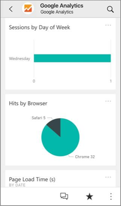
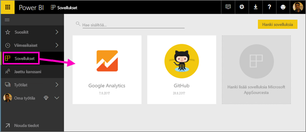
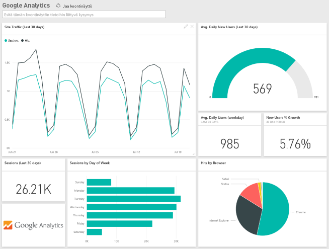
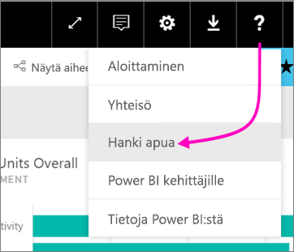

# Käyttämiesi palveluiden yhdistäminen Power BI:hin

Kun olet asentanut sovelluksen, voit tarkastella raporttinäkymää ja raportteja Power BI -palvelussa ([https://powerbi.com](https://powerbi.com)) ja Power BI -mobiilisovelluksissa. 

## Aloittaminen
[!INCLUDE [powerbi-service-apps-get-more-apps](.././includes/powerbi-service-apps-get-more-apps.md)]

## Tarkastele raporttinäkymä ja raportit
Kun tuonti on valmis, uusi sovellus ilmestyy Sovellukset-sivulle.

1. Valitse vasemmassa siirtymisruudussa **Sovellukset** ja valitse sovellus.
   
     
2. Voit esittää kysymyksen kirjoittamalla kysymysten ja vastausten ruutuun tai napsauttamalla ruutua pohjana olevan raportin avaamiseksi. 
   
    
   
    Voit suodattaa ja korostaa raportin tietoja, mutta et voi tallentaa muutoksia.

## Paketin sisältö
Kun olet muodostanut yhteyden palveluun, näet juuri luomasi sovelluksen koontinäytöllä, raporteissa ja tietojoukossa. Tiedot palvelusta keskittyvät tiettyyn skenaarioon ja kaikki palvelun tiedot eivät välttämättä sisälly siihen. Tiedot on ajastettu päivittymään automaattisesti kerran päivässä. Voit hallita aikataulua valitsemalla tietojoukon.

Lisätietoja yhteyden muodostamisesta tiettyihin palveluihin löytyy yksittäisistä ohjesivustoista.

## Vianmääritys
**Tyhjät ruudut**  
Kun Power BI ottaa ensimmäistä kertaa yhteyttä palveluun, saatat nähdä tyhjiä ruutuja koontinäytölläsi. Jos näet kahden tunnin kuluttua yhä tyhjän koontinäytön, yhteyden muodostaminen on todennäköisesti epäonnistunut. Jos et näe virhesanoman, jossa on tietoja ongelman korjaamisesta, tee tukipyyntö.

* Valitse kysymysmerkkikuvake (**?**) oikeassa yläkulmassa > **Hanki apua**.
  
    

**Puuttuvia tietoja**  
Koontinäyttö ja raportit sisältävät tietoa palvelusta, joka keskittyy tiettyyn skenaarioon ja kaikki palvelun tiedot eivät välttämättä ole mukana. Jos et näe sisältöpaketissa tiettyä mittausarvoa, lisää idea [Power BI Support](https://support.powerbi.com/forums/265200-power-bi) -tukisivustolla.

## Palveluiden ehdottaminen
Käytätkö palvelua, jota haluaisit ehdottaa Power BI -sovelluksen luomiseen? Käy [Power BI Support](https://support.powerbi.com/forums/265200-power-bi) -tukisivulla ja kerro meille siitä.

Onko sinulla palvelu, jolle haluaisit luoda sovelluksen? [Lähetä ehdotuksesi](https://azure.microsoft.com/marketplace/programs/certified/apply/) ja valitse ”Julkaise Power BI -sisältöpaketti” päästäksesi alkuun.

## Seuraavat vaiheet
* [Mitä ovat Power BI:n sovellukset?](end-user-apps.md)
* [Tietojen noutaminen Power BI:ssä](../service-get-data.md)
* Onko sinulla muuta kysyttävää? [Voit esittää kysymyksiä Power BI -yhteisössä](http://community.powerbi.com/)

