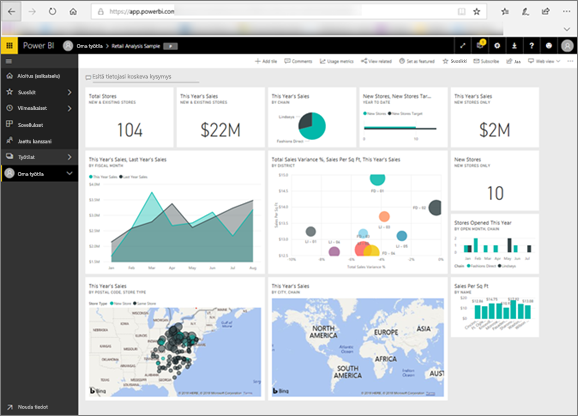

# Power BI kuluttajille
Työroolisi määrittää, miten käytät Power BI:tä. *Loppukäyttäjät* ja *kuluttajat* vastaanottavat koontinäyttöjä, raportteja ja sovelluksia työtovereiltaan. Työskentelet ***Power BI -palvelussa***, jossa voit tarkastella ja käsitellä tätä sisältöä ja tehdä sen perusteella liiketoimintapäätöksiä.

Jos et ole käyttänyt Power BI:tä aikaisemmin, suosittelemme, että luet ensin [Power BI yleiskatsaus](../power-bi-overview.md) -kohdan. Siinä opit, millaisista työkaluista Power BI koostuu.

Kuluttajana et voi käyttää Power BI:n kaikkia ominaisuuksia. Tällä ei ole merkitystä, koska koontinäyttöjen ja raporttien luominen on muiden tehtävä. Sinä käytät Power BI:tä analysointiin, valvontaan, tarkasteluun ja päätöksentekoon.

Kun luet kuluttajille suunnattuja artikkeleja, opit termejä, tutustut Power BI -palveluun ja opit löytämään sisältöä ja käsittelemään sitä.  Aloitetaanpa!

