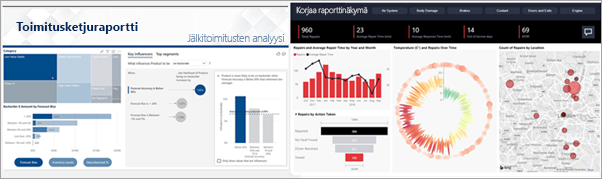
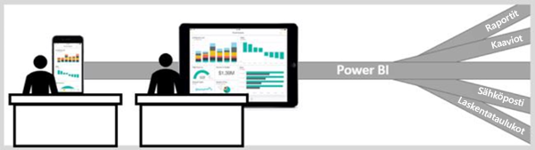

# Power BI -palvelu kuluttajille

[!INCLUDE[consumer-appliesto-ynny](../includes/consumer-appliesto-ynny.md)]

Elämme tietokulttuurissa, jossa liiketoimintapäätökset perustuvat tosiasioihin, eivät mielipiteisiin. Tarvitset tietoja näiden päätösten tekemiseen, eivätkä työtoverisi aiheuta pettymystä tässä suhteessa.     
 
He lähettävät sinulle kaikenlaisia raportteja, laskentataulukoita, kaavioita sisältäviä sähköpostiviestejä ja jopa tulosteita. Kun tietoa kasaantuu, on koko ajan vaikeampaa löytää tarvittavat tiedot nopeasti, ja pelkäät, että et ehkä käytä kaikkein uusimpia tietoja.  
 

## Power BI -palvelu *kuluttajille*

Power BI tekee työstäsi helpompaa ja samalla vaikuttavampaa. Kaikki tiedot visualisoidaan tekemällä niistä kaavioita. Pitkien luetteloiden tai lukuja ja sanoja sisältävien taulukoiden sijaan merkitykselliset tietosi ovat ***kauniita***. Ne ovat värikkäitä ja kiinnostavia visualisointeja, jotka kertovat tarinoita merkityksellisistä tiedoistasi. 

 
Avaa Power BI -palvelu selaimessa tai mobiililaitteessa. Sinä ja työtoverisi käsittelette samoja luotettuja koontinäyttöjä ja raportteja, jotka päivittyvät automaattisesti, joten käytössänne on aina uusin sisältö.   

Sisältö ei ole staattinen, joten voit syventyä siihen ja etsiä trendejä, merkityksellisiä tietoja ja muita liiketoimintatietoja. Voit osittaa ja käsitellä sisältöä ja jopa esittää kysymyksiä omin sanoin. Voit myös ottaa rennosti ja antaa tietojesi löytää sinulle kiinnostavia merkityksellisiä tietoja, lähettää sinulle ilmoituksia tietojen muuttuessa ja lähettää sähköpostitse raportteja määrittämäsi aikataulun mukaisesti. Kaikki tietosi milloin tahansa ja millä tahansa laitteella, pilvipalvelussa tai paikallisesti. Se on vasta alkua sille, mitä kaikkea Power BI voi tehdä. 

## Olenko minä Power BI *-kuluttaja*?

Työroolisi määrittää, miten käytät Power BI:tä. Loppukäyttäjät eli *kuluttajat* vastaanottavat sisältöä (koontinäyttöjä, raportteja ja sovelluksia) työkavereiltaan. Käytät Power BI:n verkko- tai mobiiliversiota, jota kutsutaan Power BI -palveluksi. Tarkastelet ja käsittelet tätä sisältöä, ja teet sen perusteella liiketoimintapäätöksiä. 
   
Kuluttajana et voi käyttää Power BI:n kaikkia ominaisuuksia. Tällä ei ole merkitystä, koska koontinäyttöjen ja raporttien luominen on muiden tehtävä. Sinä käytät Power BI -palvelua analysointiin, valvontaan, tarkasteluun ja päätöksentekoon. 

Jossain vaiheessa tulet näkemään termin ”Power BI Desktop” tai vain ”Desktop”. Tämä on erillinen työkalu, jota *suunnittelijat* käyttävät koontinäyttöjen ja raporttien luomiseen ja jakamiseen kanssasi.  Sinun on hyvä tietää, että on olemassa muita Power BI -työkaluja, mutta jos olet kuluttaja, tulet työskentelemään vain Power BI -palvelun kanssa. 

Koska käsittelet *jaettua* sisältöä, tarvitset vain **maksuttoman** käyttöoikeuden, koska työskentelet **Premium**-kapasiteettia käyttävässä organisaatiossa. [Mikä käyttöoikeus minulla on?](end-user-license.md)

## Sisällön turvallinen käyttö 
Kun suodatat, ositat, tilaat ja viet, työsi ei vaikuta taustalla olevaan tietojoukkoon tai alkuperäiseen jaettuun sisältöön (koontinäyttöihin, raportteihin ja sovelluksiin).  

Et voi vahingoittaa tietojasi.  Power BI on hyvä paikka tutkia ja kokeilla ilman pelkoa minkään rikkomisesta.  
 
Tämä ei kuitenkaan tarkoita sitä, ettetkö voi tallentaa muutoksiasi: se on tietysti mahdollista. Nämä muutokset kuitenkin koskevat vain sinun näkymääsi sisällöstä. Voit palata alkuperäiseen oletusnäkymään helposti napsauttamalla.  

## Seuraavat vaiheet

[Tutustu Power BI -palveluun kuluttajille](end-user-reading-view.md)    
[Power BI -palvelun koulutus kuluttajille](https://docs.microsoft.com/learn/paths/consume-data-with-power-bi/)    
[Terminologiaa ja käsitteitä Power BI *-kuluttajille*](end-user-basic-concepts.md)    

