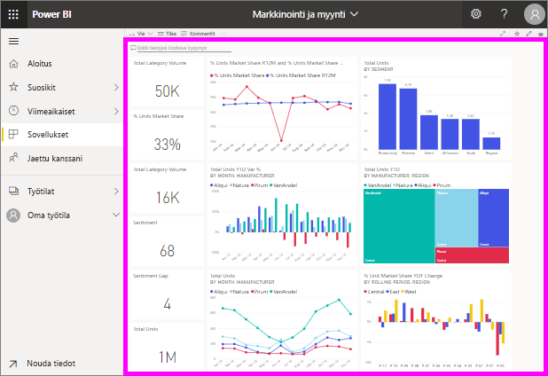

# Tarkastele koontinäyttöä

[!INCLUDE [power-bi-service-new-look-include](../includes/power-bi-service-new-look-include.md)]

Power BI:n *kuluttajat* käyttävät paljon aikaa koontinäyttöjen tarkasteluun. Koontinäytöt korostavat tiettyjä tietoja pohjana olevista raporteista ja tietojoukoista. Power BI:n kuluttajat käyttävät näitä tietoja esimerkiksi seurantaan, valvontaan, kysymyksiin vastaamiseen ja testaamiseen, jotta he voivat tehdä tietopohjaisia liiketoimintapäätöksiä.

Koontinäytön jakamiseen ja jaetun koontinäytön tarkasteluun vaaditaan Power BI Pro.

## Avaa koontinäyttö

|              |         |
|------------|--------------------------------|
|      |Koontinäytöt voidaan avata useista Power BI -palvelun sijainneista.   Etsi tämä koontinäytön kuvake. Kun olet löytänyt  koontinäytön, sen avaaminen on helppoa - sinun tarvitsee vain valita se, niin koontinäyttö  täyttää Power BI -pohjan. |
|                    |          |

Voit etsiä koontinäyttöjä kaikista siirtymisruudun säilöistä. 

- **Aloitus** 
- **Suosikit** – jos olet [lisännyt koontinäytön suosikkeihin](end-user-favorite.md)
- **Viimeisimmät** – jos olet käyttänyt koontinäyttöä lähiaikoina
- **Sovellukset** – useimmat sovellukset sisältävät sekä koontinäyttöjä että raportteja
- **Jaettu kanssani** – jos työtoveri on [jakanut koontinäytön sinulle](end-user-shared-with-me.md)
- **Oma työtila** – jos olet ladannut [Power BI -malleja](../sample-datasets.md)

## Seuraavat vaiheet
* Tutustu koontinäyttöihin paremmin tutustumalla johonkin [mallikoontinäytöistämme](../sample-tutorial-connect-to-the-samples.md).
* Lue lisätietoja [koontinäytön ruuduista](end-user-tiles.md) ja siitä, mitä tapahtuu, kun valitset sellaisen.