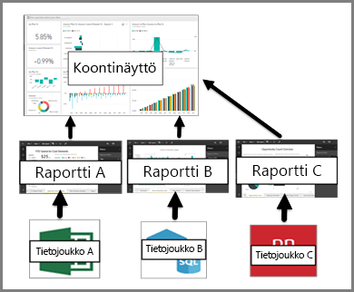

# Koontinäytöt Power BI -palvelun kuluttajille

[!INCLUDE[consumer-appliesto-ynny](../includes/consumer-appliesto-ynny.md)]

[!INCLUDE [power-bi-service-new-look-include](../includes/power-bi-service-new-look-include.md)]

Power BI ***-koontinäyttö*** on yksi sivu, jota kutsutaan usein pohjaksi, jossa käytetään visualisointeja tarinan kertomiseksi. Koska se on rajoitettu vain yhteen sivuun, hyvin suunniteltu koontinäyttö sisältää vain tarinan tärkeimmät elementit.

Koontinäytössä näkyviä visualisointeja kutsutaan *ruuduiksi*, ja niiden *kiinnittämisestä* koontinäyttöön huolehtivat raporttien *suunnittelijat*. Valitsemalla ruudun pääset useimmiten sille raporttisivulle, jossa visualisointi on luotu. Jos olet uusi Power BI:n käyttäjä, saat hyvän pohjan sen käyttöön lukemalla [Power BI:n peruskäsitteet](end-user-basic-concepts.md).

> [!NOTE]
> Koontinäyttöjä voi [tarkastella ja jakaa mobiililaitteissa](mobile/mobile-apps-view-dashboard.md).
>
> Power BI Pro vaaditaan kanssasi jaetun koontinäytön tarkastelua varten.
> 

Koontinäytön visualisoinnit ovat peräisin raporteista ja kukin raportti perustuu yhteen tietojoukkoon. Itse asiassa koontinäyttöä voidaan ajatella eteisenä, josta pääsee pohjana oleviin raportteihin ja tietojoukkoihin. Valitsemalla visualisoinnin valitseminen pääset raporttiin (ja tietojoukkoon), jota käytettiin sen luomiseen.

## Koontinäyttöjen edut
Koontinäytöt tarjoavat erinomaisen tavan liiketoiminnan tarkkailuun, vastausten etsimiseen ja tärkeimpien tietojesi näkemiseen yhdellä silmäyksellä. Koontinäytöillä olevat visualisoinnit saattavat olla peräisin yhdestä tai useammasta tietojoukosta sekä yhdestä tai useammasta pohjana olevasta raportista. Raporttinäkymä voi yhdistää paikalliset ja pilvipalvelussa olevat tiedot tarjoten niistä yhdistetyn näkymän riippumatta siitä, missä tiedot todella sijaitsevat.

Koontinäyttö ei ole vain nätti kuva, vaan se on vuorovaikutuskykyinen ja sen ruudut päivittyvät sitä mukaa, kun sen pohjana olevat tiedot muuttuvat.

## Koontinäytöt ja raportit Power BI ***-kuluttajille***
Raportit sekoitetaan usein koontinäyttöihin, koska nekin ovat pohjia, jotka ovat täynnä visualisointeja. Niiden välillä on kuitenkin merkittäviä eroja Power BI *-kuluttajien* näkökulmasta.

| **Ominaisuus** | **Koontinäytöt** | **Raportit** |
| --- | --- | --- |
| Sivut |Yksi sivu |Yksi tai useampi sivu |
| Tietolähteet |Yksi tai useampi raportti ja yksi tai useampi tietojoukko koontinäyttöä kohden |Yksi tietojoukko raporttia kohden |
| suodatusta |Ei voi suodattaa tai jakaa sektoreihin |Monta eri tapaa suodattaa, korostaa ja jakaa sektoreihin |
| Hälytysten asettaminen |Voit luoda hälytyksiä lähetettäväksi sähköpostina, kun tietyt ehdot täyttyvät |Ei |
| Esittelyssä |Voit määrittää jonkin koontinäytön ”esittelyssä” olevaksi koontinäytöksi |Esittelyssä olevaa raporttia ei voida luoda |
| Pohjana olevat tietojoukkojen taulukot ja kentät ovat näkyvissä |Ei. Voit viedä tietoja, mutta etänäe taulukoita ja kenttiä itse koontinäytössä. |Kyllä. Tietojoukon taulukot ja kentät ja arvot ovat näkyvissä. |

## Koontinäytön suunnittelijat ja koontinäytön kuluttajat
Power BI ***-kuluttajana*** saat koontinäyttöjä *suunnittelijoilta*. Jatka koontinäyttöihin perehtymistä näistä aiheista:

* [Tarkastele koontinäyttöä](end-user-dashboard-open.md)
* Lue lisätietoja [koontinäytön ruuduista](end-user-tiles.md) ja siitä, mitä tapahtuu, kun valitset sellaisen.
* Haluatko seurata yksittäistä koontinäytön ruutua ja saada sähköpostiviestin, kun se saavuttaa tietyn raja-arvon? [Luo hälytyksiä ruuduista](end-user-alerts.md).
* Pidä hauskaa ja esitä kysymyksiä koontinäytöistä. Opettele käyttämään [Power BI:n kysymyksiä ja vastauksia](end-user-q-and-a.md) -toimintoa kysymyksen esittämiseksi tietojasi koskien, jolloin saat vastauksen visualisoinnin muodossa.

> [!TIP]
> Jos et löytänyt etsimääsi täältä, käytä vasemmalla olevaa sisällysluetteloa.
> 

## Seuraavat vaiheet
[Tarkastele koontinäyttöä](end-user-dashboard-open.md) 