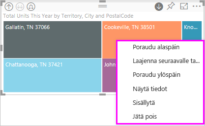

# Visualisointiin porautumistila Power BI:ssä

Tässä artikkelissa kerrotaan, miten voit porautua visualisointiin Microsoft Power BI -palvelussa. Kun poraat arvopisteitä ylös- tai alaspäin, voit tutkia tarkemmin tietojesi yksityiskohtia. 

## Porautuminen edellyttää hierarkiaa

Kun visualisoinnissa on hierarkia, saat porautumalla näkyviin lisää tietoja. Sinulla voi olla esimerkiksi visualisointi, joka kuvaa olympiamitalien määrää hierarkian mukaan, joka muodostuu urheilusta, lajista ja tapahtumasta. Visualisointi näyttää oletusarvoisesti mitalimäärän urheilulajin mukaan, esimerkiksi voimistelu, hiihto ja vesiurheilu. Mutta koska sillä on hierarkia, visualisoinnin yhden elementin (kuten palkin, rivin tai kuplan) valitseminen antaa yksityiskohtaisemman kuvan. Valitsemalla **vesiurheilu**-elementin saat näkyviin uintia, uimahyppyä ja vesipalloa koskevat tiedot.  Valitsemalla **uimahyppy**-elementin saat näkyviin ponnahduslauta-, koroke- ja taitohyppytapahtumat.

Päivämäärät ovat hierarkian yksilöivä tyyppi.  Raporttien suunnittelijat lisäävät usein päivämäärähierarkioita visualisointeihin. Yleinen päivämäärähierarkia sisältää vuoden, vuosineljänneksen, kuukauden ja päivän. 

## Selvitä, mihin visualisointeihin voidaan porautua
Etkö ole varma, mitkä Power BI -visualisoinnit sisältävät hierarkian? Liikuta hiiren osoitinta visualisoinnin päällä. Jos näet porautumisen ohjausobjektien yhdistelmän ylhäällä, visualisoinnissa on hierarkia.

  

## Opi porautumaan alas- ja ylöspäin

Tässä esimerkissä käytetään puukarttaa, jossa on hierarkia, joka koostuu alueesta, kaupungista, postinumerosta ja myymälän nimestä. Puukartassa ennen porautumista tarkastellaan alueella tänä vuonna myytyjen yksiköiden kokonaismäärää. 

  

### Kaksi tapaa käyttää porautumisominaisuuksia

Poraudu alaspäin-, Poraudu ylöspäin- ja Laajenna-toimintoja voi käyttää kahdella eri tavalla visualisoinneissa, jotka sisältävät hierarkioita. Kokeile niitä ja käytä sitä, josta pidät eniten.

- Ensimmäinen tapa: kun osoitat visualisointia, näet kuvakkeet ja voit käyttää niitä.  

    

- Toinen tapa: napsauta visualisointia hiiren kakkospainikkeella ja käytä valikkoa.

    

## Porautumisen polut

### Porautuminen alaspäin kaikki kentät kerrallaan

Käytettävissä on useita tapoja porautua visualisointiin. Poraudu alaspäin -kuvakkeen valinta vie seuraavalle tasolle hierarkiassa. Jos katsot **Alue**-tasoa Kentuckyssä ja Tennesseessä, voit porautua molemmissa osavaltioissa kaupunkitasolle, sitten postinumeron tasolle ja lopuksi myymälän nimen tasolle. Polun jokainen vaihe tuo näkyviin uusia tietoja.

Valitse porautumiskuvake  kunnes pääset takaisin kohtaan Yksikköjen kokonaismäärä tänä vuonna alueen mukaan.

### Laajenna kaikki kentät kerralla

**Laajenna** lisää muita hierarkiatasoja nykyiseen näkymään. Jos siis tarkastelet **Alue**-tasoa, voit laajentaa ja lisätä kaupungin, postinumeron ja nimen tiedot puukarttaan. Jokainen polun vaihe tuo näkyviin edelliset tiedot ja lisää uuden tietojen tason.

Voit myös valita, haluatko porautua alaspäin vai laajentaa yksi kenttä kerrallaan.

### Porautuminen alaspäin yksi kenttä kerrallaan

1. Valitse Poraudu alaspäin -kuvake, jos haluat ottaa sen käyttöön .

    Nyt voit halutessasi porautua alaspäin **yksi kenttä kerrallaan** valitsemalla visualisoinnin elementin. Esimerkkejä visuaalisista elementeistä: palkki, kupla ja lehti.

    

    Jos et ota porautumista alaspäin käyttöön, visualisoinnin elementin (kuten palkin, kuplan tai lehden) valitseminen ei poraa alaspäin. Sen sijaan se ristisuodattaa muut raporttisivulla olevat kaaviot.

1. Valitse lehti **TN:lle**. Puukartassa näytetään nyt kaikki Tennesseen kaupungit ja alueet, joissa on myymälä.

    

1. Tässä vaiheessa voit:

    1. Jatkaa porautumista alaspäin Tennesseelle.

    1. Porautua alaspäin tiettyyn kaupunkiin Tennesseessä.

    1. Laajenna sen sijaan.

    Poraudutaan jälleen alaspäin yksi kenttä kerrallaan.  Valitse **Knoxville, TN**. Puukartassa näkyy nyt Knoxvillen myymälän postinumero.

    

    Huomaa, että otsikko muuttuu porautuessasi alaspäin ja uudelleen takaisin ylös.

### Kaikkien kenttien laajentaminen ja laajentaminen yksi kenttä kerrallaan

Puukartta, jossa näkyy vain postinumero, ei ole kovin havainnollinen.  *Laajennetaan* siis hierarkiaa yksi taso alaspäin.  

1. Kun puukartta on aktiivinen, valitse *Laajenna alaspäin* -kuvake  Puukartassa näkyy nyt kaksi hierarkian tasoa: postinumero ja myymälän nimi.

    

1. Jos haluat nähdä kaikki neljä Tennesseen tietojen hierarkiatasoa, valitse Poraudu ylöspäin -nuoli, kunnes saavutat puukartan toisen tason, **Yksiköt yhteensä tänä vuonna alueen ja kaupungin mukaan**.

    

1. Varmista, että porautuminen alaspäin on edelleen käytössä,  ja valitse *Laajenna alaspäin* -kuvake  Puukartassa näytetään nyt sama määrä lehtiä (ruutuja), mutta jokaisessa lehdessä on lisätietoja. Pelkän kaupungin ja osavaltion sijasta siinä näkyy nyt myös postinumero.

    

1. Valitse *Laajenna alaspäin* -kuvake vielä kertaalleen, jotta näet puukartassa Tennesseen tietojen kaikki neljä hierarkiatasoa. Osoittamalla lehteä näet vielä lisää tietoja.

    

## Näytä tiedot porautuessasi
Käytä **Näytä tiedot** -valintaa, jotta näet kulissien taakse. Aina kun poraudut tai laajennat, **Näytä tiedot** näyttää tiedot, joita käytetään visualisoinnin luomiseen. Tietojen avulla voit ymmärtää, miten hierarkiat, porautuminen ja laajentaminen toimivat yhdessä visualisointien luomisessa. 

Valitse oikeassa yläkulmassa olevat kolme pistettä (...) ja valitse sitten **Näytä tiedot**. 

Seuraavassa taulukossa näytetään tulokset, jotka saadaan näkyviin porauduttaessa alaspäin kaikki kentät kerralla alueesta myymälään nimeen.  

Huomaa, että kokonaismäärät ovat samat kohdissa **Kaupunki**, **Postinumero** ja **Nimi**. Näin ei aina ole.  Näissä tiedoissa on vain yksi myymälä kullakin postinumerolla ja kussakin kaupungissa.  

## Huomioitavat asiat ja rajoitukset
Oletusarvoisesti poraaminen ei suodata raportin muita visualisointeja. Raportin suunnittelija voi kuitenkin muuttaa tätä oletustoimintaa. Kun poraudut, katso, ovatko sivun muut visualisoinnit ristiinsuodatettu tai ristiinkorostettu.

## Seuraavat vaiheet

[Visualisoinnit Power BI -raporteissa](../visuals/power-bi-report-visualizations.md)

[Power BI -raportit](end-user-reports.md)

[Power BI:n peruskäsitteet](end-user-basic-concepts.md)

Onko sinulla muuta kysyttävää? [Kokeile Power BI -yhteisöä](http://community.powerbi.com/)
