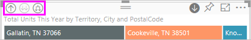

# Visualisointiin porautumistila Power BI:ssä

Tässä artikkelissa kerrotaan, miten voit porautua alaspäin visualisointiin Microsoft Power BI -palvelussa ja Power BI Desktopissa. Power BI -raporteissa voi olla useita tietohierarkioita, jotka antavat mahdollisimman monia merkityksellisiä tietoja datasta. Kun poraat arvopisteitä ylös- tai alaspäin, voit tutkia tarkemmin tietojesi yksityiskohtia. Voit hyödyntää niitä jopa kaikkein pienimmissä mobiililaitteissa.

## Porautuminen edellyttää hierarkiaa

Kun visualisoinnissa on hierarkia, saat porautumalla alaspäin näkyviin lisää tietoja. Sinulla voi olla esimerkiksi visualisointi, joka kuvaa olympiamitalien määrää hierarkian mukaan, joka muodostuu urheilusta, lajista ja tapahtumasta. Visualisointi näyttää oletusarvoisesti mitalimäärän urheilulajin mukaan – esimerkiksi voimistelu, hiihto ja vesiurheilu. Mutta koska sillä on hierarkia, visualisoinnin yhden elementin (kuten palkin, rivin tai kuplan) valitseminen näyttää selvästi yksityiskohtaisemman kuvan. Valitsemalla **vesiurheilu**-elementin saat näkyviin uintia, uimahyppyä ja vesipalloa koskevat tiedot.  Valitsemalla **uimahyppy**-elementin saat näkyviin ponnahduslauta-, koroke- ja taitohyppytapahtumat.

Voit lisätä hierarkioita omistamiisi raportteihin, mutta et niihin, jotka on jaettu kanssasi.
Etkö ole varma, mitkä Power BI -visualisoinnit sisältävät hierarkian? Liikuta hiiren osoitinta visualisoinnin päällä. Jos nämä porauksen ohjausobjektit tulevat näkyviin yläkulmissa, visualisoinnissa on hierarkia.

    
   

Päivämäärät ovat hierarkian yksilöivä tyyppi. Kun lisäät visualisointiin päivämääräkentän, Power BI lisää automaattisesti aikahierarkian, joka sisältää vuoden, vuosineljänneksen, kuukauden ja päivän. Lisätietoja saat artikkelista [Visualisoinnin hierarkiat ja porautuminen alaspäin](../guided-learning/visualizations.yml?tutorial-step=18) tai katsomalla alla olevan videon.

<iframe width="560" height="315" src="https://www.youtube.com/embed/MNAaHw4PxzE?list=PL1N57mwBHtN0JFoKSR0n-tBkUJHeMP2cP" frameborder="0" allowfullscreen></iframe>

> [!NOTE]
> Jos haluat lisätietoja siitä, miten voit luoda hierarkioita Power BI Desktopin avulla, katso video [Miten hierarkioita luodaan ja lisätään](https://youtu.be/q8WDUAiTGeU).

## Edellytykset

1. Power BI -palvelussa tai Desktopissa porautuminen edellyttää visualisointia, jolla on hierarkia.

1. Avaa seuraamista varten [Jälleenmyyntianalyysin malli](../sample-datasets.md). Luo **Puukartan** visualisointi, joka näyttää seuraavat:

    | Säilö | Kenttä |
    | ---- | ----- |
    | Arvo |Myynti \|\_ Yksiköt yhteensä tänä vuonna |
    | Ryhmä | Myymälä \|\_ Alue \|\_ Kaupunki \|\_ Postinumero \|\_ Nimi

    Puukartassa on alueesta, kaupungista, postinumerosta ja postitoimipaikasta koostuva hierarkia. Jokainen alue sisältää yhden tai useamman kaupungin, jokainen kaupunki yhden tai useamman postinumeron ja niin edelleen. Visualisointi näyttää oletusarvoisesti vain alueen tiedot, koska *Alue* näkyy luettelossa ensimmäisenä.

    

1. Voi olla hankala ymmärtää sitä, miten erilaiset porautumiskuvakkeet toimivat yhdessä. Suodatetaanpa puukartta, jossa näytetään vain kaksi pienempää aluetta: **KY** ja **TN**. Valitse puukartta ja laajenna sitten **Alue** kohdassa **Visuaalisen tason suodattimet** ja valitse **KY** ja **TN**.

    

    Nyt puukartassa näkyy vain kaksi aluetta.

    

## Kolme tapaa käyttää porautumisominaisuuksia

Poraudu alaspäin-, Poraudu ylöspäin- ja Laajenna-toimintoja voi käyttää useilla eri tavoilla visualisoinneissa, jotka sisältävät hierarkioita. Tässä artikkelissa esitellään seuraavaksi ensimmäinen tapa. Kun olet oppinut alaspäin porautumisen ja laajennuksen perusteet, osaat käyttää niitä kaikkea kolmea. Ne kaikki tekevät samoja asioita. Kokeile niitä ja valitse se, josta pidät eniten.

- Kun osoitat visualisointia, näet kuvakkeet ja voit käyttää niitä.  

    

- Valikko tulee näkyviin hiiren kakkospainiketta napsauttamalla.

    

- Valitse Power BI-valikkoriviltä **Tutki**.

   

## Porautumisen polut

### Poraudu alaspäin

Käytettävissäsi on useita tapoja porautua visualisointiin. **Poraudu alaspäin** vie sinut seuraavalle tasolle hierarkiassa. Jos tarkastelet **Alue**-tasoa, voit porautua alaspäin kaupungin tasolle, sitten postinumeron tasolle ja lopuksi nimen tasolle. Polun jokainen vaihe tuo näkyviin uusia tietoja.

### Laajenna

**Laajenna** lisää muita hierarkiatasoja nykyiseen näkymään. Jos siis tarkastelet **Alue**-tasoa, voit laajentaa ja lisätä kaupungin, postinumeron ja nimen tiedot puukarttaan. Jokainen polun vaihe tuo näkyviin edelliset tiedot ja lisää uuden tietojen tason.

Voit myös valita, haluatko porautua alaspäin vai laajentaa yksi kenttä kerrallaan tai kaikki kentät kerrallaan.

## Porautuminen alaspäin kaikki kentät kerrallaan

1. Aloita puukartan ylätasolta, jossa näkyvät KY:n ja TN:n tiedot. Laajenna puukarttaa valitsemalla jokin kahvoista ja vetämällä sitä oikealle.

    

1. Jos haluat porautua alaspäin *kaikki kentät kerrallaan*, valitse visualisoinnin vasemmassa yläkulmassa oleva kaksoisnuoli . Puukartassa näkyvät nyt Kentuckyn ja Tennesseen kaupunkitiedot.

    

1. Porautumalla alaspäin vielä kerran siirryt postinumeron tasolle hierarkiassa.

    

1. Jos haluat porautua takaisin ylöspäin, valitse ylänuoli visualisoinnin vasemmassa yläkulmassa .

## Porautuminen alaspäin yksi kenttä kerrallaan

Tässä menetelmässä käytetään Poraudu alaspäin -kuvaketta, joka näkyy itse visualisoinnin oikeassa yläkulmassa.

1. Valitse Poraudu alaspäin -kuvake, jos haluat ottaa sen käyttöön .

    Nyt voit halutessasi porautua **yksi kenttä kerrallaan**.

    

    Jos et ota porautumista alaspäin käyttöön, visualisointielementin (kuten palkin, kuplan tai lehden) valitseminen ei poraa alaspäin. Sen sijaan se ristisuodattaa muut raporttisivulla olevat kaaviot.

1. Valitse lehti **TN:lle**. Puukartassa näytetään nyt kaikki Tennesseen kaupungit, joissa on myymälä.

    

1. Tässä vaiheessa voit:

    1. Jatkaa porautumista alaspäin Tennesseelle.

    1. Porautua alaspäin tiettyyn kaupunkiin Tennesseessä.

    1. Laajentaa sen sijaan (katso **Laajenna kaikki kentät kerrallaan** alla).

    Poraudutaan jälleen alaspäin yksi kenttä kerrallaan.  Valitse **Knoxville, TN**. Puukartassa näkyy nyt Knoxvillen myymälän postinumero.

    

    Huomaa, että otsikko muuttuu porautuessasi alaspäin ja uudelleen takaisin ylös.

## Kaikkien kenttien laajentaminen ja laajentaminen yksi kenttä kerrallaan

Puukartta, jossa näkyy vain postinumero, ei ole kovin havainnollinen.  Laajennetaan siis hierarkiaa yksi taso alaspäin.  

1. Kun puukartta on aktiivinen, valitse *Laajenna alaspäin* -kuvake  Puukartassa näkyy nyt kaksi hierarkian tasoa: postinumero ja myymälän nimi.

    

1. Jos haluat nähdä kaikki neljä Tennesseen tietojen hierarkiatasoa, valitse Poraudu ylöspäin -nuoli, kunnes saavutat puukartan toisen tason, **Yksiköt yhteensä tänä vuonna alueen ja kaupungin mukaan**.

    

1. Varmista, että porautuminen alaspäin on edelleen käytössä,  ja valitse *Laajenna alaspäin* -kuvake  Puukartassa näkyy nyt joitakin lisätietoja. Pelkän kaupungin ja osavaltion sijasta siinä näkyy nyt myös postinumero.

    

1. Valitse *Laajenna alaspäin* -kuvake vielä kertaalleen, jotta näet puukartassa Tennesseen tietojen kaikki neljä hierarkiatasoa. Osoittamalla lehteä näet vielä lisää tietoja.

    

## Poraaminen suodattaa muut visualisoinnit

Kun työskentelet Poraudu-tilassa, päätät itse, millä tavoin alaspäin porautuminen ja laajentaminen vaikuttaa sivun muihin visualisointeihin.

Oletusarvoisesti poraaminen ei suodata raportin muita visualisointeja. Voit kuitenkin ottaa tämän ominaisuuden käyttöön Power BI Desktopissa ja Power BI -palvelussa.

1. Valitse Desktopissa **Muoto**-välilehti ja merkitse sitten valintaruutu kohdassa **Poraaminen suodattaa muut visualisoinnit**.

    

1. Kun nyt poraudut alaspäin, poraudut ylöspäin tai laajennat visualisointia hierarkiassa, tämä toiminto suodattaa sivulla olevat muut visualisoinnit.

    

    

> [!NOTE]
> Voit ottaa tämän toiminnon käyttöön Power BI -palvelussa yläreunan valikkoriviltä valitsemalla **Visualisointitoimet** > **Poraaminen suodattaa muut visualisoinnit**.
>
> 

## Tietoja hierarkia-akselista ja hierarkiaryhmästä

Voit ajatella hierarkia-akselia ja hierarkiaryhmää mekanismina, jonka avulla voit suurentaa ja pienentää niiden tietojen askelväliä, joita haluat tarkastella. Kaikki tiedot, jotka voidaan järjestää luokkiin ja aliluokkiin, ovat kelvollisia sisältämään hierarkian, mukaan lukien päivämäärät ja ajat.

Voit luoda hierarkian sisältävän visualisoinnin Power BI:ssä valitsemalla yhden tai useamman tietokentän lisättäväksi joko **Akseli**-säilöön tai **Ryhmä**-säilöön. Lisää sitten **Arvot**-säilöön tietoja, joita haluat tarkastella tietokenttinä . Tiedät tietojen olevan hierarkkisia, jos *porautumistilan* kuvakkeet näkyvät visualisoinnin vasemmassa ja oikeassa yläkulmassa.

Käytännössä kannattaa ajatella kahdenlaisia hierarkkisia tietoja:

- Päivämäärä- ja kellonaikatiedot – jos sinulla on tietotyypin päivämäärä/aika sisältävä tietokenttä, tällöin sinulla on jo hierarkkisia tietoja. Power BI luo automaattisesti hierarkian kaikille tietokentille. Voit jäsentää arvot yhdeksi [DateTime](https://msdn.microsoft.com/library/system.datetime.aspx)-rakenteeksi. Sinun tarvitsee vain lisätä yksi päivämäärä-/aikakenttä **Akseli**- tai **Ryhmä**-ruutuun.

- Luokkatiedot – jos Power BI poimii tiedot alikokoelmia sisältävistä kokoelmista tai niissä on muutoin tietorivejä, joilla on yhteisiä arvoja, tietosi ovat hierarkkisia.

Power BI:n avulla voit laajentaa alijoukkoja yksitellen tai kaikki kerrallaan. Voit porautua alaspäin tietojen läpi nähdäksesi yksittäisen alijoukon kullakin tasolla tai nähdäksesi kaikki alijoukot samanaikaisesti kullakin tasolla. Voit esimerkiksi porautua alaspäin tiettyyn vuoteen tai tarkastella kunkin vuoden kaikkia tuloksia etenemällä hierarkiassa alaspäin.

Vastaavasti voit porautua ylöspäin samalla tavalla.

Seuraavissa osioissa kuvataan, kuinka poraudutaan alaspäin ylimmästä näkymästä, keskimmäisestä näkymästä ja alimmasta näkymästä.

### Hierarkkiset tiedot ja aikatiedot

Tässä esimerkissä:

1. Seuraa [Jälleenmyyntianalyysin mallia](../sample-datasets.md) ja luo pinottu pylväskaaviovisualisointi, jossa tarkastellaan seuraavia:

    | Säilö | Kenttä |
    | ---- | ----- |
    | Akseli | Aika \|\_ Kuukausi |
    | Arvot | Myynti \|\_ TotalSales |

    Vaikka akselin tietokenttä onkin **kuukausi**, se luo myös **Vuosi**-luokan **Akseli**-ruutuun. Tämä johtuu siitä, että Power BI tarjoaa täyden DateTime-rakenteen kaikille arvoille, jotka se lukee. Hierarkiassa ylhäällä näytetään vuotta koskevat tiedot.

    

1. Kun Porautuminen alaspäin -tila on käytössä, siirry hierarkiassa yksi taso alaspäin valitsemalla kaavion palkin. Näet kolme palkkia saatavilla oleville vuosineljännestiedoille.

1. Valitse sitten vasemman yläkulman kuvakkeista **Laajenna kaikki alaspäin yhden hierarkiatason verran**.

1. Tee se jälleen kerran siirtyäksesi hierarkian alimmalle tasolle, joka näyttää jokaisen kuukauden tulokset.

    

Visualisoinnin lisäksi näemme kussakin raportissa hahmonnettujen tietojen hierarkian. Valitse oikeassa yläkulmassa olevat kolme pistettä (...) ja valitse sitten **Näytä tiedot**. Seuraavassa taulukossa näytetään alaspäin porautumisen tulokset raportissa yhdestä kuukaudesta tai kaikista kuukausista:

|Laajennettu tila|Vuosi|Vuosineljännes|Kuukausi|Päivä|
| --- |:---:|:---:|:---:|---|
|Yksittäinen|||||
|Kaikki|||||

Huomaa, että tiedot ovat samat **vuosineljänneksen** ja **vuoden** raporteille. Kun olet porautunut alaspäin **Arvot**-kohtaan määritetyn tiedon tasolle, näet, miten yksittäinen raportti muuttuu yksityiskohtaisemmaksi ja ”kaikki kuukaudet” -raportissa on enemmän tietoja.

### Hierarkkiset luokkatiedot

Kokoelmista ja alikokoelmista mallinnetut tiedot ovat hierarkkisia.

Hyvä esimerkki tästä ovat sijaintitiedot. Otetaan esimerkiksi tietolähteessä oleva taulukko, jonka sarakkeet ovat maa, osavaltio, kaupunki ja postinumero. Tiedot, joiden maa, osavaltio ja kaupunki ovat samat, ovat hierarkkisia.

Tässä esimerkissä:

1. Seuraa [Jälleenmyyntianalyysin mallia](../sample-datasets.md). Luo pinottu pylväskaaviovisualisointi, jossa tarkastellaan seuraavia:

    | Säilö | Kenttä |
    | ---- | ----- |
    | Arvo |Myynti \|\_ Yksiköt yhteensä tänä vuonna |
    | Akseli | Myymälä \|\_ Alue \|\_ Kaupunki – Kaupunki on ehkä vedettävä **Selite**-säilöstä **Akseli**-säilöön. \|\_ Postinumero \|\_ Nimi |

    

1. Kun Porautuminen alaspäin -tila on käytössä, valitse vasemman yläkulman kuvakkeista **Laajenna kaikki alaspäin yhden hierarkiatason verran** kolme kertaa.

    Sinun pitäisi olla hierarkian alimmalla tasolla, joka näyttää alueen, kaupungin ja postinumeron tulokset.

    

Visualisoinnin lisäksi näemme kussakin raportissa hahmonnettujen tietojen hierarkian. Valitse oikeassa yläkulmassa olevat kolme pistettä (...) ja valitse sitten **Näytä tiedot**. Seuraavassa taulukossa näytetään alaspäin porautumisen tiedot yhdelle alueelle tai kaikille alueille.

| Laajennettu tila|Alue|Kaupunki|Postinumero|Nimi|
| ---|:---:|:---:|:---:|---|
|Yksittäinen|||||
|Kaikki|||||

 Kun poraudut alaspäin, näet, miten **yksittäinen** raportti muuttuu yksityiskohtaisemmaksi ja **Kaikki** alueet -raportissa on enemmän tietoja.

## Huomioitavat asiat ja rajoitukset

Jos päivämääräkentän lisääminen visualisointiin ei luo hierarkiaa, syynä voi olla se, että Päivämäärä-kenttää ei ole todellisuudessa tallennettu päivämääräksi. Jos omistat tietojoukon:

1. Avaa se *Tieto*-näkymässä Power BI Desktopissa

1. Valitse sarake, jossa on päivämäärä.

1. Vaihda **Mallinnus**-välilehdessä **Tietotyyppi**-kohdan vaihtoehdoksi **Päivämäärä** tai **Päivämäärä/aika**.

Jos raportti on jaettu kanssasi, voit pyytää muutosta omistajalta.

## Seuraavat vaiheet

[Visualisoinnit Power BI -raporteissa](../visuals/power-bi-report-visualizations.md)

[Power BI -raportit](end-user-reports.md)

[Power BI:n peruskäsitteet](end-user-basic-concepts.md)

Onko sinulla muuta kysyttävää? [Kokeile Power BI -yhteisöä](http://community.powerbi.com/)
