# Pikaopas - Power BI -palveluun tutustuminen

[!INCLUDE [power-bi-service-new-look-include](../includes/power-bi-service-new-look-include.md)]

Nyt kun tunnet Power BI:n perusasiat, tutustutaan **Power BI -palveluun**. Kuten aiemmin mainittiin, ryhmäsi jäsen saattaa käyttää kaiken aikansa **Power BI Desktopissa** tietojen koostamiseen ja raporttien luomiseen muille. Sinun aikasi vuorostaan saattaa kulua Power BI -palvelussa muiden luoman sisällön tarkasteluun ja käsittelemiseen (**kuluttamis**kokemus). Tässä pikaoppaassa tuot näytetietoja ja käytät kyseisiä tietoja tutustuessasi Power BI -palveluun. 
 
## Edellytykset

- Jos et ole rekisteröitynyt Power BI:hin, [rekisteröidy ilmaiseen kokeiluversioon](https://app.powerbi.com/signupredirect?pbi_source=web) ennen aloittamista.

- Lue [Power BI -palvelun peruskäsitteet](end-user-basic-concepts.md)

## Avaa Power BI -palvelu ja kerää joitakin tietoja
Tutustutaan Power BI -palveluun mallitietojen avulla. Voit käyttää kaikenlaisia mallitietoja tutustuessasi palveluun. Tällä kertaa käytetään vähittäismyymälöitä koskevia tietoja.    
1. Avaa app.powerbi.com ja valitse **Mallit**-linkki. 

    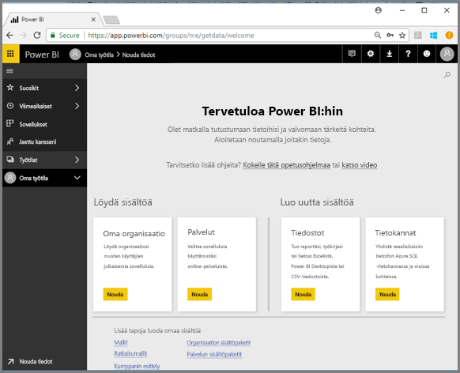

2. Valitse **Jälleenmyyntianalyysimalli > Yhdistä**.

    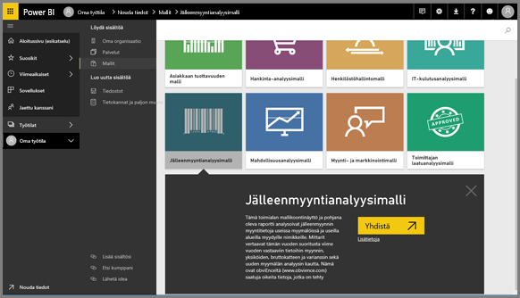

    Power BI -palvelu tuo mallin ja näyttää raporttinäkymän. Koontinäytöt erottavat Power BI -palvelun Power BI Desktopista. Näyte sisältää myös raportin ja tietojoukon, joihin palaamme myöhemmin.

    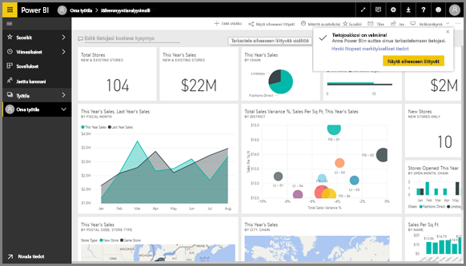

Katso, miten Amanda esittelee Power BI -palvelun siirtymistoiminnot.  Kokeile sen jälkeen itse noudattamalla videon alapuolella olevia vaiheittaisia ohjeita.

<iframe width="560" height="315" src="https://www.youtube.com/embed/G26dr2PsEpk" frameborder="0" allowfullscreen></iframe>

## Näytä sisältö (koontinäytöt, raportit, työkirjat, tietojoukot, työtilat, sovellukset)
Aloitetaan katsomalla, miten perussisältö (koontinäytöt, raportit, tietojoukot, työkirjat) on järjestetty. Sisältö näytetään työtilan kontekstissa. Tässä vaiheessa sinulla on vain yksi työtila, jota kutsutaan **Omaksi työtilaksi**. Kuluttajat eivät tavallisesti tarvitse tai käytä muita työtiloja. Oma työtila -sijaintiin voit tallentaa kaiken omistamasi sisällön. Ajattele sitä oman sisältösi henkilökohtaisena eristyksenä tai työskentelyalueena. Oma työtila on se paikka, johon juuri lataamasi jälleenmyyntianalyysimalli on tallennettu. 

Sisältösi on jaettu omassa työtilassa neljään välilehteen: Raporttinäkymät, Raportit, Työkirjat ja Tietojoukot.

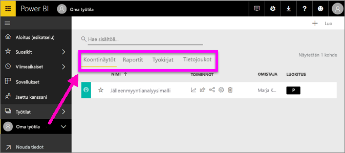

Valitse työtila vasemmassa siirtymisruudussa (vasen siirtymisruutu) ja siihen liittyvän sisällön välilehdet (koontinäytöt, raportit, työkirjat, tietojoukot) täyttävät oikealla olevan Power BI -pohjan.

Jos olet uusi käyttäjä, näet vain yhden työtilan, joka on **Oma työtila**.

Välilehdissä (eli *sisältönäkymissä*) näet tietoa sisällöstä sekä toimintoja, joita voit suorittaa kyseiselle sisällölle.  Esimerkiksi Raporttinäkymät-välilehdestä voit avata raporttinäkymän, hakea ja lajitella sisältöä sekä tehdä paljon muuta.

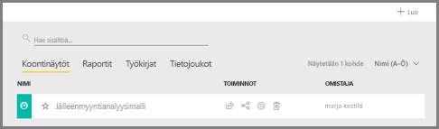

Avaa raporttinäkymä valitsemalla raporttinäkymän nimi.

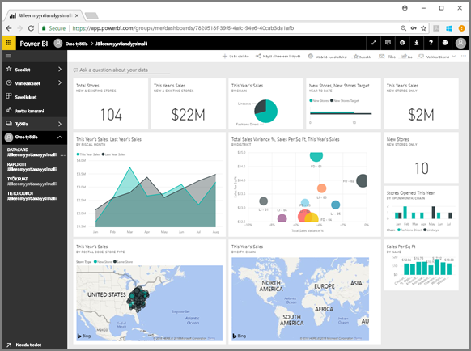

## Raporttinäkymän ja raportin lisääminen suosikkeihin
**Suosikkien** avulla pääset nopeasti käyttämään itsellesi tärkeää sisältöä.  

1. Kun raporttinäkymä on auki, valitse **Lisää suosikkeihin** oikeasta yläkulmasta.
   
   
   
   **Lisää suosikkeihin** -kohdan tilalle tulee **Poista suosikeista** ja tähtikuvake muuttuu keltaiseksi.
   
   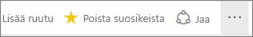

2. Jos haluat nähdä luettelon kaikesta suosikeiksi lisätystä sisällöstä, valitse vasemmassa siirtymisruudussa **Suosikit**-kohdan oikealla puolella oleva nuoli. Vasen siirtymisruutu on Power BI -palvelun pysyvä ominaisuus, joten voit käyttää luetteloa Power BI -palvelun missä tahansa kohdassa.
   
    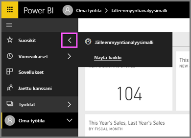
   
    Meillä on toistaiseksi vain yksi suosikki. Suosikit voivat olla raporttinäkymiä, raportteja tai sovelluksia.  

1. Koontinäytön tai raportin voi merkitä suosikiksi myös sisältönäkymän **Koontinäytöt**- tai **Raportit**-välilehdessä.  Avaa **Raportit**-välilehti ja valitse tähtikuvake raportin nimen vasemmalta puolelta.
   
   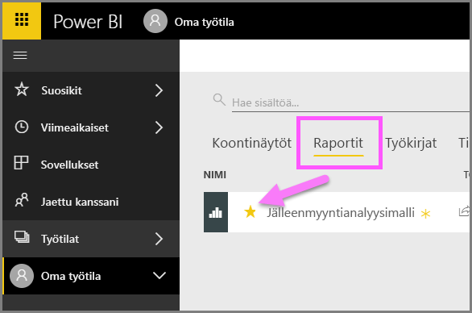

3. Avaa **Suosikit**-*ruutu* valitsemalla **Suosikit** vasemmasta siirtymisruudusta tai valitsemalla tähtikuvake .
   
   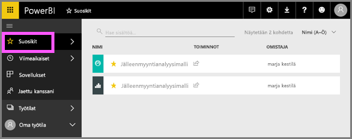
   
   Sinulla on nyt kaksi suosikkia: yksi raporttinäkymä ja yksi raportti. Tästä voit avata ja etsiä sisältöä, poistaa sisältöä suosikeista ja jakaa sisältöä työtovereiden kanssa.

4. Avaa raportti raporttieditorissa valitsemalla sen nimi.

    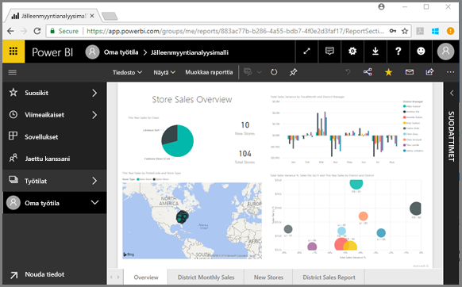

Katso lisätietoja artikkelista [Suosikit](end-user-favorite.md)

## Paikanna uusimmat sisältösi

1. Suosikkien tapaan voit nopeasti tarkastella myös viimeksi käyttämääsi sisältöä missä tahansa Power BI -palvelun kohdassa valitsemalla vasemmasta siirtymisruudusta **Viimeisimmät**-kohdan vieressä olevan nuolen.

   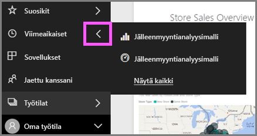

    Valitse avattava sisältö pikaikkunasta.

2. Joskus et halua vain avata viimeaikaista sisältöä, mutta haluat tarkastella tietoja tai tehdä muita toimia, kuten tarkastella merkityksellisiä tietoja tai viedä Exceliin. Tällaisissa tilanteissa avaa **Viimeaikaiset**-ruutu valitsemalla **Viimeaikaiset** tai sen kuvake vasemmasta siirtymisruudusta. Jos sinulla olisi useampi kuin yksi työtila, tämä luettelo sisältäisi sisältöä kaikista työtiloistasi.

   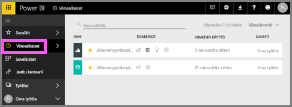

Katso lisätietoja artikkelista [Viimeisimmät Power BI:ssä](end-user-recent.md)

### Hae ja lajittele sisältöä
Sisältönäkymässä on helpompi hakea, suodattaa ja lajitella sisältöä. Jos haluat hakea koontinäyttöä, raporttia tai työkirjaa, kirjoita hakualueelle. Power BI suodattaa ja näyttää vain sisällön, jonka nimessä on kirjoittamasi hakumerkkijono.

Koska sinulla on vain yksi malli, hakemista ja lajittelemista ei tarvita.  Kun sinulla on pitkiä luetteloita, jotka koostuvat raporttinäkymistä, raporteista, työkirjoista ja tietojoukoista, hakemisesta ja lajittelemisesta on valtavasti hyötyä.

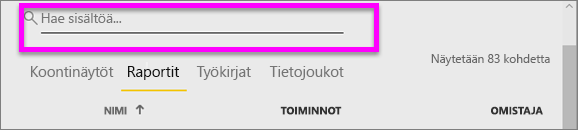

Voit lajitella sisällön myös nimen tai omistajan mukaan. Huomaa ylöspäin osoittava nuoli **Nimi**-kohdan oikealle puolella. Olemme tällä hetkellä lajittelemassa 83 kohdetta aakkosjärjestyksessä nimen mukaan nousevasti. Jos haluat muuttaa lajittelujärjestyksen laskevaksi, valitse **Nimi**. Ylänuoli muuttuu alaspäin osoittavaksi nuoleksi.

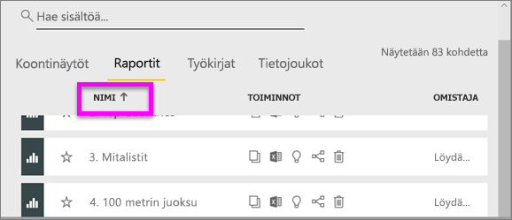

Kaikki sarakkeet eivät ole lajiteltavissa. Jos haluat tietää, onko jokin sarake lajiteltavissa, pidä hiiren osoitinta kyseisen sarakeotsikon päällä.

Lisätietoja on artikkelissa [Power BI -siirtyminen: haku ja lajittelu](end-user-search-sort.md)

## Resurssien tyhjentäminen
Kun olet suorittanut pikaoppaan, voit halutessasi poistaa Jälleenmyyntianalyysimallin raporttinäkymän, raportin ja tietojoukon.

1. Avaa Power BI -palvelu (app.powerbi.com) ja kirjaudu sisään.    
2. Valitse vasemmasta siirtymisruudusta **Työtilat > Oma työtila**.  
    Keltainen tähti kertoo, että kyse on suosikista.    
3. Valitse **Raporttinäkymät**-välilehdestä Jälleenmyyntianalyysimallin raporttinäkymän vieressä oleva **Poista**-roskakorikuvake.    

    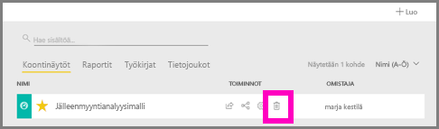

4. Siirry **Raportit**-välilehdelle ja tee sama Jälleenmyyntianalyysiraportille.
1. Siirry **Tietojoukot**-välilehdelle ja tee sama Jälleenmyyntianalyysin tietojoukolle.

## Seuraavat vaiheet

> [!div class="nextstepaction"]
> [Lukunäkymä Power BI -palvelussa](end-user-reading-view.md)
