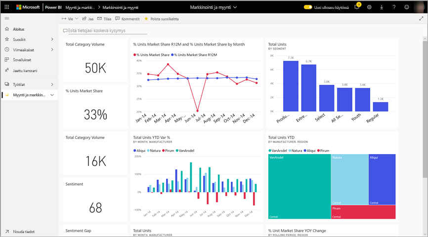
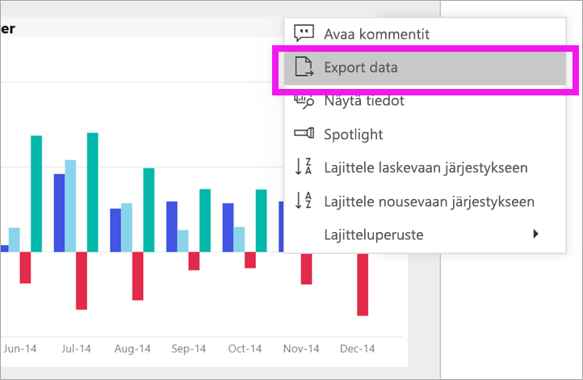
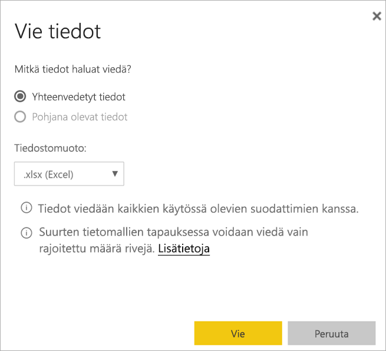
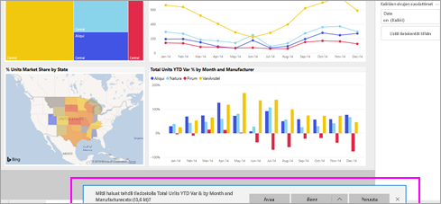

# Tietojen vieminen visualisoinnista

[!INCLUDE [power-bi-service-new-look-include](../includes/power-bi-service-new-look-include.md)]

Jos haluat nähdä visualisoinnin luomiseen käytetyt tiedot, [voit näyttää kyseiset tiedot Power BI:ssä](end-user-show-data.md) tai viedä ne tiedot Exceliin. Tietojen vienti edellyttää sopivaa käyttöoikeutta sekä sisällön muokkausoikeuksia. Jos vieminen ei onnistu, ota yhteys Power BI -järjestelmänvalvojaasi. 

## Power BI -raporttinäkymän visualisoinnista

1. Aloita Power BI -raporttinäkymästä. Käytämme ***Markkinointi ja myynti*** -mallisovelluksen raporttinäkymää. Voit [ladata kyseisen sovelluksen osoitteesta AppSource.com](https://appsource.microsoft.com/en-us/product/power-bi/microsoft-retail-analysis-sample.salesandmarketingsample-preview?flightCodes=e2b06c7a-a438-4d99-9eb6-4324ce87f282).

    

2. Kun viet osoittimen visualisoinnin päälle, näet kolme pistettä (...) sekä napsauttamalla avattavan toimintovalikon.

    

3. Valitse **Vie Exceliin**.

4. Selaimestasi riippuu, mitä seuraavaksi tapahtuu. Sinua saatetaan kehottaa tallentamaan tiedosto tai selaimen alareunassa voidaan näyttää linkki vietyyn tiedostoon. 

    

5. Avaa tiedosto Excelissä.  

    

## Raportin visualisoinnista
Voit viedä tietoja raportin visualisoinnista .csv- ja .xlsx (Excel) -muodossa. 

1. Valitse jokin raporttinäkymän ruutu, jolloin sen pohjana oleva raportti avautuu.  Tässä esimerkissä valitaan sama visualisointi kuin yllä (*Yksiköiden kokonaismäärän varianssiprosentti vuoden alusta)* . 

    

    Koska tämä ruutu luotiin *Myynti ja markkinointi* -malliraportista, kyseinen raportti avautuu. Raportti avautuu sivulle, joka sisältää valitun ruudun visualisoinnin. 

2. Valitse ruutu raportista. Laajenna oikealla oleva **Suodattimet**-ruutu. Tässä visualisoinnissa on käytetty suodattimia. Lisätietoja suodattimista on artikkelissa [Suodattimien käyttäminen raportissa](end-user-report-filter.md).

    

3. Valitse visualisoinnin oikean yläkulman kolme pistettä. Valitse **Vie tiedot**.

    

4. Voit viedä Yhteenvedetyt tiedot tai Pohjana olevat tiedot. Jos käytät *Myynti ja markkinointi* -mallisovellusta, **Pohjana olevat tiedot** -vaihtoehto ei ole käytössä. Saatat kuitenkin kohdata raportteja, joissa molemmat vaihtoehdot ovat käytettävissä. Niiden erot ovat seuraavat.

    **Yhteenvedetyt tiedot**: valitse tämä vaihtoehto, jos haluat viedä tietoja siitä, mitä näet visualisoinnissa.  Tällainen vientityyppi näyttää vain visualisoinnin luomiseen käytetyt tiedot. Jos visualisoinnissa on käytössä suodattimia, myös vietävät tiedot suodatetaan. Esimerkiksi tässä visualisoinnissa vienti sisältää vain sellaisia tietoja, jotka koskevat vuotta 2014, Keski-aluetta ja neljää valmistajaa: VanArsdel, Natura, Aliqui ja Pirum.
  

    **Pohjana olevat tiedot**: Valitse tämä vaihtoehto, jos haluat viedä visualisoinnissa näytetyt tiedot **sekä** lisätietoja pohjana olevasta tietojoukosta.  Ne voivat sisältää tietoja, jotka sisältyvät tietojoukkoon, mutta joita ei käytetä visualisoinnissa. 

    

5. Selaimestasi riippuu, mitä seuraavaksi tapahtuu. Sinua saatetaan kehottaa tallentamaan tiedosto tai selaimen alareunassa voidaan näyttää linkki vietyyn tiedostoon. 

    

6. Avaa tiedosto Excelissä. Vertaa samasta visualisoinnista vietyjen tietoihin määrää raporttinäkymän samasta visualisoinnista vietyihin tietoihin. Ero on, että tämä vienti sisältää **pohjana olevia tietoja**. 

    

## Seuraavat vaiheet

[Visualisoinnin lähdetietojen näyttäminen](end-user-show-data.md)