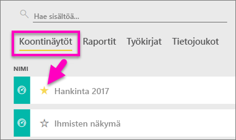
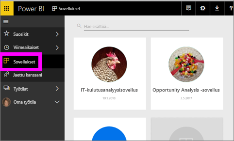
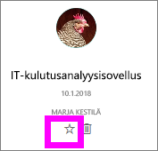
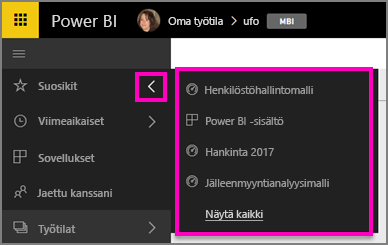
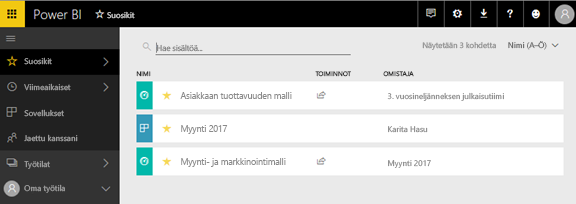
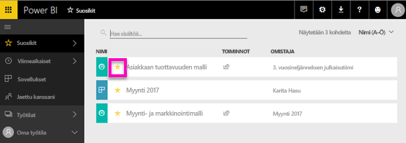

# Power BI -palvelun suosikkikoontinäytöt, -raportit ja -sovellukset
Kun lisäät sisällön *suosikkeihin*, voit käyttää sitä kaikista työtiloistasi.  Suosikit ovat yleensä sisältöä, jota käytät useimmin.

> [!NOTE]
> Tämä aihe koskee vain Power BI -palvelua, ei Power BI Desktopia.
> 
> 

Voit myös valita yhden koontinäytön [suositelluksi koontinäytöksi](end-user-featured.md) Power BI -palvelussa.

## Koontinäytön tai raportin lisääminen *suosikkeihin*
Katso ensin, kuinka Amanda lisää suosikkeja työtilaansa, ja kokeile sitten itse noudattamalla videon alapuolella olevia vaiheittaisia ohjeita.

<iframe width="560" height="315" src="https://www.youtube.com/embed/G26dr2PsEpk" frameborder="0" allowfullscreen></iframe>

1. Avaa koontinäyttö tai raportti, jota käytät usein. Myös jaettu sisältö voi olla *suosikki*.
2. Valitse Power BI -palvelun oikeassa yläkulmassa **Suosikki** tai tähden kuvake .
   
   
   
   Voit myös lisätä koontinäytön tai raportin suosikkeihin **koontinäyttöjen** työtilasta tai sisällön tarkastelun **Raportit**-välilehdestä.
   
   

## Sovelluksen lisääminen *suosikkeihin*

1. Valitse vasemmassa siirtymisruudussa **Sovellukset**.

   

2. Saat lisätietoja pitämällä hiiren osoitinta sovelluksen päällä.  Valitse tähti   kuvake ja lisää suosikkeihin.
   
   

## *Suosikkien* käsitteleminen
1. Kun haluat käyttää suosikkeja, valitse missä tahansa työtilassa pikaikkunanuoli **Suosikit**-kohdan oikealla puolella.  Täältä voit avata suosikin valitsemalla sen. Luettelossa on vain viisi suosikkia (aakkosjärjestyksessä). Jos suosikkeja on enemmän kuin viisi,avaa suosikit-ruutu valitsemalla **Näytä kaikki** (katso alla kohta 2). 
   
   
2. Jos haluat nähdä **kaiken** suosikeiksi lisätyn sisällön, valitse vasemmassa siirtymisruudussa **Suosikit** tai Suosikit  -kuvake.  
   
    
   
   Seuraavat toiminnot ovat käytettävissä: avaaminen, omistajien tunnistaminen ja myös jakaminen työtovereiden kanssa.

## Sisällön poistaminen suosikeista
Etkö enää käytä raporttia yhtä usein kuin aiemmin?  Voit poistaa sen suosikeista. Kun poistat sisällön suosikeista, se poistetaan Suosikit-luettelostasi, mutta ei Power BI:stä.

1. Valitse vasemmassa siirtymisruudussa **Suosikit**, jotta **Suosikit**-näyttö avautuu.
   
   
2. Valitse keltainen tähti suosikeista poistettavan sisällön vieressä.

> **HUOMAUTUS**: Voit myös poistaa suosikeista raporttinäkymän, raportin tai itse sovelluksen. Avaa se ja poista keltaisen kuvakkeen valinta.   
> 
> 

## Seuraavat vaiheet
[Mikä on Power BI?](../power-bi-overview.md)

[Power BI:n peruskäsitteet](end-user-basic-concepts.md)

Onko sinulla muuta kysyttävää? [Kokeile Power BI -yhteisöä](http://community.powerbi.com/)

