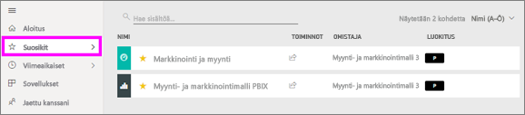
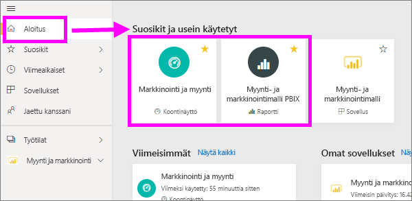
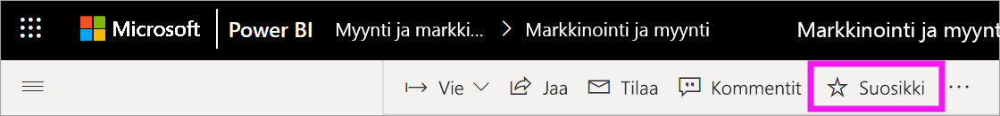
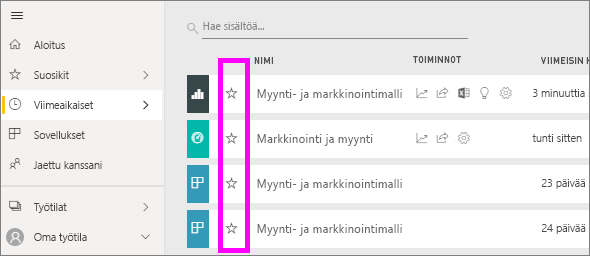
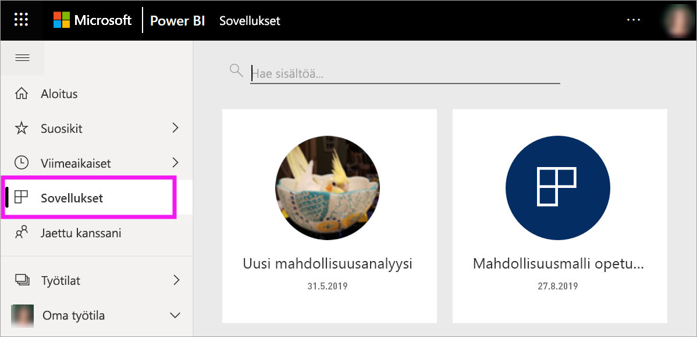
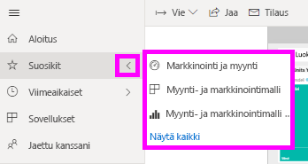
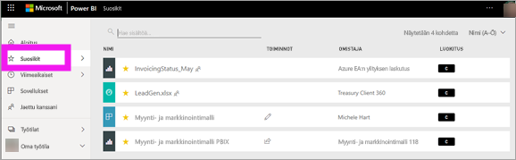
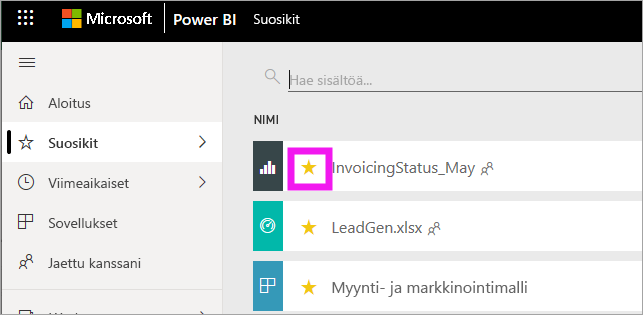

# Power BI -palvelun suosikkikoontinäytöt, -raportit ja -sovellukset
Kun lisäät tietyn sisällön *suosikkeihin*, pääset nopeasti käyttämään sitä **Suosikit**-sisältöluettelosta sekä **Power BI -aloitussivun** > **Suosikeista ja usein käytetyistä**. Suosikit ovat tyypillisesti sisältöä, jota käytät useimmiten, ja ne tunnistetaan keltaisesta tähdestä.

   

   

Voit myös valita yhden koontinäytön Power BI -palvelun [suositelluksi koontinäytöksi](end-user-featured.md).

## Koontinäytön tai raportin lisääminen suosikkeihin

1. Avaa koontinäyttö tai raportti, jota käytät usein. Myös jaettu sisältö voi olla suosikki.

2. Valitse Power BI -palvelun yläosan valikkoriviltä **Suosikki** tai tähden  kuvake.
   
   
   
   Voit myös merkitä suosikiksi koontinäytön tai raportin mistä tahansa, missä näet tähtikuvakkeen, kuten aloitussivulta, viimeisimmistä, sovelluksista tai kanssasi jaetuista. 
   
   

## Sovelluksen lisääminen suosikkeihin

1. Valitse siirtymisruudusta **Sovellukset**.

   

2. Saat lisätietoja pitämällä hiiren osoitinta sovelluksen päällä. Valitse tähti  kuvake ja lisää suosikkeihin.
   
   

## Suosikkien käsitteleminen
1. Kun haluat käyttää suosikkeja, valitse pikaikkunanuoli **Suosikit**-kohdan oikealla puolella. Tästä voit avata suosikin valitsemalla sen. Luettelossa on enintään viisi suosikkia aakkosjärjestyksessä. Jos suosikkeja on enemmän kuin viisi, avaa suosikkisisältöluettelo valitsemalla **Näytä kaikki**. 
   
   
2. Jos haluat nähdä kaiken suosikeiksi lisätyn sisällön, valitse siirtymisruudussa **Suosikit** tai Suosikit  -kuvake. 
   
    
   
   Seuraavat toiminnot ovat käytettävissä. Voit avata suosikin, tunnistaa omistajat ja myös jakaa suosikkeja työtovereidesi kanssa.

## Sisällön poistaminen suosikeista
Jos et enää käytä raporttia yhtä usein kuin aiemmin, voi poistaa sen suosikeista. Kun poistat sisällön suosikeista, se poistetaan Suosikit-luettelostasi, mutta ei Power BI:stä.

1. Valitse vasemmassa siirtymisruudussa **Suosikit**, jotta **Suosikit**-näyttö avautuu.
   
   
2. Valitse keltainen tähti suosikeista poistettavan sisällön vieressä.

> [!NOTE]
> Voit myös poistaa suosikeista raporttinäkymän, raportin sovelluksen. Avaa se ja poista keltaisen kuvakkeen valinta. 
> 
> 
## Rajoitukset ja huomioitavat asiat
Nykyisin voit valita suosikiksi sovelluksen, jolloin kaikki tämän sovelluksen raportit ja koontinäytöt määritetään suosikeiksi. Yksittäisiä sovellusraportteja tai koontinäyttöjä ei voi määritellä suosikeiksi. 

## Seuraavat vaiheet
- [Power BI: Peruskäsitteet](end-user-basic-concepts.md)
- Onko sinulla kysyttävää? Kokeile [Power BI -yhteisöä](http://community.powerbi.com/).

