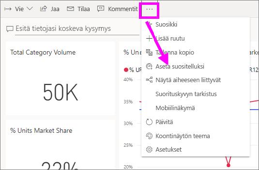
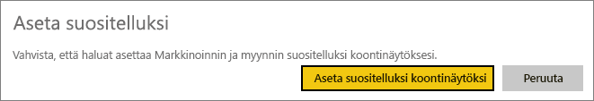
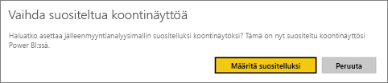
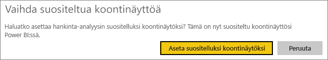
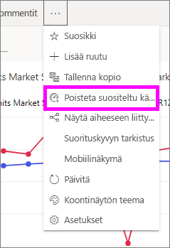

# Power BI -palvelun Suositellut koontinäytöt
## Suositellun koontinäytön luominen
Monilla meillä on tietty koontinäyttö, jolla käymme useammin kuin muilla.  Se saattaa olla koontinäyttö, jota käytetään yrityksen pyörittämiseen tai vaikkapa koontinäyttö, joka sisältää ruutukoosteen monista eri koontinäytöistä ja raporteista.

Kun valitset koontinäytön *suositelluksi*, Power BI -palvelu aukeaa aina sen avatessasi niin, että tämä koontinäyttö on näkyvissä.  

Voit myös valita joitakin koontinäyttöjä ja asettaa ne *suosikeiksi*. Katso [Koontinäyttöjen suosikit](end-user-favorite.md).

Jos et ole vielä määrittänyt suositeltua koontinäyttöä, Power BI avaa joko sen koontinäytön, jota olet viimeksi käyttänyt, tai Power BI -aloitussivun.  

### Koontinäytön asettaminen **suositelluksi**
Katso, kun Amanda luo suositellun koontinäytön, ja seuraa sitten videon alla olevia ohjeita ja kokeile sitä itse.

<iframe width="560" height="315" src="https://www.youtube.com/embed/G26dr2PsEpk" frameborder="0" allowfullscreen></iframe>

1. Avaa koontinäyttö, jonka haluat asettaa *Suositelluksi*. 
2. Valitse yläreunan valikkoriviltä kolme pistettä (...) ja valitse sitten **Aseta suositelluksi**.  
   
    
3. Vahvista valinta.
   
    

## Suositellun koontinäytön vaihtaminen
Jos muutat mielesi myöhemmin, voit tietenkin määrittää uuden koontinäytön suositelluksi koontinäytöksi.

1. Noudata ohjeita vaiheista 1 ja 2 yllä.
   
    
2. Valitse **Aseta suositelluksi**. Koontinäytön poistaminen suositelluista ei poista sitä työtilastasi.  
   
    

## Suositellun koontinäytön poistaminen
Jos et halua asettaa mitään koontinäyttöä suositelluksi, seuraavassa on ohjeet koontinäytön poistamiseksi suositelluista.

1. Avaa sillä hetkellä suositeltuna oleva koontinäyttö.
2. Valitse yläreunan valikkoriviltä kolme pistettä (...) ja valitse sitten **Poista suositelluista**.

    
   
## Seuraavat vaiheet
[Koontinäytön lisääminen suosikkeihin](end-user-favorite.md)

Ilmenikö muuta kysyttävää? [Kokeile Power BI -yhteisöä](http://community.powerbi.com/)

