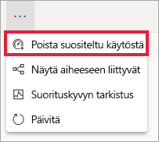

# Power BI -palvelun Suositellut koontinäytöt
## Suositellun koontinäytön luominen
Monilla meillä on tietty koontinäyttö, jolla käymme useammin kuin muilla.  Se saattaa olla koontinäyttö, jota käytetään yrityksen pyörittämiseen tai vaikkapa koontinäyttö, joka sisältää ruutukoosteen monista eri koontinäytöistä ja raporteista.

Kun määrität koontinäytön *suositelluksi*, niin aina, kun avaat Power BI -palvelun, se aukeaa siten, että kyseinen koontinäyttö on näkyvissä.  

Voit myös valita joitakin koontinäyttöjä ja asettaa ne *suosikeiksi*. Katso [Koontinäyttöjen suosikit](end-user-favorite.md).

> [!NOTE] 
>Tämä aihe koskee vain Power BI -palvelua, ei Power BI Desktopia.

Jos et ole vielä määrittänyt suositeltua koontinäyttöä, Power BI avaa koontinäytön, jota olet viimeksi käyttänyt.  

### Koontinäytön asettaminen **suositelluksi**
Katso, kun Amanda luo suositellun koontinäytön, ja seuraa sitten videon alla olevia ohjeita ja kokeile sitä itse.

<iframe width="560" height="315" src="https://www.youtube.com/embed/G26dr2PsEpk" frameborder="0" allowfullscreen></iframe>

1. Avaa koontinäyttö, jonka haluat asettaa *Suositelluksi*. 
2. Yläreunan valikkorivissä näkyy joko **Aseta suositelluksi** tai vain suositeltu  -kuvake. Valitse jompikumpi.
   
    
3. Vahvista valinta.
   
    

## Suositellun koontinäytön vaihtaminen
Jos muutat mielesi myöhemmin, voit tietenkin määrittää uuden koontinäytön suositelluksi koontinäytöksi.

1. Noudata ohjeita vaiheista 1 ja 2 yllä.
   
    
2. Valitse **Aseta suositelluksi**. Koontinäytön poistaminen suositelluista ei poista sitä työtilastasi.  
   
    

## Suositellun koontinäytön poistaminen
Jos et halua asettaa mitään koontinäyttöä suositelluksi, seuraavassa on ohjeet koontinäytön poistamiseksi suositelluista.

1. Avaa sillä hetkellä suositeltuna oleva koontinäyttö.
2. Valitse ylemmästä valikkopalkista **Poista suositeltu**.
   
    

Nyt Power BI avautuu viimeksi käytettyyn koontinäyttöön.  

## Seuraavat vaiheet
[Koontinäytön lisääminen suosikkeihin](end-user-favorite.md)

Ilmenikö muuta kysyttävää? [Kokeile Power BI -yhteisöä](http://community.powerbi.com/)

