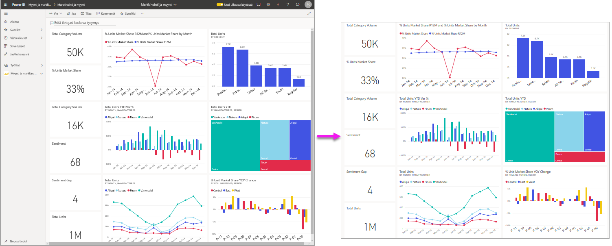
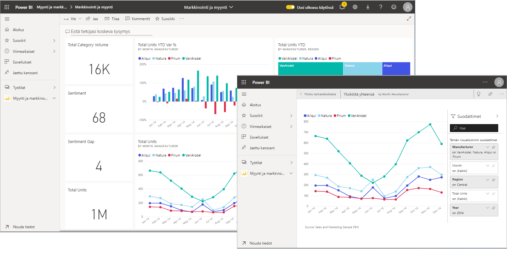
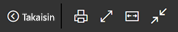
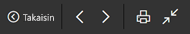
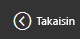
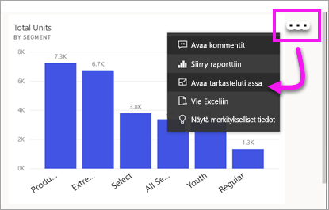
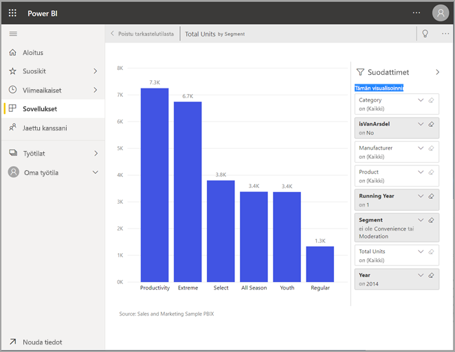
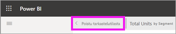
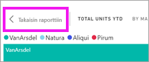

# Näytä sisältö yksityiskohtaisemmin: tarkastelutila ja koko näytön tila

[!INCLUDE [power-bi-service-new-look-include](../includes/power-bi-service-new-look-include.md)]    

<iframe width="560" height="315" src="https://www.youtube.com/embed/dtdLul6otYE" frameborder="0" allowfullscreen></iframe>

Tarkastelutila ja koko näytön tila ovat kaksi eri tapaa nähdä visualisoinnit, raportit ja koontinäytöt yksityiskohtaisemmin.  Suurin ero on se, että koko näytön tilassa kaikki sisällön ympärillä olevat ruudut poistuvat, mutta tarkastelutilassa voit edelleen käyttää visualisointeja. Tutustutaan seuraavaksi tarkemmin samankaltaisuuksiin ja eroihin.  

|Sisältö    | Tarkastelutila  |Koko näytön tila  |
|---------|---------|----------------------|
|Koontinäyttö     |   Ei ole mahdollista     | kyllä |
|Raporttisivu   | Ei ole mahdollista  | kyllä|
|Raportin visualisointi | kyllä    | kyllä |
|Koontinäytön ruutu | kyllä    | Ei ole mahdollista |
|Windows 10 Mobile | Ei ole mahdollista | Kyllä |

## Mikä on koko näytön tila?

Näytä Power BI -palvelun sisältö (koontinäytöt, raporttisivut ja visualisoinnit) ilman valikoiden ja siirtymisruutujen aiheuttamia häiriöitä.  Saat sisältösi aidon, koko näytön näkymän yhdellä silmäyksellä keskeytyksettä. Tätä kutsutaan joskus myös TV-tilaksi.   

Jos käytät Power BI mobiilisovellusta, [koko näytön tila on käytettävissä Windows 10 -mobiilisovelluksia varten](./mobile/mobile-windows-10-app-presentation-mode.md). 

Koko näytön tilan käyttötapoja:

* koontinäytön, visualisoinnin tai raportin esittäminen kokouksessa tai konferenssissa
* esittäminen toimistossa erillisellä suurella näytöllä tai projektorilla
* tarkasteleminen pienessä näytössä
* tarkasteleminen lukitussa tilassa – voit koskettaa näyttöä tai viedä hiiren ruutujen päälle ilman että taustalla oleva raportti tai koontinäyttö avautuu

## Mikä on tarkastelutila?

***Kohdistus***tilassa voit laajentaa (avata ponnahdusikkunassa) visualisoinnin tai ruudun ja tarkastella sitä lähemmin.  Sinulla saattaa olla koontinäyttö tai raportti, joka on ahdettu hieman liian täyteen, ja haluat lähentää vain yhteen visualisointiin.  Tarkastelutilaa kannattaa käyttää juuri tähän.  

Tarkastelutilassa Power BI *-kuluttaja* voi käsitellä tätä visualisointia luotaessa käytettyjä suodattimia.  Power BI -palvelussa voit käyttää koontinäytön ruudun tai raportin visualisoinnin tarkastelutilaa.

## Työskentely koko näytön tilassa

Koko näytön tila on käytettävissä koontinäytöille, raporttisivuille ja raportin visualisoinneille. 

- Jos haluat avata koontinäytön koko näytön tilassa, valitse koko näyttö -kuvake  yläreunan valikkoriviltä. 

- Jos haluat avata raporttisivun koko näytön tilassa, valitse **Näytä** > **Koko näyttö**.

    

- Jos haluat nähdä visualisoinnin koko näytön tilassa, avaa se ensin tarkastelutilassa ja valitse sitten **Näytä** > **Koko näyttö**.  

Valitsemasi sisältö täyttää koko näytön.    Kun olet koko näytön tilassa, saat pikavalikon näkyviin liikuttamalla hiirtä tai kohdistinta. Koko näytön tila on käytettävissä monissa erilaisissa sisällöissä, joten pikavalikkojen vaihtoehdot eroavat hieman toisistaan, mutta ovat melko itsestään selviä.  Näet määrityksen, kun pidät hiiren osoitinta kuvakkeen päällä.

Koontinäyttöjen valikko    
    

Raporttisivujen ja raportin visualisointien valikko    
    

  *     
  Palaa edelliselle sivulle selaimessa **Takaisin**-painikkeella. Jos edellinen sivu oli Power BI -sivu, sekin näkyy koko näytön tilassa.  Koko näytön tila pysyy käytössä, kunnes poistut siitä.

  *     
  Tämän painikkeen avulla voit tulostaa koontinäytön tai raporttisivun koko näytön tilassa.

  *     
    Käytä **Sovita näyttöön** -painiketta, kun haluat näyttää koontinäytön suurimmassa mahdollisessa koossa ilman vierityspalkkeja.  

    

  *        
    Joskus vierityspalkit lähinnä ärsyttävät, mutta haluat silti nähdä koontinäytön koko käytettävissä olevan tilan leveydeltä. Valitse **Sovita leveyteen** -painike.    

    

  *        
    Voit siirtyä raportin sivulta toiselle koko näytön raporteissa näiden nuolten avulla.    
  *      
  Jos haluat poistua koko näytön tilasta, valitse **Poistu koko näytön tilasta** -kuvake.

      

## Työskentely tarkastelutilassa

Tarkastelutila on käytettävissä koontinäytön ruuduille ja raportin visualisoinneille. 

- Avaa koontinäytön ruutu tarkastelutilassa pitämällä hiiren osoitinta koontinäytön ruudun tai raportin visualisoinnin päällä ja valitse **Enemmän vaihtoehtoja** (...) ja valitse **Avaa tarkastelutilassa**.

    .. 

- Avaa raportin visualisointi pitämällä hiiren osoitinta visualisoinnin päällä ja valitse **tarkastelutila**kuvake .  

   

Visualisointi aukeaa ja täyttää koko raportin. Huomaa, että käytettävissäsi on edelleen **Suodattimet**-ruutu, jonka avulla voit käsitellä visualisointia. **Suodattimet**-ruutu ja siirtymisruutu voidaan kutistaa.

   

     

Tutki tarkemmin [muokkaamalla suodattimia](end-user-report-filter.md) ja etsimällä tiedoistasi kiinnostavia havaintoja.  

Perehdy tietoihin ja etsi uusia merkityksellisiä tietoja sekä vastauksia kysymyksiin. *Kuluttajana* et voi lisätä uusia suodattimia, muuttaa visualisoinneissa käytettäviä kenttiä etkä luoda uusia visualisointeja.  Voit kuitenkin käyttää olemassa olevia suodattimia. 

Koontinäytön ruudun muutoksia ei voida tallentaa. Raportin visualisoinnissa kaikkiin olemassa oleviin suodattimiin tekemäsi muutokset kuitenkin tallennetaan, kun poistut Power BI:stä. Jos et halua, että Power BI muistaa tekemäsi muutokset, valitse **Palauta oletukset**.   

Poistu tarkastelutilasta ja palaa koontinäyttöön valitsemalla joko **Poistu tarkastelutilasta** tai **Palaa raporttiin** (visualisoinnin vasemmassa yläkulmassa).

    

  

## Huomioon otettavat seikat ja vianmääritys

* Kun käytät tarkastelutilaa raportin visualisoinnissa, voit tarkastella ja käsitellä kaikkia suodattimia: visuaalisen tason, sivutason, porautumisen ja raporttitason suodattimia.    
* Kun käytät tarkastelutilaa koontinäytön visualisoinnissa, voit tarkastella ja käsitellä vain visuaalisen tason suodatinta.

## Seuraavat vaiheet

[Tarkastele raporttien asetuksia](end-user-report-view.md)