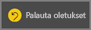

# Näytä sisältö yksityiskohtaisemmin: kohdistustila ja koko näytön tila

<iframe width="560" height="315" src="https://www.youtube.com/embed/dtdLul6otYE" frameborder="0" allowfullscreen></iframe>

Kohdistustila ja koko näytön tila ovat kaksi eri tapaa nähdä visualisoinnit, raportit ja koontinäytöt yksityiskohtaisemmin.  Suurin ero on se, että koko näytön tilassa kaikki sisällön ympärillä olevat ruudut poistuvat, mutta kohdistustilassa voit edelleen käyttää visualisointeja. Tutustutaan seuraavaksi tarkemmin samankaltaisuuksiin ja eroihin.  

|Sisältö    | Kohdistustila  |Koko näytön tila  |
|---------|---------|----------------------|
|Koontinäyttö     |   Ei ole mahdollista     | kyllä |
|Raporttisivu   | Ei ole mahdollista  | kyllä|
|Raportin visualisointi | kyllä    | kyllä |
|Koontinäytön ruutu | kyllä    | kyllä |
|Windows 10 Mobile | Ei ole mahdollista | Kyllä |

## Mikä on koko näytön tila?

Näytä Power BI -palvelun sisältö (koontinäytöt, raporttisivut, ruudut ja visualisoinnit) ilman valikoiden ja siirtymispalkkien aiheuttamia häiriöitä.  Saat sisältösi aidon, koko näytön näkymän yhdellä silmäyksellä keskeytyksettä. Tätä kutsutaan joskus myös TV-tilaksi.   

Avaa koko näytön tila valitsemalla **koko näyttö** -kuvake  Power BI -palvelun valikkoriviltä, joka on koontinäytön, raportin, kohdistustilan ruudun tai kohdistustilan visualisoinnin yläpuolella.  Valitsemasi sisältö täyttää koko näytön.
Jos käytät Power BI mobiilisovellusta, [koko näytön tila on käytettävissä Windows 10 -mobiilisovelluksia varten](./mobile/mobile-windows-10-app-presentation-mode.md). 

Koko näytön tilan käyttötapoja:

* koontinäytön, ruudun, visualisoinnin tai raportin esittäminen kokouksessa tai konferenssissa
* esittäminen toimistossa erillisellä suurella näytöllä tai projektorilla
* tarkasteleminen pienessä näytössä
* tarkasteleminen lukitussa tilassa – voit koskettaa näyttöä tai viedä hiiren ruutujen päälle ilman että taustalla oleva raportti tai koontinäyttö avautuu

## Mikä on kohdistustila?
***Kohdistus***tilassa voit laajentaa (avata ponnahdusikkunassa) visualisoinnin tai ruudun ja tarkastella sitä lähemmin.  Sinulla saattaa olla koontinäyttö tai raportti, joka on ahdettu hieman liian täyteen, ja haluat lähentää vain yhteen visualisointiin.  Kohdistustilaa kannattaa käyttää juuri tähän.  

Kohdistustilassa Power BI *-kuluttaja* voi käsitellä tätä visualisointia luotaessa käytettyjä suodattimia.  Power BI -palvelussa voit käyttää koontinäytön ruudun tai raportin visualisoinnin kohdistustilaa.

## Työskentely koko näytön tilassa
Jos haluat avata koontinäytön tai raporttisivun koko näytön tilassa, valitse koko näyttö -kuvake  yläreunan siirtymispalkista. Kun olet koko näytön tilassa, saat pikavalikon näkyviin liikuttamalla hiirtä tai kohdistinta. Koko näytön tila on käytettävissä monissa erilaisissa sisällöissä, joten pikavalikkojen vaihtoehdot eroavat hieman toisistaan, mutta ovat melko itsestään selviä.  Näet määrityksen, kun pidät hiiren osoitinta kuvakkeen päällä.

Koontinäyttöjen valikko    
    

Raporttisivujen valikko    
    

  *     
  Palaa edelliselle sivulle selaimessa **Takaisin**-painikkeella. Jos edellinen sivu oli Power BI -sivu, sekin näkyy koko näytön tilassa.  Koko näytön tila pysyy käytössä, kunnes poistut siitä.

  *     
  Tämän painikkeen avulla voit tulostaa koontinäytön tai raporttisivun koko näytön tilassa.

  *     
    Käytä **Sovita näyttöön** -painiketta, kun haluat näyttää koontinäytön suurimmassa mahdollisessa koossa ilman vierityspalkkeja.  

    

  *        
    Joskus vierityspalkit lähinnä ärsyttävät, mutta haluat silti nähdä koontinäytön koko käytettävissä olevan tilan leveydeltä. Valitse **Sovita leveyteen** -painike.    

    

  *        
    Voit siirtyä raportin sivulta toiselle koko näytön raporteissa näiden nuolten avulla.    
  * Jos haluat poistua koko näytön tilasta, valitse **Poistu koko näytön tilasta** -kuvake.

      

## Työskentely kohdistustilassa
Kohdistustilan voi avata kahdella eri tavalla, toinen on tarkoitettu koontinäytön ruuduille ja toinen raportin visualisoinneille.

### Koontinäyttöjen kohdistustila
1. Avaa koontinäyttö Power BI -palvelussa.

2. Pidä hiiren osoitinta koontinäytön ruudun tai raportin visualisoinnin päällä, valitse kolme pistettä (...) ja valitse sitten **Avaa kohdistustilassa**.

    .

2. Ruutu aukeaa ja täyttää koko raportin.

   

3. Laajenna Suodattimet-ruutu nähdäksesi kaikki tähän visualisaatioon käytetyt suodattimet.

   

4. Tutki tarkemmin [muokkaamalla suodattimia](end-user-report-filter.md) ja etsimällä tiedoistasi kiinnostavia havaintoja.  

5. Poistu kohdistustilasta ja palaa koontinäyttöön valitsemalla **Poistu kohdistustilasta** (visualisoinnin vasemmassa yläkulmassa).

        

## Kohdistustila raportin visualisointeja varten
1. Avaa raportti Power BI -palvelussa.  Käytämme tässä esimerkissä jälleenmyyntianalyysimallia.

1. Kun raportti on avattu, valitse **Alueen kuukausimyynti -välilehti**.

2. Pidä hiiren osoitinta vasemmassa alakulmassa olevan aluekaavion päällä ja valitse **Kohdistustila**-kuvake .  

   
2. Visualisointi aukeaa ja täyttää koko raportin.

   
3. Halutessasi voit laajentaa Suodattimet-ruutua käsitelläksesi tähän visualisointiin käytettyjä suodattimia. Perehdy tietoihin ja etsi uusia merkityksellisiä tietoja sekä vastauksia kysymyksiin. *Kuluttajana* et voi lisätä uusia suodattimia, muuttaa visualisoinneissa käytettäviä kenttiä tai luoda uusia visualisointeja.  Kaikki olemassa oleviin suodattimiin tekemäsi muutokset kuitenkin tallennetaan, kun poistut Power BI:stä. Jos et halua, että Power BI muistaa tekemäsi muutokset, valitse **Palauta oletukset**.   

   

5. Poistu kohdistustilasta ja palaa raporttiin valitsemalla **Takaisin raporttiin** (visualisoinnin vasemmassa yläkulmassa).

      

## Huomioon otettavat seikat ja vianmääritys
* Kun käytät kohdistustilaa raportin visualisoinnissa, voit tarkastella ja käsitellä kaikkia suodattimia: visuaalisen tason, sivutason, porautumisen ja raporttitason suodattimia.    
* Kun käytät kohdistustilaa koontinäytön visualisoinnissa, voit tarkastella ja käsitellä vain visuaalisen tason suodatinta.

## Seuraavat vaiheet
[Tarkastele raporttien asetuksia](end-user-report-view.md)