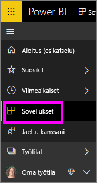
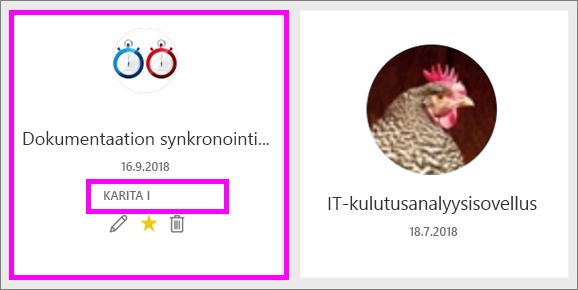
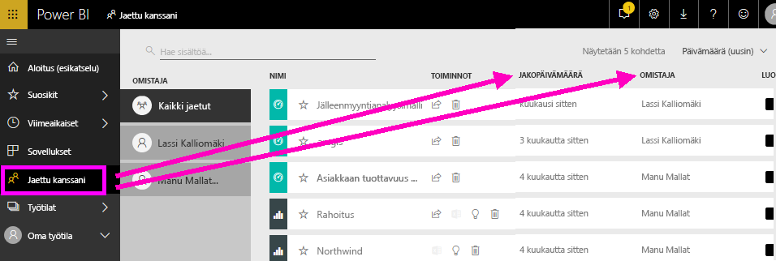
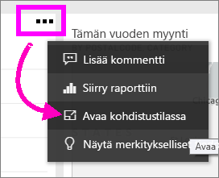
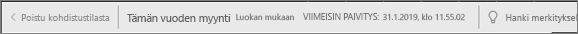
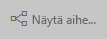
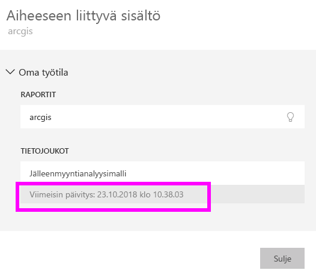

# Sisältösi on ajan tasalla
*Kuluttajana* olet kosketuksessa sisältöön, jonka ovat luoneet ja jakaneet kanssasi *suunnittelijat*. Saatat ihmetellä, onko sisältö ajan tasalla, tai ehkä haluat vain tietää, milloin sisältö on viimeksi päivitetty. Kun tiedät käsitteleväsi uusinta sisältöä, se antaa sinulle luottamuksen tunteen.  
 

Jotta voidaan tehdä oikeat päätökset, on usein ehdottoman välttämätöntä huolehtia siitä, että käytetty tieto on viimeisintä laatua. Miten voit varmistaa, että käytät uusinta sisältöä? Useimmissa tapauksissa se ei edellytä sinulta mitään toimia. Kanssasi jaetut sovellukset ladataan uudelleen ja päivitetään automaattisesti sovelluksen suunnittelijan päättämän aikataulun mukaan. Sama koskee koontinäyttöjä ja raportteja, jotka on jaettu kanssasi – suunnittelija varmistaa joko manuaalisesti tai automaattista päivitysaikataulua käyttämällä, että sisältö on tuoretta.  

Jos sinulla on kysyttävää tietojen tuoreudesta, ota yhteyttä suunnittelijaan.

## Suunnittelijan nimen paikantaminen

### Sovellukset

Sovelluksen näytössä näkyy sekä suunnittelijan nimi että sovelluksen luomispäivämäärä.  

1. Valitse vasemmasta siirtymisruudusta **Sovellukset**.

    

    Näet kunkin sovelluksen nimen ja luomispäivämäärän. 

2. Viemällä hiiren osoittimen sovelluksen kohdalle saat näyttöön myös suunnittelijan nimen. 

    

### Jaettu kanssani
**Jaettu kanssani** -näytössä näkyy sisällön omistajan nimi sekä päivämäärä, jona sisältö on jaettu kanssasi.

 

## Miten voit etsiä viimeisimmän uudelleenlatauksen päivämäärän
Jos olet kiinnostunut, voit hakea suurimmalle osalle sisällöstä sen viimeisen uudelleenlatauspäivämäärän. 

### Koontinäytön ruudut
Tarkastele koontinäytön ruutua kohdistustilassa, niin saat nähdä sen viimeisimmän päivityksen aikaleiman.

1. Valitse koontinäytön ruudussa kolme pistettä (...) ja valitse sitten **Avaa kohdistustilassa**.

    

2. Oikeassa yläkulmassa näytetään viimeisimmän päivityksen päivämäärä. Jollet näe sitä, laajenna selaintasi niin, että se ulottuu leveämmälle. 

    

### Raporttinäkymistä ja raporteista
Toinen tapa hakea viimeisin päivityspäivämäärä on käyttämällä kohtaa **Näytä aiheeseen liittyvät**.  **Näytä aiheeseen liittyvät** on käytettävissä Power BI:n ylävalikkorivissä.

**Aiheeseen liittyvä sisältö** -ruutu näyttää viimeisimmän päivitystiedon koontinäytön tai raportin pohjana olevalle tietojoukolle.

## Mitä tapahtuu, jos suunnittelija poistaa sovelluksen

Jos suunnittelija poistaa sovelluksen, sovellukseen liittyvät koontinäytöt ja raportit poistuvat automaattisesti myös Power BI -työtilastasi. Ne eivät ole enää käytettävissä, eikä sovellusta näy enää siirtymisruudussa.

## Tee tilaus, niin näet muutokset
Toinen tapa pysytellä ajan tasalla on tilata raportti tai koontinäyttö. Sen sijaan, että joutuisit kirjautumaan sisään ja avaamaan raportin tai koontinäytön, voit pyytää Power BI:ltä tilannevedoksia määrittelemäsi aikataulun mukaisesti.  Katso lisätietoja kohdasta [Tilaa koontinäyttöjä ja raportteja](end-user-subscribe.md).

## Tietoilmoitusten määrittäminen
Haluatko saada ilmoituksen, jos tiedot muuttuvat niin, että määrittämäsi raja ylittyy? [Luo tietoilmoitus](end-user-alerts.md).  Tietoilmoituksia käyttäen on helppo pysyä ajan tasalla. Tietoilmoituksia käyttämällä annat Power BI:lle käskyn lähettää sinulle sähköpostia, jos raportissa esiintyvä arvo ylittää tietyn kynnyksen.  Esimerkiksi varaston tavaramäärä laskee 25 yksikköä pienemmäksi tai myynti ylittää tavoitteet.  

## Seuraavat vaiheet
[Luo tietoilmoitus](end-user-alerts.md)    
[tilaa koontinäyttöjä ja raportteja](end-user-subscribe.md)    
[Tarkastele aiheeseen liittyvää sisältöä](end-user-related.md)    
