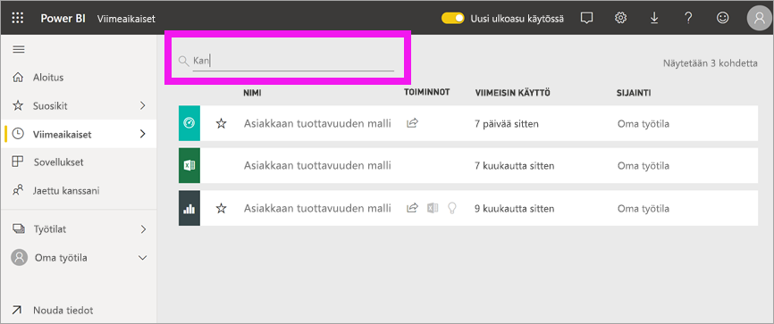

# Etsi omat koontinäytöt, raportit ja sovellukset
Power BI:ssä termi *sisältö* viittaa sovelluksiin, koontinäyttöihin ja raportteihin. Sisällön luovat Power BI:n *suunnittelijat*, jotka jakavat sen kaltaistesi kollegojen kanssa. Sisältösi on käytettävissä ja nähtävissä Power BI-palvelussa, ja paras paikka aloittaa työskentely Power BI:ssä on aloitussivusi.

## Tutki Power BI -aloitussivua
Kun kirjaudut sisään, Power BI avautuu ja näyttää aloitussivusi seuraavassa kuvassa esitetyllä tavalla.
 

Power BI -aloitussivu tarjoaa kolme eri tapaa paikantaa ja tarkastella sisältöäsi. Kaikki kolme voivat käyttää samaa sisältövarantoa, joten ne ovat vain eri tapoja päästä käyttämään sisältöä. Toisinaan haku on helpoin ja nopein tapa löytää jotakin, mutta yleensä *kortin* valitseminen aloitussivulta on paras vaihtoehto.

- Aloitussivu näyttää ja järjestää suosituimman ja viimeisimmän sisältösi sekä sisältösuositukset ja oppimisresurssit. Jokainen sisältökohde näkyy *korttina*, jossa on otsikko ja kuvake. Kortin valitsemalla avaat tämän sisällön.
- Vasemmalla puolella on siirtymisruutu, jota kutsutaan siirtymisruuduksi. Tässä ruudussa sama sisältö on järjestetty hieman eri tavalla: Suosikit, Viimeisimmät, Sovellukset ja Jaettu kanssani. Täällä voit tarkastella sisältöluetteloita ja valita niistä sen, jonka avaat.
- Oikeassa yläkulmassa olevan yleisen hakuruudun avulla voit hakea sisältöä otsikon, nimen tai avainsanan avulla.

Seuraavissa aiheissa tarkastellaan kaikkia näitä vaihtoehtoja sisällön etsimiseksi ja tarkastelemiseksi.

## Aloitussivu
Aloitussivulla voit tarkastella kaikkea sitä sisältöä, jonka käyttöön sinulla on oikeus. Aluksi aloitussivullasi ei välttämättä ole paljoa sisältöä (ks. kuvaa yllä), mutta tämä muuttuu sitä mukaa kun aloitat Power BI:n käytön työtovereidesi kanssa.

Aloitussivu päivittyy myös yhdessä suositellun sisällön ja oppimisresurssien kanssa. 
 
Kun käytät Power BI -palvelua, saat työtovereilta koontinäyttöjä, raportteja ja sovelluksia, ja näin aloitussivusi vähitellen täyttyy. Ajan mittaan se saattaa muistuttaa seuraavaa aloitussivua.

 
Seuraavissa aiheissa tarkastellaan lähemmin aloitussivua ylhäältä alas.

## Tärkein sisältö ulottuvillasi

### Suosikit ja usein käytetyt
Tämä yläosa sisältää linkkejä sisältöön, jota käytät useimmiten tai jonka olet merkinnyt [suositelluksi tai suosikiksi](end-user-favorite.md). Huomaa, että eräillä korteilla on keltaiset tähdet; nämä kaksi sovellusta ja tämä koontinäyttö on merkitty suosikeiksi.
 
### Viimeisimmät ja Omat sovellukset
Seuraavassa osiossa näytetään sisältö, jota olet käyttänyt viimeksi. Huomaa kunkin kortin aikaleima. **Omat sovellukset** -osiossa on luettelo sovelluksista, jotka on jaettu kanssasi tai jotka olet [ladannut AppSourcesta](end-user-apps.md); viimeisimmät sovellukset on luetteloitu tässä. Voit valita **Näytä kaikki**, jolloin näet luettelon kaikista kanssasi jaetuista sovelluksista.

### Työtilat
Power BI:n *kuluttajana* sinulla on yleensä vain yksi työtila: **Oma työtila**. 

### Jaettu kanssani
Työtoverit jakavat sovelluksia kanssasi, mutta he voivat myös jakaa yksittäisiä koontinäyttöjä ja raportteja. Huomaa, että **Jaettu kanssani** -osiossa on kolme koontinäyttöä ja kolme raporttia, jotka työtoverisi ovat jakaneet kanssasi.

### Suositellut sovellukset
Toimintasi ja tiliasetustesi perusteella Power BI näyttää joukon suositeltuja sovelluksia. Sovelluskortin valitseminen avaa sovelluksen.
 
### Oppimisresurssit
Aloitussivun alaosassa on joukko oppimisresursseja. Se, mitä resursseja tarkkaan ottaen näkyy, riippuu toiminnastasi, asetuksistasi ja Power BI -järjestelmänvalvojan tahdosta. 
 
## Siirtymisruutuun tutustuminen

Käytä siirtymisruutua koontinäyttöjen, raporttien ja sovellusten paikantamiseen ja niiden välillä siirtymiseen. Joskus siirtymisruudun käyttäminen on nopein tapa päästä sisältöön.
Siirtymisruutu on näkyvissä, kun avaat aloitussivusi, ja pysyy muuttumattomana avatessasi muita Power BI -palvelun alueita.
  
Siirtymisruutu järjestää sisältösi säilöihin, jotka muistuttavat sitä, mitä olet jo nähnyt aloitussivulla: Suosikit, Viimeisimmät, Sovellukset ja Jaettu kanssani. Pikaikkunoita käyttämällä voit tarkastella vain uusinta sisältöä kussakin näistä säilöistä, tai voit siirtyä sisältöluetteloihin, joista näet kunkin säilöluokan koko sisällön.
 
- Jos haluat avata jonkin näistä sisältöosioista ja näyttää luettelon kaikista kohteista, valitse otsikko.
- Jos haluat tarkastella kunkin säilön viimeisimpiä tietoja, valitse pikaikkuna ( **>** ).

    

 
Siirtymisruutu on toinen tapa löytää haluamasi sisältö nopeasti. Sisältö on järjestetty samalla tavalla kuin aloitussivulla, mutta se näkyy luetteloina korttien sijaan. 

## Hae kaikesta sisällöstä
Joskus haku on nopein tapa löytää sisältösi. Saatat esimerkiksi kaipailla aloitussivulta koontinäyttöä, jota et ole vähään aikaan käyttänyt. Ehkä myös muistat työtoverisi Aaronin jakaneen sen kanssasi, muttet muista, millä nimellä hän sitä kutsui tai minkä tyyppistä sisältöä hän jakoi ja oliko se oikeastaan koontinäyttö vai raportti.
 
Voit antaa koontinäytön nimen kokonaan tai osittain ja hakea sitä. Voit myös antaa työtoverisi nimen ja hakea sisältöä, jonka hän on jakanut kanssasi. Haku määrittyy etsimään vastaavuuksia kaikesta omistamastasi tai käyttämästäsi sisällöstä.

## Seuraavat vaiheet
Yleiskatsaus [Power BI:n peruskäsitteisiin](end-user-basic-concepts.md)
