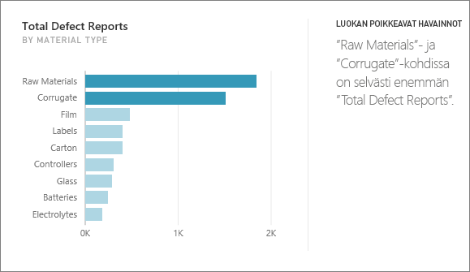
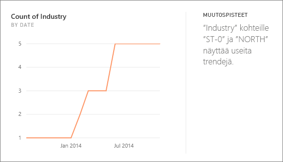
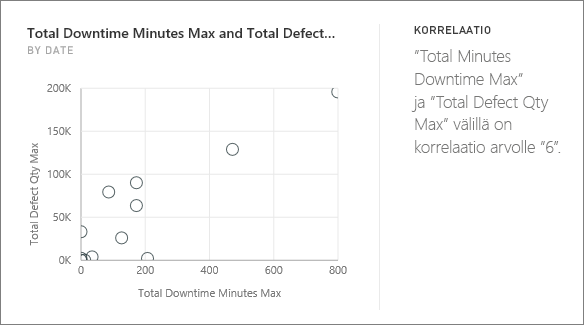
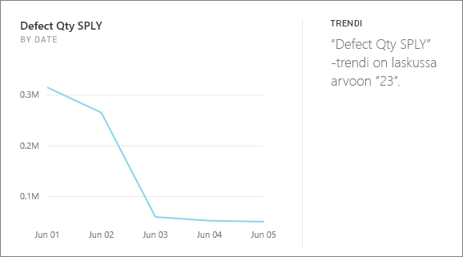
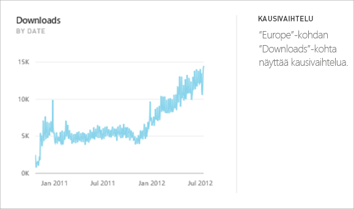
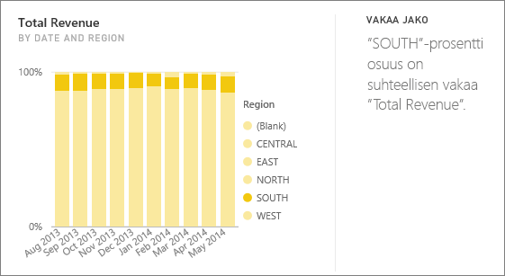
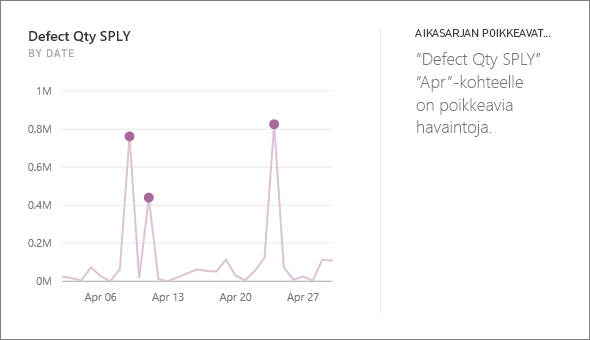

# Power BI:n tukemat merkityksellisten tietojen tyypit

Power BI voi etsiä tiedoistasi mielenkiintoisia trendejä ja malleja. Nämä trendit ja mallit esitetään *merkityksellisiksi tiedoiksi* kutsuttujen visualisointien muodossa. 

Jos haluat lisätietoja merkityksellisten tietojen käyttämisestä, katso [Power BI:n merkitykselliset tiedot](end-user-insights.md)

## Merkityksellisten tietojen toiminta
Power BI tekee nopeasti hakuja tietojoukkojesi eri alijoukoista. Haun aikana Power BI käyttää joukkoa kehittyneitä algoritmeja, jotka löytävät mahdollisesti kiinnostavia merkityksellisiä tietoja. Power BI:n *käyttäjät* voivat suorittaa merkityksellisiä tietoja koontinäytön ruuduille.

## Terminologia
Power BI käyttää tilastollisia algoritmeja merkityksellisten tietojen tunnistamiseen. Algoritmit luetellaan ja kuvataan tämän artikkelin seuraavassa osiossa. Ennen kuin käsittelemme algoritmeja, selitämme muutamia termejä, jotka saattavat olla sinulle vieraita. 

* **Mittari** – mittari on määrällinen (numeromuotoinen) kenttä, jota voidaan käyttää laskutoimituksissa. Tavallisia laskutoimituksia ovat summa, keskiarvo ja minimi. Jos yrityksemme esimerkiksi valmistaa ja myy rullalautoja, mittarimme voivat olla myytyjen rullalautojen lukumäärä ja keskimääräinen vuosivoitto.  
* **Dimensio** – dimensiot ovat kategorista (teksti-) tietoa. Dimensio kuvaa henkilöä, objektia, kohdetta, tuotteita, paikkaa ja aikaa. Tietojoukossa dimensiot ovat tapa ryhmitellä *mittarit* hyödyllisiin luokkiin. Rullalautayrityksessämme dimensiot voivat tarkoittaa myynnin (joka on mittari) tarkastelua mallin, värin, maan tai markkinointikampanjan mukaan.   
* **Korrelaatio** – korrelaatio kertoo meille, miten asioiden käyttäytyminen liittyy toisiin asioihin.  Jos niiden kasvun tai vähenemisen mallit ovat samanlaiset, ne korreloivat positiivisesti. Jos taas niiden muutossuunnat ovat vastakkaiset, ne korreloivat negatiivisesti. Jos esimerkiksi punaisten rullalautojen myynti kasvaa aina televisiomarkkinointikampanjan myötä, punaisten rullalautojen myynnin ja televisiokampanjan välillä on positiivinen korrelaatio.
* **Aikasarja** – aikasarja on tapa näyttää aika peräkkäisinä arvopisteinä. Nämä arvopisteet voivat olla esimerkiksi sekunteja, tunteja, kuukausia tai vuosia.  
* **Jatkuva muuttuja** – jatkuva muuttuja voi olla mikä tahansa arvo minimi- ja maksimirajan välillä, muuten kyseessä on diskreetti muuttuja. Esimerkkejä ovat lämpötila, paino, ikä ja aika. Jatkuviin muuttujiin voi sisältyä arvon osia tai murto-osia. Myytyjen sinisten rullalautojen kokonaismäärä on diskreetti muuttuja, koska emme voi myydä rullalaudan puolikasta.  

## Minkälaisia merkityksellisiä tietoja on olemassa?
Power BI käyttää seuraavia algoritmeja. 

### Luokan poikkeavat havainnot (ylä/ala)
Korostaa tapaukset, joissa yhdellä tai kahdella luokalla on paljon suuremmat arvot kuin muilla luokilla.  

### Aikasarjan muutospisteet
Korostaa kohdat, joissa tietojen aikasarjan trendeissä on merkittäviä muutoksia.

### Korrelaatio
Havaitsee tapaukset, joissa useat mittarit osoittavat samanlaisen mallin tai trendin, kun niitä verrataan tietojoukon luokkaan tai arvoon.

### Pieni varianssi
Havaitsee tapaukset, jossa arvopisteet eivät eroa keskiarvosta huomattavasti.

### Enemmistö (päätekijät)
Etsii tapauksia, jossa kokonaisarvon enemmistön voidaan katsoa johtuneen yhdestä tekijästä, kun se jaetaan toisella dimensiolla.  

### Aikasarjan yleiset trendit
Havaitsee ylöspäin ja alaspäin suuntautuvat trendit aikasarjatiedoissa.

### Kausivaihtelu aikasarjassa
Etsii toistuvia kuvioita aikasarjatiedoissa, kuten viikoittaista, kuukausittaista tai vuosittaista kausivaihtelua.

### Vakaa jako
Korostaa tapaukset, joissa on olemassa pääkohde-alikohde-korrelaatio alikohteen osuudessa suhteessa pääkohteen yleisarvoon jatkuvassa muuttujassa.

### Aikasarjan poikkeavat havainnot
Tunnistaa aikasarjan tiedoissa erityiset päivämäärät tai ajat, joiden arvot eroavat huomattavasti muista päivä-/aika-arvoista.

## Seuraavat vaiheet
[Power BI:n merkitykselliset tiedot](end-user-insights.md)

Onko sinulla kysyttävää? [Kokeile Power BI -yhteisöä](https://community.powerbi.com/)

