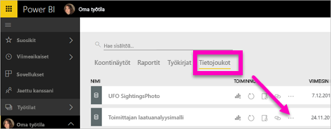
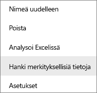
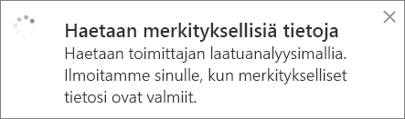
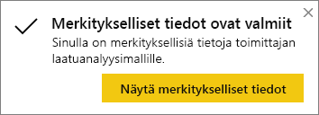
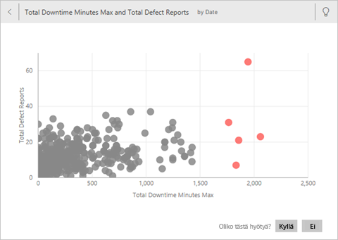
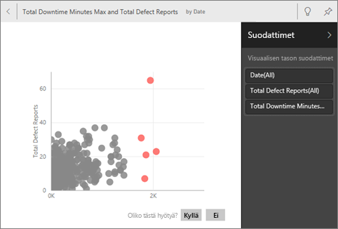
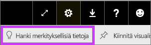

# Koontitietojen automaattinen luominen Power BI:llä
Etkö tiedä, mistä aloittaisit uuden tietojoukon kanssa?  Tarvitsetko koontinäytön nopeasti?  Haluatko koontitietoja, jotka ovat ehkä jääneet huomaamatta?

Saat nopeita merkityksellisiä tietoja ja voit luoda tietoihin perustuvia mielenkiintoisia, vuorovaikutteisia visualisointeja. Nopeat merkitykselliset tiedot voidaan suorittaa koko tietojoukolle (nopeat tiedot) tai tietylle koontinäytön ruudulle (suodatetut tiedot). Voit suorittaa merkitykselliset tiedot jopa toisiin merkityksellisiin tietoihin!

> **HUOM.** Merkitykselliset tiedot eivät toimi DirectQueryllä – ne toimivat vain Power BI:hin ladatuilla tiedoilla.
> 

Merkityksellisiä tietoja -ominaisuus on perustuu kasvavaan [edistyneiden analyysialgoritmien joukkoon](end-user-insight-types.md), jota kehitetään yhdessä Microsoft Researchin kanssa. Sen avulla entistä useammat ihmiset voivat saada merkityksellisiä tietoja tiedoistaan uusilla ja intuitiivisilla tavoilla.

## Nopeiden merkityksellisten tietojen suorittaminen tietojoukkoon
Katso, kuinka Amanda suorittaa nopeat merkitykselliset tiedot tietojoukkoon, avaa merkityksellisen tiedon kohdistustilassa, kiinnittää yhden tiedoista ruutuna koontinäytölleen ja hakee sitten merkityksellisiä tietoja koontinäytön ruudusta.

<iframe width="560" height="315" src="https://www.youtube.com/embed/et_MLSL2sA8" frameborder="0" allowfullscreen></iframe>

Nyt on sinun vuorosi. Tutustu merkityksellisiin tietoihin [toimittajan laatuanalyysimallin](../sample-supplier-quality.md) avulla.

1. Valitse **Tietojoukot**-välilehdeltä kolme pistettä (...) ja valitse **Hae merkitykselliset tiedot**.
   
    
   
    
2. Power BI hakee tietojoukostasi trendejä [erilaisten algoritmien](end-user-insight-types.md) avulla.
   
    
3. Merkitykselliset tietosi ovat valmiit muutamassa sekunnissa.  Näytä visualisoinnit valitsemalla **Tarkastele merkityksellisiä tietoja**.
   
    
   
   > **HUOM.** Joistain tietojoukoista ei voi luoda merkityksellisiä tietoja, koska tiedot eivät ole tilastollisesti merkittäviä.  Saat lisätietoja tutustumalla ohjeartikkeliin [Tietojen optimointi merkityksellisiä tietoja varten](../service-insights-optimize.md).
   > 
   > 
1. Visualisoinneissa näytetään erityinen **nopeat merkitykselliset tiedot** -pohja, jossa on enintään 32 erillistä merkityksellisiä tietoja sisältävää korttia. Jokaisessa kortissa on taulukko tai kaavio sekä lyhyt kuvaus.
   
    

## Vuorovaikutus merkityksellisten tietojen korttien kanssa
  

1. Osoita korttia ja lisää visualisointi koontinäyttöön valitsemalla kiinnityskuvake.
2. Osoita korttia, valitse kolme pistettä (...) ja valitse **Näytä merkitykselliset tiedot**. Merkitykselliset tiedot avataan koko näytölle.
   
    
3. Kohdistustilassa voit:
   
   * suodattaa visualisointeja.  Voit tarkastella suodattimia valitsemalla oikeasta yläkulmasta nuolen, joka laajentaa Suodattimet-ruudun.
        
   * Kiinnitä merkityksellisten tietojen kortti koontinäyttöön valitsemalla  tai **Kiinnitä visualisointi**.
   * Merkityksellisten tietojen suorittaminen korttiin. Tätä kutsutaan usein **tietojen suodattamiseksi**. Valitse oikeasta yläkulmasta hehkulamppukuvake  tai **Hae merkityksellisiä tietoja**.
     
       
     
     Merkitykselliset tiedot näytetään vasemmalla ja uudet kortit, joiden tiedot peruvat pelkästään kyseisiin merkityksellisiin tietoihin, näytetään oikealla.
     
       
4. Voit palata alkuperäiseen merkityksellisten tietojen pohjaan valitsemalla vasemmasta yläkulmasta **Poistu kohdistustilasta**.

## Merkityksellisten tietojen suorittaminen koontinäytön ruudulle
Sen sijaan, että hakisit merkityksellisiä tietoja koko tietojoukosta, tarkenna hakuasi yksittäisen koontinäytön ruudun luomiseen käytettyihin tietoihin. Tätäkin kutsutaan usein **tietojen suodattamiseksi**.

1. Avaa koontinäyttö.
2. Osoita ruutua. Valitse kolme pistettä (...) ja sitten **Näytä merkitykselliset tiedot**. Ruutu avautuu [kohdistustilassa](end-user-focus.md) ja merkityksellisten tietojen kortit näytetään oikealla.    
   
        
4. Herättivätkö yksittäiset merkitykselliset tiedot kiinnostuksesi? Tutustu asiaan tarkemmin valitsemalla kyseinen kortti. Valitut merkitykselliset tiedot näytetään vasemmalla ja uudet kortit, joiden tiedot peruvat pelkästään kyseisiin merkityksellisiin tietoihin, näytetään oikealla.    
6. Jatka tietoihin tutustumista. Kun löydät mielenkiintoisia merkityksellisiä tietoja, kiinnitä se koontinäyttöösi valitsemalla **Kiinnitä visualisointi** oikeasta yläkulmasta.

## Seuraavat vaiheet
Jos omistat tietojoukon, [optimoi se nopeita merkityksellisiä tietoja varten](../service-insights-optimize.md)

Lue lisätietoja [nopeiden merkityksellisten tietojen tyypeistä](end-user-insight-types.md)

Onko sinulla muuta kysyttävää? [Kokeile Power BI -yhteisöä](http://community.powerbi.com/)

