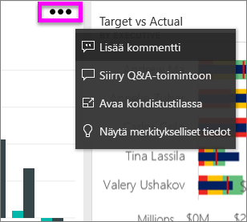
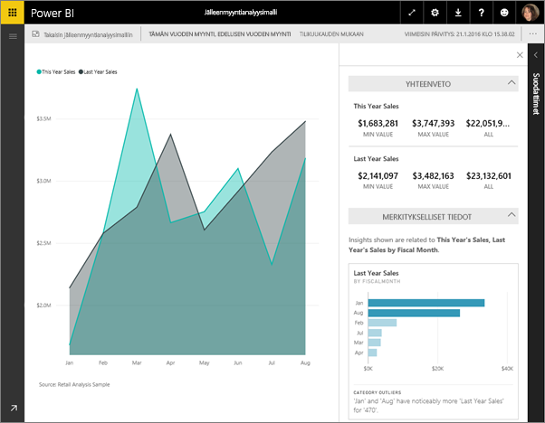
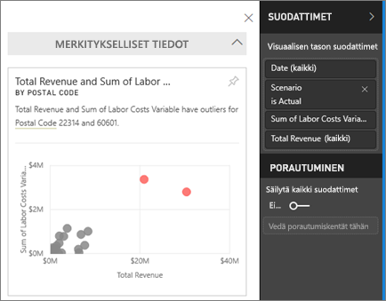
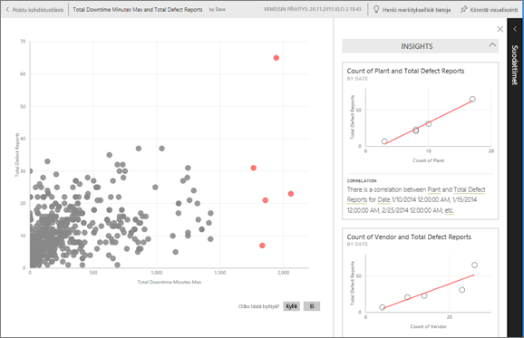

# Merkityksellisten tietojen tarkasteleminen koontinäytön ruuduissa Power BI:n avulla
Koontinäytön visualisointiruutujen kautta voit tarkastella tietoja. Kun valitset ruudun, raportti avautuu. Raportissa voit suodattaa ja lajitella raportin taustalla olevaa tietojoukkoa ja perehtyä siihen tarkemmin. Kun suoritat merkityksellisiä tietoja, Power BI tarkastelee tietoja puolestasi.

Saat nopeita merkityksellisiä tietoja ja voit luoda tietoihin perustuvia mielenkiintoisia, vuorovaikutteisia visualisointeja. Nopeat merkitykselliset tiedot voidaan suorittaa tietylle koontinäytön ruudulle, tai voit suorittaa merkitykselliset tiedot jopa toisiin merkityksellisiin tietoihin.

Merkityksellisiä tietoja -ominaisuus on perustuu kasvavaan [edistyneiden analyysialgoritmien joukkoon](end-user-insight-types.md), jota kehitetään yhdessä Microsoft Researchin kanssa. Sen avulla entistä useammat ihmiset voivat saada merkityksellisiä tietoja tiedoistaan uusilla ja intuitiivisilla tavoilla.

## Merkityksellisten tietojen suorittaminen koontinäytön ruudulle
Kun suoritat merkitykselliset tiedot koontinäytön ruudulle, Power BI hakee vain kyseisen koontinäytön ruudun luomiseen käytetyt tiedot. 

1. [Avaa koontinäyttö](end-user-dashboards.md).
2. Osoita ruutua. Valitse kolme pistettä (...) ja sitten **Näytä merkitykselliset tiedot**. 

    

3. Ruutu avautuu [kohdistustilassa](end-user-focus.md) ja merkityksellisten tietojen kortit näytetään oikealla.    
   
        
4. Herättivätkö yksittäiset merkitykselliset tiedot kiinnostuksesi? Tutustu asiaan tarkemmin valitsemalla kyseinen kortti. Valitut merkitykselliset tiedot näytetään vasemmalla ja uudet kortit, joiden tiedot peruvat pelkästään kyseisiin merkityksellisiin tietoihin, näytetään oikealla.    

 ## Vuorovaikutus merkityksellisten tietojen korttien kanssa
Kun sinulla on merkityksellinen tieto avattuna, jatka siihen tutustumista.

   * Suodata visualisointi piirtoalustalla.  Voit tarkastella suodattimia valitsemalla oikeasta yläkulmasta nuolen, joka laajentaa Suodattimet-ruudun.

     
   
   * Merkityksellisten tietojen suorittaminen korttiin. Tätä kutsutaan usein **aiheeseen liittyviksi merkityksellisiksi tiedoiksi**. Valitse oikeasta yläkulmasta hehkulamppukuvake  tai **Hanki merkityksellisiä tietoja**.
     
     
     
     Merkitykselliset tiedot näytetään vasemmalla ja uudet kortit, joiden tiedot peruvat pelkästään kyseisiin merkityksellisiin tietoihin, näytetään oikealla.
     
     

Voit palata alkuperäiseen merkityksellisten tietojen pohjaan valitsemalla vasemmasta yläkulmasta **Poistu kohdistustilasta**.

## Huomioon otettavat seikat ja vianmääritys
- **Näytä merkitykselliset tiedot** ei toimi DirectQueryllä – se toimii vain Power BI:hin ladatuilla tiedoilla.
- **Näytä merkitykselliset tiedot** ei toimi kaikissa koontinäytön ruututyypeissä. Se ei ole käytettävissä esimerkiksi mukautetuissa visualisoinneissa.<!--[custom visuals](end-user-custom-visuals.md)-->

## Seuraavat vaiheet
Lue lisätietoja [nopeiden merkityksellisten tietojen tyypeistä](end-user-insight-types.md)

