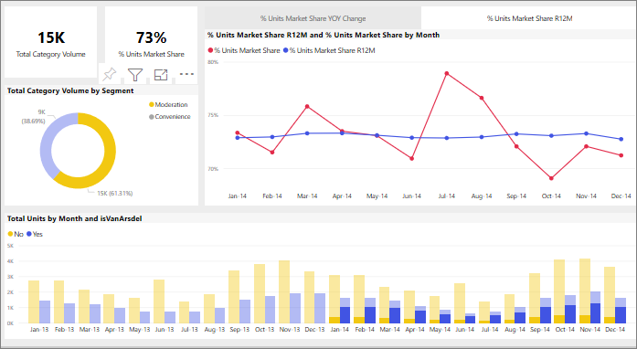

# Visualisointien ristiinsuodatus keskenään Power BI -raportissa
Yksi Power BI:n mahtavista ominaisuuksista on se, että kaikki raporttisivun visualisoinnit on yhdistetty toisiinsa. Jos valitset jonkin visualisoinnin arvopisteen, myös sivun kaikki muut kyseisen tiedon sisältävät visualisoinnit muuttuvat valinnan perusteella. 

## Visualisointien keskinäinen vuorovaikutus

Jos valitset arvopisteen yhdessä raporttisivun visualisoinnissa, ristiinsuodatat tai ristiinkorostat oletusarvoisesti sivun muut visualisoinnit. Raporttien *suunnitteluohjelma* määrittää sen, miten sivun visualisoinnit vaikuttavat toisiinsa. *Suunnitteluohjelmassa* visualisointien vuorovaikutus voidaan esimerkiksi ottaa käyttöön tai poistaa käytöstä ja lisäksi voidaan muuttaa ristiinsuodatuksen, ristiinkorostuksen ja [porautumisen](end-user-drill.md) oletusarvoja. 

Jos et ole vielä käyttänyt hierarkioita tai porautumista, voit oppia niistä lukemalla [porautumisesta Power BI:ssä](end-user-drill.md). 

Ristiinsuodatus ja ristiinkorostus voivat olla hyödyllisiä tapoja selvittää, miten yksi arvo tiedoissasi vaikuttaa toisiin. Voit esimerkiksi valita rengaskaavion valvontaosion, jolloin korostat tämän osion vaikutusta jokaiseen sarakkeeseen kuukausittaisten yksiköiden kokonaismäärän kaaviossa ja suodatat oikeanpuoleisen viivakaavion.

Katso [Tietoja suodattamisesta ja korostamisesta](end-user-report-filter.md). 

  
> [!NOTE]
> Termejä *ristiinsuodatus* ja *ristiinkorostus* käytetään tässä kuvatun toiminnan erottamiseksi siitä, mitä tapahtuu, kun käytät visualisointien suodattamiseen ja korostamiseen **Suodattimet**-ruutua.  

## Huomioon otettavat seikat ja vianmääritys
- Jos raportissasi on visualisointi, joka tukee [porautumista](end-user-drill.md), yhteen visualisointiin porautuminen ei oletusarvoisesti vaikuta muihin raporttisivun visualisointeihin.     
- Jos käytät visualisointi A:ta vuorovaikutukseen visualisointi B:n kanssa, visualisointi A:n visualisointitason suodattimia käytetään visualisointi B:ssä.

## Seuraavat vaiheet
[Raporttisuodattimien käyttäminen](../power-bi-how-to-report-filter.md)
