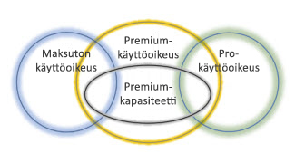
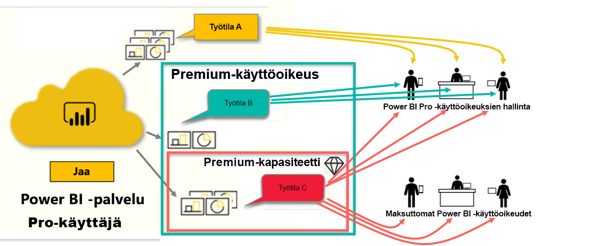

# Power BI -käyttöoikeustyypit
*Kuluttajana* käytät Power BI -palvelua raporttien ja koontinäyttöjen tarkastelemiseen, jotta voit tehdä liiketoimintapäätöksiä. Jos olet käyttänyt Power BI:tä jonkin aikaa tai olet jutellut *design-osaston* työntekijöiden kanssa, olet luultavasti huomannut, että jotkin ominaisuudet toimivat vain, jos sinulla on tietyntyyppinen käyttöoikeus. 

Tässä artikkelissa selitetään käyttöoikeustyyppien ja yhdistelmien erot: maksuton, Pro, Premium ja Premium-kapasiteetti. Saat myös ohjeet sen selvittämiseen, millaista käyttöoikeusyhdistelmää käytät.  

Aloitamme tarkastelemalla kahta käyttöoikeusluokkaa – käyttäjäkohtaisia käyttöoikeuksia ja organisaatiotason käyttöoikeuksia. Aloitamme käyttöoikeuksien oletuskapasiteeteilla. Sitten tutustumme siihen, miten Power BI -järjestelmänvalvojasi ja sisällön omistajat voivat muokata käyttöoikeuksien oletuskapasiteetteja roolien ja oikeuksien avulla. 

Jos käyttöoikeutesi sen sallii, järjestelmänvalvoja voi esimerkiksi rajoittaa mahdollisuuksiasi viedä tietoja, käyttää luonnollisen kielen Q&A-kyselyitä tai julkaista verkkoon. Kun raportin *suunnittelija* määrittää sisältöä työtilaan, hän voi määrittää sinulle työtilaroolin. Roolit määrittävät, mitä voit tehdä ja mitä et voi tehdä työtilassa. *Suunnittelija* voit säätää käyttöoikeutesi rajoituksia myös oikeusasetuksilla. Toisin sanoen: tämä on monimutkaista. Toivottavasti tämä artikkeli kuitenkin selkeyttää tilannetta.

## Käyttäjäkohtaiset käyttöoikeudet
Ensimmäinen käyttöoikeustyyppi on **käyttäjäkohtainen** käyttöoikeus. Jokaisella Power BI -palvelun käyttäjällä on joko maksuton käyttöoikeus tai Pro-käyttöoikeus. Jotkin ominaisuudet ja toiminnot on rajoitettu käyttäjille, joilla on Pro-käyttöoikeus.  

- **Power BI Pro -käyttöoikeuden** avulla käyttäjä voi tehdä yhteistyötä muiden Pro-käyttäjien kanssa luomalla ja jakamalla sisältöä. Vain käyttäjät, joilla on Pro-käyttöoikeus, voivat julkaista raportteja, tilata koontinäyttöjä ja raportteja sekä tehdä yhteistyötä työtovereiden kanssa työtiloissa. 

    

    Power BI Pro on yksilöllinen käyttöoikeus, jonka avulla käyttäjät voivat lukea ja käsitellä raportteja ja koontinäyttöjä, joita muut käyttäjät ovat julkaisseet Power BI -palvelussa. Käyttäjät, joilla on tämä käyttöoikeustyyppi, voivat jakaa sisältöä ja tehdä yhteistyötä muiden Power BI Pro -käyttäjien kanssa. Vain Power BI Pro -käyttäjät voivat julkaista tai jakaa sisältöä muiden käyttäjien kanssa tai käyttää muiden luomaa sisältöä. Ainoa poikkeus tähän on [Power BI Premium -kapasiteetissa isännöity sisältö](#understanding-premium-and-premium-capacity). Pro-käyttöoikeuksia käyttävät yleensä raporttien *suunnittelijat* ja kehittäjät. Saat lisätietoja alta kohdasta [Power BI Premium -kapasiteetti](#understanding-premium-and-premium-capacity).

- **Erillinen maksuton Power BI -käyttöoikeus** on myös tehokas, mutta se on tarkoitettu käyttäjille, jotka ovat vasta aloittamassa Power BI:n käyttöä tai jotka luovat sisältöä itseään varten. [Rekisteröidy Power BI:hin yksityishenkilönä](../service-self-service-signup-for-power-bi.md). Maksuton erillinen käyttöoikeus ei ole liitetty organisaation käyttöoikeuteen. 

    Maksuton erillinen käyttäjän käyttöoikeus on täydellinen käyttäjälle, joka opettelee Power BI:n käyttöä Microsoftin mallitiedostojen avulla. Käyttäjät, joilla on maksuton erillinen käyttöoikeus, eivät voi tarkastella toisten jakamaa sisältöä tai jakaa omaa sisältöään muiden Power BI -käyttäjien kanssa. 

    

Onko kaikki tähän mennessä selvää?  OK. Lisätään toinen kerros, **Premium-kapasiteetti**.

## Premiumin ja Premium-kapasiteetin erot
Premium on **organisaatiotason** käyttöoikeus. Se sisältää tietyt ominaisuudet ja toiminnot niiden ominaisuuksien sekä toimintojen lisäksi, jotka sisältyvät organisaation **käyttäjäkohtaisiin** Power BI -käyttöoikeuksiin. 

Kun organisaatio ostaa Premium-käyttöoikeuden, järjestelmänvalvoja tavallisesti määrittää Pro-käyttöoikeudet niille työntekijöille, jotka luovat ja jakavat sisältöä. Järjestelmänvalvoja myös määrittää maksuttomat käyttöoikeudet kaikille, jotka kuluttavat luotua sisältöä. Pro-käyttäjät luovat [työtiloja](end-user-workspaces.md) ja lisäävät sisältöä (koontinäyttöjä, raportteja ja sovelluksia) kyseisiin työtiloihin. Jotta muut voivat tehdä yhteistyötä näissä työtiloissa, Pro-käyttäjät käyttävät *kapasiteetin*, oikeuksien ja roolien yhdistelmää. 

Kun organisaatio ostaa Premium-käyttöoikeuden, organisaatio saa Power BI -palvelusta erityisesti varatun kapasiteetin. Kapasiteettia ei jaeta muiden kanssa. Kapasiteettia tukee erillinen laitteisto, joka on täysin Microsoftin hallinnoima. Organisaatiot voivat halutessaan käyttää varattua kapasiteettiaan laajasti tai kohdistaa sen tiettyihin työtiloihin. Premium-kapasiteetin työtila on tila, jossa Pro-käyttäjät voivat jakaa ja tehdä yhteistyötä maksuttoman version käyttäjien kanssa ilman, että heidän täytyy hankkia Pro-tilejä.  

Premium-kapasiteetissa edellytetään silti Pro-käyttöoikeuksia sisällön suunnittelijoilta. Suunnittelijat muodostavat yhteyden tietolähteisiin, mallintavat tietoja ja luovat raportteja sekä koontinäyttöjä, jotka on pakattu työtilasovelluksiksi. Käyttäjä voi käyttää Power BI Premium -työtilaa myös ilman Pro-käyttöoikeutta, kunhan sisältö kuuluu Premium *-kapasiteettiin* ja työtilan omistaja antaa käyttäjälle oikeuden.

Alla olevan kaavion vasen puoli kuvaa Pro-käyttäjiä, jotka luovat ja jakavat sisältöä työtiloissa.  
- **Työtila A** luotiin organisaatiossa, jolla ei ole Premium-käyttöoikeutta. 

- **Työtila B** luotiin organisaatiossa, jolla on Premium-käyttöoikeus, vaikka tätä tiettyä työtilaa ei tallennettu Premium-kapasiteettiin. Työtilassa ei ole vinoneliökuvaketta.

- **Työtila C** luotiin organisaatiossa, jolla on Premium-käyttöoikeus, ja se tallennettiin Premium-kapasiteettiin. Tällä työtilalla on vinoneliökuvake.  

Power BI Pron *suunnittelija* voi jakaa ja tehdä yhteistyötä muiden Pro-käyttäjien kanssa missä tahansa näistä kolmesta työtilasta. Tämä pätee, kunhan suunnittelija jakaa työtilan koko organisaation kanssa tai määrittää Pro-käyttäjille työtilarooleja. 

Power BI Pron *suunnittelija* voi jakaa ja tehdä yhteistyötä maksuttoman version käyttäjien kanssa vain työtilassa C. Työtilalle täytyy määrittää Premium-kapasiteettia, jotta maksuttoman version käyttäjät voivat käyttää työtilaa. Työtilassa suunnittelija määrittää roolit työtovereille: *Järjestelmänvalvoja*, *Jäsen*, *Osallistuja* tai *Katselija*. Rooli määrittää, mitä toimintoja käyttäjä voi tehdä työtilassa. Power BI *-kuluttajille* määritetään yleensä *Katselija*-rooli. Saat lisätietoja ohjeartikkelista [Työtilat Power BI -kuluttajille](end-user-workspaces.md).

## Selvitä, mikä käyttöoikeus sinulla on
Voit tarkistaa Power BI -käyttöoikeustietosi useilla eri tavoilla. 

Selvitä ensin, mikä **käyttäjän** käyttöoikeus sinulla on.

- Tiettyihin Microsoft Office -versioihin sisältyy Power BI Pro -käyttöoikeus.  Jos haluat tarkistaa, sisältääkö Office-versiosi Power BI:n, siirry [Office-portaaliin](https://portal.office.com/account) ja valitse **Tilaukset**.

    Tällä ensimmäisellä käyttäjällä Pradtannalla on Office 365 E5, joka sisältää Power BI Pro -käyttöoikeuden.

    

    Tällä toisella käyttäjällä Zalanilla on maksuton Power BI -käyttöoikeus. 

    

Tarkista seuraavaksi, onko tililläsi myös Premium-käyttöoikeus. Kumpi tahansa edellä mainituista käyttäjistä, Pro tai maksuton, voi kuulua organisaatioon, jolla on Premium-käyttöoikeus.  Tarkistetaan tilanne toiselta käyttäjältä, Zalanilta.  

- Valitse Power BI -palvelussa **Oma työtila** ja valitse sitten oikeassa yläkulmassa oleva hammasrataskuvake. Valitse **Hallitse henkilökohtaista tallennustilaa**.

    

    **Käyttäjäkohtaisen** käyttöoikeuden Pro-versio ja maksuton versio sisältää 10 Gt pilvitallennustilaa, jota voidaan käyttää Power BI -raporttien tai Excel-työkirjojen isännöintiin. Jos näet yli 10 Gt, olet sellaisen organisaatiotilin jäsen, jolla on Premium-käyttöoikeus.

    

    Muistathan, että Office-portaalin sivulla Zalanin käyttäjätilauksena näkyi Power BI (maksuton). Koska Zalanin organisaatio on ostanut Premium-käyttöoikeuden, hänellä on Power BI -palvelussa 100 Gt käytössään (ei 10 Gt). Koska hän on *kuluttajana* organisaatiossa, jolla on Premium-käyttöoikeus, hän voi tarkastella jaettua sisältöä, tehdä yhteistyötä työtovereiden kanssa, käyttää sovelluksia ja tehdä paljon muutakin, kunhan *suunnittelija* asettaa työtilan Premium-kapasiteettiin. Power BI -järjestelmänvalvoja ja sisällön suunnittelija määrittävät hänen käyttöoikeuksiensa laajuuden. Ota huomioon, että Pro-käyttäjä on jo jakanut työtilan Zalanin kanssa. Vinoneliökuvake kertoo hänelle, että työtila on tallennettu Premium-kapasiteettiin. 

   
## Työtilaroolien kuvaus
Tähän mennessä olemme käyneet läpi käyttäjäkohtaiset käyttöoikeudet, Premium-käyttöoikeudet ja Premium-kapasiteetin. Tutustutaan nyt työtilan *rooleihin*.

Koska tämä artikkeli on tarkoitettu Power BI *-kuluttajille*, käytämme seuraavaa esimerkkitilannetta:

-  Olet *maksuttoman* version käyttäjä organisaatiossa, jolla on Power BI Premium -käyttöoikeus. 
- Power BI Pro -käyttäjä on luonut kokoelman koontinäyttöjä ja raportteja sekä julkaissut tämän kokoelman *sovelluksena* koko organisaatiolle.  
- Sovellukset ovat olemassa *työtiloissa* ja työtila on Premium-kapasiteetissa.    
- Tässä sovellustyötilassa on yksi koontinäyttö ja kaksi raporttia.
- Pro-käyttäjä on määrittänyt sinulle **Katselija**-roolin.

### Katselija-rooli
Roolien avulla Power BI *-suunnittelija* voivat hallita, kuka voi tehdä mitäkin työtilassa, jotta tiimit voivat tehdä yhteistyötä. **Katselija** on yksi näistä rooleista. 

Kun työtila on Power BI Premium -kapasiteetissa, Katselija-roolin saaneet käyttäjät voivat käyttää työtilaa, vaikka heillä ei olisi Power BI Pro -käyttöoikeutta. Koska Katselija-roolilla ei ole oikeutta käyttää tai viedä taustatietoja, se tarjoaa turvallisen tavan käyttää koontinäyttöjä, raportteja ja sovelluksia.

> [!TIP]
> Jos haluat lisätietoja muista rooleista (Järjestelmänvalvoja, Jäsen ja Osallistuja), tutustu [uuden työtilan luomisen](../service-new-workspaces.md) ohjeisiin.

