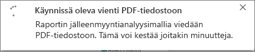
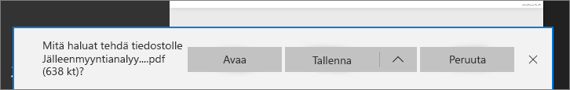

# Raporttien vieminen Power BI:stä PDF-muotoon
Power BI:llä voit julkaista raportin PDF-muodossa ja luoda helposti Power BI -raporttiisi perustuvan PDF-tiedoston. Kun **viet PDF-muotoon**, jokaisesta Power BI -raportin sivusta tulee yksittäinen sivu PDF-tiedostossa.

## Ohjeet Power BI -raportin viemiseksi PDF-muotoon
Valitse Power BI -palvelussa raportti, joka näytetään kankaalla. Voit myös valita raportin aloitussivulta, sovelluksista tai vasemman siirtymisruudun mistä tahansa osasta.

1. Valitse valikkoriviltä **Tiedosto** > **Vie PDF-muotoon**.

    

    Oikeassa yläkulmassa näytetään edistymispalkki. Vieminen voi kestää muutamia minuutteja, minkä aikana voit jatkaa Power BI:n käyttöä.

    

    Kun vieminen on valmis, ilmoituspalkissa kerrotaan, että Power BI -palvelu on suorittanut viennin.

2. Tiedostosi on käytettävissä sijainnissa, jossa selain näyttää ladatut tiedostot. Seuraavassa kuvassa se näkyy selainikkunan alareunan lataukset-palkissa.

    

Siinä kaikki. Voit ladata tiedoston ja avata sen millä tahansa PDF-lukuohjelmalla, esimerkiksi Microsoft Edgeen sisältyvällä PDF-lukuohjelmalla.

## Rajoitukset ja huomioitavat asiat
Huomioi seuraavat seikat ja rajoitukset, kun käytät **Vie PDF-muotoon** -toimintoa.

- Istunnon sisäinen vuorovaikutteisuus, kuten korostus ja suodatus sekä porautuminen, eivät vielä ole vielä tuettuja ominaisuuksia PDF-muotoon vietäessä. Viety PDF-tiedosto näyttää alkuperäiset visualisoinnit sellaisina kuin ne tallennettiin raporttiin. Jos olet käyttänyt suodattimia ja osittajia ja haluat säilyttää ne viennissä, tallenna raportti ja vie se tallentamisen jälkeen.

* **R-visualisointeja** ei tällä hetkellä tueta. Nämä visualisoinnit ovat tyhjiä PDF-tiedostossa. Niiden tilalla näytetään virheilmoitus.  

* **Sertifioituja** **mukautettuja visualisointeja** tuetaan. Saat lisätietoja sertifioiduista mukautetuista visualisoinneista, mukaan lukien sertifioinnin hakemisesta visualisoinnille, artikkelista [Mukautetun visualisoinnin sertifiointi](../power-bi-custom-visuals-certified.md). Mukautettuja visualisointeja, joita ei ole sertifioitu, ei tueta. Niiden tilalla näytetään virheilmoitus PDF-tiedostossa.   

* Yli 30 raporttisivua sisältäviä raportteja ei tällä hetkellä voi viedä.

* Raportin vieminen PDF-muotoon saattaa kestää muutamia minuutteja. Kestoon vaikuttavat mm. raportin rakenne ja Power BI -palvelun senhetkinen kuormitus.

* Jos **Vie PDF-muotoon** -valikkovaihtoehtoa ei ole käytettävissä Power BI -palvelussa, syy on todennäköisesti se, että vuokraajan järjestelmänvalvoja on poistanut toiminnon käytöstä. Saat lisätietoja ottamalla yhteyttä vuokraajan järjestelmänvalvojaan.

* Taustakuvat rajataan kaavion raja-alueen mukaiseksi. Suosittelemme, että poistat taustakuvat ennen PDF-muotoon viemistä.

* PDF-muotoon ei voi julkaista raportteja, jotka ovat vuokraajan Power BI -toimialueen ulkopuolisen käyttäjän omistamia (esimerkiksi organisaation ulkopuolisen henkilön omistama raportti, joka on jaettu kanssasi).

* Jos jaat koontinäytön organisaatiosi ulkopuoliselle henkilölle (joka ei ole Power BI -vuokraajasi toimialueella), kyseinen henkilö ei voi viedä jaettuun koontinäyttöön liittyviä raportteja PDF-muotoon. Jos olet esimerkiksi aaron@contoso.com, voit jakaa sisältöä käyttäjän cassie@cohowinery.com kanssa. cassie@cohowinery.com ei kuitenkaan voi viedä siihen liittyviä raportteja PDF-muotoon.

* Power BI -palvelu käyttää PDF-viennin kielenä Power BI:n kieliasetuksen kieltä. Jos tarkistaa kieliasetuksesi tai muuttaa sitä, valitse hammasrataskuvake > **Asetukset** > **Yleiset** > **Kieli**.

## Seuraavat vaiheet
[Raportin tulostaminen](end-user-print.md)