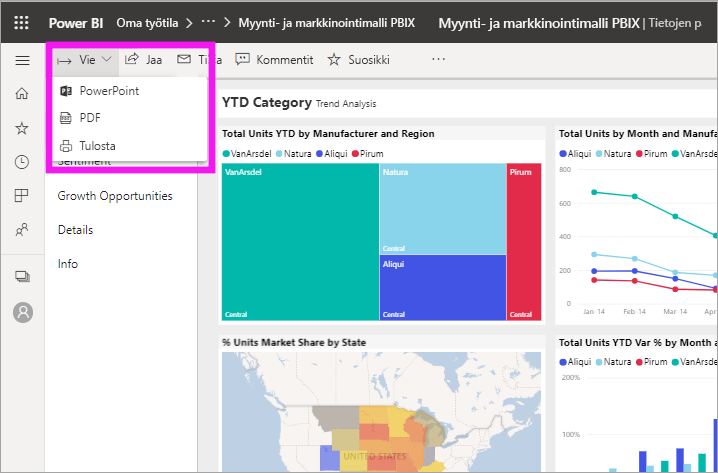
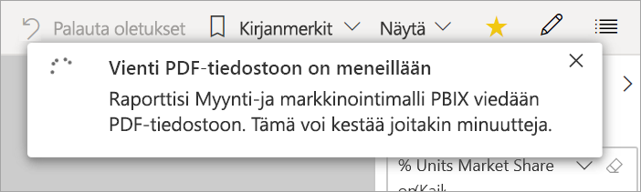
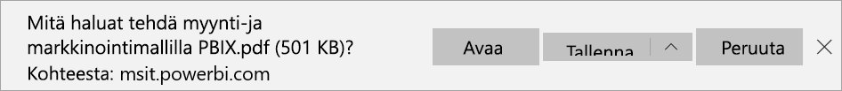

# Raporttien vieminen Power BI:stä PDF-muotoon

[!INCLUDE [power-bi-service-new-look-include](../includes/power-bi-service-new-look-include.md)]

Power BI:llä voit julkaista raportin PDF-muodossa ja luoda helposti Power BI -raporttiisi perustuvan PDF-tiedoston. Kun viet PDF-muotoon, jokaisesta Power BI -raportin sivusta tulee yksittäinen sivu PDF-tiedostossa.

## Power BI -raportin vieminen PDF-muotoon
Valitse Power BI -palvelussa raportti, joka näytetään kankaalla. Voit myös valita raportin **aloitussivulta**, **sovelluksista** tai siirtymisruudun mistä tahansa muusta säilöstä.

1. Valitse valikkopalkista **Vie** > **PDF**.

    

    Näkyviin tulee ponnahdusikkuna, jossa on vaihtoehtoina **Nykyiset arvot** ja **Oletusarvot**. **Nykyiset arvot** vie raportin nykyisessä tilassa, johon sisältyvät ne aktiiviset muutokset, joita olet tehnyt osittajan ja suodattimen arvoihin. Useimmat käyttäjät valitsevat tämän vaihtoehdon. Vaihtoehtoisesti voit valita **Oletusarvot**-vaihtoehdon, joka vie raportin sen alkuperäisessä tilassa (jossa *suunnittelija* on jakanut sen) eikä sisällä mitään alkuperäiseen tilaan tekemiäsi muutoksia.
    
    Ponnahdusikkunassa on myös valintaruutu, jossa voit valita, viedäänkö raportin piilotetut välilehdet. Valitse tämä valintaruutu, jos haluat viedä vain sellaiset raportin välilehdet, joita voit tarkastella selaimessasi. Jos haluat viedä myös kaikki piilotetut välilehdet, voit jättää tämän valintaruudun tyhjäksi. Jos valintaruutu näkyy harmaana, raportissa ei ole piilotettuja välilehtiä. Kun olet tehnyt valintasi, jatka valitsemalla **Vie**.
    
    Oikeassa yläkulmassa näytetään edistymispalkki. Vieminen voi kestää joitakin minuutteja. Voi jatkaa Power BI:ssä työskentelemistä raportin viemisen aikana.

    

    Kun Power BI -palvelu on suorittanut viennin, ilmoituspalkissa näkyy ilmoitus siitä.

2. Tiedostosi on käytettävissä sijainnissa, jossa selain näyttää ladatut tiedostot. Seuraavassa kuvassa se näkyy selainikkunan alareunan lataukset-palkissa.

    

Siinä kaikki. Voit ladata tiedoston ja avata sen millä tahansa PDF-lukuohjelmalla, esimerkiksi Microsoft Edgeen sisältyvällä PDF-lukuohjelmalla.

## Rajoitukset ja huomioitavat asiat
Ota huomioon seuraavat seikat ja rajoitukset, kun käytät **Vie PDF-muotoon** -toimintoa.

* R-visualisointeja ei tällä hetkellä tueta. Nämä visualisoinnit ovat tyhjiä PDF-tiedostossa. Niiden tilalla näytetään virheilmoitus. 
* Sertifioituja mukautettuja visualisointeja tuetaan. Saat lisätietoja sertifioiduista mukautetuista visualisoinneista, mukaan lukien sertifioinnin hakemisesta visualisoinnille, artikkelista [Mukautetun visualisoinnin sertifiointi](../developer/power-bi-custom-visuals-certified.md). Mukautettuja visualisointeja, joita ei ole sertifioitu, ei tueta. Niiden tilalla näytetään virheilmoitus PDF-tiedostossa. 
* Yli 30 raporttisivua sisältäviä raportteja ei tällä hetkellä voi viedä.
* Raportin vieminen PDF-muotoon saattaa kestää muutamia minuutteja. Kestoon vaikuttavat esimerkiksi raportin rakenne ja Power BI -palvelun kulloinenkin kuormitus.
* Jos **Vie PDF-muotoon** -valikkovaihtoehtoa ei ole käytettävissä Power BI -palvelussa, syy on todennäköisesti se, että vuokraajan järjestelmänvalvoja on poistanut toiminnon käytöstä. Saat lisätietoja ottamalla yhteyttä vuokraajan järjestelmänvalvojaan.
* Taustakuvat rajataan kaavion raja-alueen mukaiseksi. Suosittelemme poistamaan taustakuvat ennen PDF-muotoon viemistä.
* PDF-muotoon ei voi julkaista raportteja, jotka ovat vuokraajan Power BI -toimialueen ulkopuolisen käyttäjän omistamia (esimerkiksi organisaation ulkopuolisen henkilön omistama raportti, joka on jaettu kanssasi).
* Jos jaat raporttinäkymän organisaatiosi ulkopuoliselle henkilölle (joka ei ole Power BI -vuokraajasi toimialueella), kyseinen henkilö ei voi viedä jaettuun raporttinäkymään liittyviä raportteja PDF-muotoon. Jos olet esimerkiksi aaron@contoso.com, voit jakaa sisältöä käyttäjän cassie@cohowinery.com kanssa. Käyttäjä cassie@cohowinery.com ei kuitenkaan voi viedä siihen liittyviä raportteja PDF-muotoon.
* Kun PDF-muotoon viedään taustakuvan sisältäviä raportteja, kuva saattaa vääristyä viennissä, jos **Normaali**- tai **Täyttö**-vaihtoehtoa käytetään **Sivun tausta** -asetuksena. Käytä parhaan tuloksen varmistamiseksi **Sovita**-asetusta, jolloin vältetään vietyyn tiedostoon liittyvät ongelmat.
* Power BI -palvelu käyttää PDF-viennin kielenä Power BI:n kieliasetuksen kieltä. Jos haluat tarkistaa kieliasetuksesi tai muuttaa sitä, valitse hammasrataskuvake  > **Asetukset** > **Yleiset** > **Kieli**.
* URL-suodattimia ei oteta tällä hetkellä huomioon, kun valitset viennin kohdalla **Nykyiset arvot**.
* Raporteissa, joiden sivukoko on poikkeava, saattaa esiintyä ongelmia vietäessä. Saat parhaat tulokset vaihtamalla raportissa käyttöön vakiosivukoon.
* Kun viet PDF-tiedostoon, mukautettuja fontteja käyttävien teemojen avulla voit korvata mukautetun fontin oletusfontilla.
* Vaikka pyrimme tarjoamaan johdonmukaisen käyttökokemuksen, emme voi taata, että Power BI -palvelusta viety PDF-tiedosto vastaa aina paikallisesta Power BI Desktop -tiedostosta vietyä PDF-tiedostoa.

## Seuraavat vaiheet
[Raportin tulostaminen](end-user-print.md)
