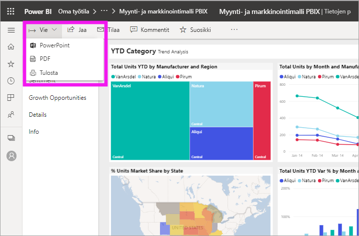
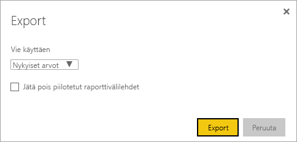
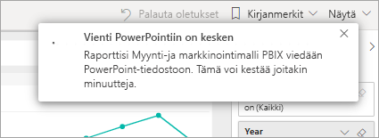
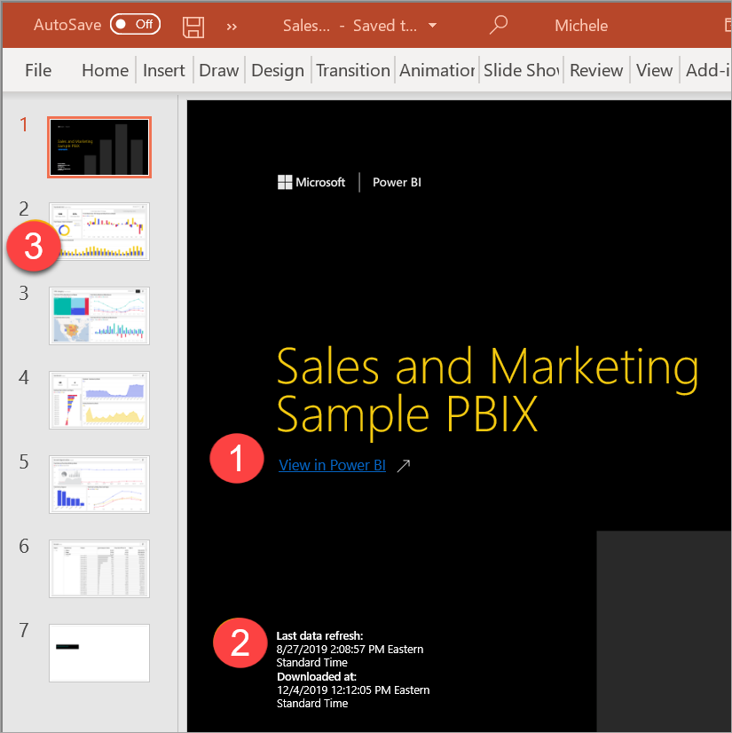

# Raporttien vieminen PowerPointiin

[!INCLUDE[consumer-appliesto-yyny](../includes/consumer-appliesto-yyny.md)]

Voit julkaista Power BI -palvelussa (app.powerbi.com) raportin Microsoft PowerPointiin ja luoda helposti Power BI -raporttiin perustuvan diasarjan. PowerPointiin vietäessä tapahtuu seuraavaa:

* Jokaisesta Power BI -raportin sivusta tulee yksittäinen dia PowerPointissa.
* Power BI -raportin jokainen sivu viedään yksittäisenä suuritarkkuuksisena kuvana PowerPointiin.
* Voit säilyttää raporttiin lisäämäsi suodattimet ja osittajien asetukset.
* PowerPointissa luodaan linkki Power BI -raporttiin.

**Power BI -raportin** vieminen **PowerPointiin** on nopeaa. Seuraa seuraavassa osiossa kuvailtuja vaiheita.

Voit myös kopioida yhden visualisoinnin kerrallaan Power BI -palvelusta ja liittää sen PowerPointiin (tai mihin tahansa muuhun liittämistä tukevaan ohjelmaan). Kopioi visualisointi leikepöydälle valitsemalla **Kopioi kuvana**. Avaa sitten PowerPoint ja liitä visualisointi. Jos haluat lisätietoja, katso [Kopioi visualisoinnit staattisina kuvina](../visuals/power-bi-visualization-copy-paste.md).

## Power BI -raportin vieminen PowerPointiin
Valitse **Power BI** -palvelussa raportti, jonka haluat näyttää pohjalla. Voit myös valita raportin **aloitussivulta**, **sovelluksista** tai siirtymisruudun avulla mistä tahansa muusta säilöstä.

[!INCLUDE [power-bi-service-new-look-include](../includes/power-bi-service-new-look-include.md)]

Kun PowerPointiin vietävä raportti näkyy kankaalla, valitse **Vie** > **PowerPoint** valikkoriviltä.

Näkyviin tulee ponnahdusikkuna, jossa on vaihtoehtoina **Nykyiset arvot** ja **Oletusarvot**. **Nykyiset arvot** vie raportin nykyisessä tilassa, johon sisältyvät ne aktiiviset muutokset, joita olet tehnyt osittajan ja suodattimen arvoihin.  Useimmat käyttäjät valitsevat tämän vaihtoehdon. Jos olet vierittänyt, **Nykyiset arvot** vaihtoehto ei sisällä visualisoinnin vieritystilaa, vaan sen sijaan se vie tietojen ylimmän osan. Vaihtoehtoisesti voit valita **Oletusarvot**-vaihtoehdon, joka vie raportin sen alkuperäisessä tilassa (jossa *suunnittelija* on jakanut sen) eikä sisällä mitään alkuperäiseen tilaan tekemiäsi muutoksia.

 
Ponnahdusikkunassa on myös valintaruutu, jossa voit valita, viedäänkö raportin piilotetut välilehdet. Valitse tämä valintaruutu, jos haluat viedä vain sellaiset raportin välilehdet, joita voit tarkastella selaimessasi. Jos haluat viedä myös kaikki piilotetut välilehdet, jätä tämä valintaruutu tyhjäksi. Jos valintaruutu näkyy harmaana, raportissa ei ole piilotettuja välilehtiä. Esimerkki piilotetusta välilehdestä on työkaluvihjeen välilehti. [Mukautetut työkaluvihjeet](../create-reports/desktop-tooltips.md) luodaan raportin *suunnittelijoiden* toimesta, eivätkä ne näy raporttivälilehtinä Power BI -palvelussa *kuluttajille*. 

Kun olet tehnyt valintasi, jatka valitsemalla **Vie**. Näet Power BI -palvelun selainikkunan oikeassa yläkulmassa ilmoituspalkin, jossa ilmoitetaan raportin viemisestä PowerPointiin. 

Vieminen voi kestää joitakin minuutteja. Kestoon vaikuttavat esimerkiksi raportin rakenne ja Power BI -palvelun kulloinenkin kuormitus. Voi jatkaa Power BI:ssä työskentelemistä raportin viemisen aikana.

Kun Power BI -palvelu on suorittanut viennin, ilmoituspalkissa näkyy ilmoitus siitä. Tiedostosi on käytettävissä sijainnissa, jossa selain näyttää ladatut tiedostot. Seuraavassa kuvassa se näkyy selainikkunan alareunan lataukset-palkissa.

Siinä kaikki. Voit ladata tiedoston, avata sen PowerPointissa ja sitten muokata tai parannella sitä samoin kuin mitä tahansa muuta PowerPoint-esitystä.

## PowerPoint-tiedoston avaaminen
Kun avaat Power BI:ssä viedyn PowerPoint-tiedoston, löydät siitä muutamia hienoja ja hyödyllisiä ominaisuuksia. Tutustu seuraavaan kuvaan ja katso sitten numeroidut elementit, joissa on kuvattu joitain näistä kätevistä ominaisuuksista. PowerPoint-sivut luodaan aina 9:16-standardikoossa riippumatta alkuperäisen Power BI -raportin sivujen koosta tai mittasuhteista.

1. Diapinon ensimmäinen sivu sisältää raportin nimen ja linkin, jonka avulla voit **tarkastella Power BI:ssä** raporttia, johon diat perustuvat.
2. Saat myös joitakin hyödyllisiä tietoja raportista. **Viimeisin tietojen päivitys** ilmaisee päivämäärän ja ajan, joihin viety raportti perustuu. **Ladattu osoitteesta** -kohdassa näkyy päivämäärä ja aika, jolloin Power BI -raportti on viety PowerPoint-tiedostoon. **Ladattu osoitteesta** -ajaksi määritetään tietokoneesi aikavyöhyke viennin ajankohtana.

3. Jokainen raporttisivu on erillinen dia. Ne näkyvät siirtymisruudussa. 
4. Julkaistu raportti hahmonnetaan Power BI -asetusten mukaisella kielellä tai muussa tapauksessa selaimen kieliasetuksen mukaan. Jos haluat tarkistaa kieliasetuksesi tai muuttaa sitä, valitse hammasrataskuvake  > **Asetukset** > **Yleiset** > **Kieli**. Kielialueiden tiedot ovat ohjeartikkelissa [Power BI:n tuetut kielet ja maat tai alueet](../fundamentals/supported-languages-countries-regions.md).

Kun tarkastelet yksittäistä diaa, huomaat kunkin raporttisivun olevan riippumaton kuva. Vieritys PowerPointissa ei ole käytettävissä, koska jokainen dia on staattinen kuva.

Edellä olevien vaiheiden jälkeen voit tehdä PowerPoint-esitykselläsi ja sen suuritarkkuuksisilla kuvilla mitä haluat.

## Huomioon otettavat seikat ja vianmääritys
Ota huomioon seuraavat seikat ja rajoitukset, kun käytät **Vieminen PowerPointiin** -ominaisuutta.
 

* [URL-suodattimia](../collaborate-share/service-url-filters.md) ei oteta tällä hetkellä huomioon, kun valitset viennin kohdalla **Nykyiset arvot**.

* Kun viet PowerPointiin ja raportti käyttää mukautettua fonttia, kyseinen fontti korvataan oletusfontilla.

* Seuraavia visualisointityyppejä ei tueta, eikä niitä viedä PowerPointiin:
   - [Mukautettuja visualisointeja, joita ei ole sertifioitu](../developer/visuals/power-bi-custom-visuals-certified.md), ei tueta. 
   - [ESRI ArcGIS -visualisointia](../visuals/power-bi-visualizations-arcgis.md) ei tueta
   - R- ja Python-visualisointeja ei tueta.
   - Taustakuvat rajataan kaavion raja-alueen mukaiseksi. Suosittelemme poistamaan taustakuvat ennen PowerPointiin viemistä.

* Joitakin raportteja ei voi viedä. Näitä ovat esimerkiksi seuraavat:
    - Raportit, jotka ovat vuokraajan Power BI -toimialueen ulkopuolisen käyttäjän omistamia (esimerkiksi organisaation ulkopuolisen henkilön omistama raportti, joka on jaettu kanssasi).
    - Jos jaat raporttinäkymän organisaatiosi ulkopuoliselle henkilölle (joka ei ole Power BI -vuokraajasi toimialueella), kyseinen henkilö ei voi viedä jaettuun raporttinäkymään liittyviä raportteja PowerPointiin. Jos olet esimerkiksi aaron@contoso.com, voit jakaa sisältöä käyttäjän david@cohowinery.com kanssa. Käyttäjä david@cohowinery.com ei kuitenkaan voi viedä siihen liittyviä raportteja PowerPointiin.
    - Raportit , joissa on yli 30 raporttisivua. Vain ensimmäiset 30 sivua viedään.
    - Raportit, jotka viedään PowerPointin vanhempiin versioihin.

* Jos **Vie PowerPointiin** -valikkovaihtoehtoa ei ole käytettävissä Power BI -palvelussa, syy on todennäköisesti se, että vuokraajan järjestelmänvalvoja on poistanut toiminnon käytöstä. Saat lisätietoja ottamalla yhteyttä vuokraajan järjestelmänvalvojaan.
* Power BI -palvelu käyttää PowerPoint-viennin kielenä Power BI:n kieliasetusta. Jos haluat tarkistaa kieliasetuksesi tai muuttaa sitä, valitse hammasrataskuvake  > **Asetukset** > **Yleiset** > **Kieli**.

## Seuraavat vaiheet
[Kopioi visualisoinnit staattisina kuvina](../visuals/power-bi-visualization-copy-paste.md)    
[Raportin tulostaminen](end-user-print.md)
