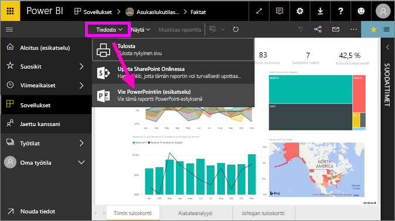

# Raporttien vieminen Power BI:stä PowerPointiin
Voit julkaista Power BI:llä raportin **Microsoft PowerPointiin** ja luoda helposti Power BI -raporttiin perustuvan diasarjan. **PowerPointiin vietäessä** tapahtuu seuraavaa:

* Jokaisesta Power BI -raportin sivusta tulee yksittäinen dia PowerPointissa
* Power BI -raportin jokainen sivu viedään yksittäisenä, korkean resoluution kuvana PowerPointiin <!-- * The filters and slicers settings that you added to the report are preserved. -->
* PowerPointissa luodaan linkki Power BI -raporttiin 

**Power BI -raportin** vieminen **PowerPointiin** on nopeaa. Seuraa seuraavassa osiossa kuvailtuja vaiheita.

## Power BI -raportin vieminen PowerPointiin
Valitse Power BI -palvelussa raportti, joka näytetään kankaalla. Voit myös valita raportin **aloitussivulta**, **sovelluksista** tai vasemman siirtymisruudun mistä tahansa osasta.

Kun PowerPointiin vietävä raportti näkyy kankaalla, valitse **Tiedosto > Vie PowerPointiin** Power BI -palvelun valikkoriviltä.

   
Näkyviin tulee ponnahdusikkuna, jossa on vaihtoehtoina **Nykyinen näkymä** ja **Oletusnäkymä**.  **Nykyinen näkymä** vie raportin nykyisessä tilassa, johon sisältyvät ne aktiiviset muutokset, joita olet tehnyt osittajan ja suodattimen arvoihin.  Useimmat käyttäjät valitsevat tämän vaihtoehdon.  Vaihtoehtoisesti voit valita **Oletusnäkymä**-vaihtoehdon, joka vie raportin sen alkuperäisessä tilassa (jossa laatija on jakanut sen) eikä sisällä mitään alkuperäiseen tilaan tekemiäsi muutoksia.
    
Ponnahdusikkunassa on myös valintaruutu, jossa voit valita, viedäänkö raportin piilotetut välilehdet.  Valitse tämä valintaruutu, jos haluat viedä vain sellaiset raportin välilehdet, joita voit tarkastella selaimessasi.  Jos haluat viedä myös kaikki piilotetut välilehdet, voit jättää tämän valintaruudun valitsematta.  Jos valintaruutu näkyy harmaana, raportissa ei ole piilotettuja välilehtiä.  Kun olet tehnyt valintasi, jatka napsauttamalla **Vie**.

Näet Power BI -palvelun selainikkunan oikeassa yläkulmassa ilmoituspalkin, jossa ilmoitetaan raportin viemisestä PowerPointiin. Raportin vieminen voi kestää muutamia minuutteja, minkä aikana voit jatkaa Power BI:ssä työskentelemistä.

Kun vieminen on valmis, ilmoituspalkissa kerrotaan, että Power BI -palvelu on suorittanut viennin.

Tiedostosi on käytettävissä sijainnissa, jossa selain näyttää ladatut tiedostot. Seuraavassa kuvassa se näkyy selainikkunan alareunan lataukset-palkissa.

Siinä kaikki. Voit ladata tiedoston, avata sen PowerPointissa ja sitten muokata tai parannella sitä aivan kuin mitä tahansa muuta PowerPoint-esitystä.

## Viedyn PowerPoint-tiedoston tarkastelu
Kun avaat Power BI:ssä viedyn PowerPoint-tiedoston, löydät siitä muutamia hienoja ja hyödyllisiä ominaisuuksia. Tutustu seuraavaan kuvaan ja katso sitten alla olevat numeroidut elementit, joissa on kuvattu joitain näistä ominaisuuksista.

1. Diapinon ensimmäinen sivu sisältää raportin nimen ja linkin, jonka avulla voit **tarkastella Power BI:ssä** raporttia, johon diat perustuvat.
2. Lisäksi saat käyttöösi joitakin hyödyllisiä raporttia koskevia tietoja, kuten viedyn raportin pohjana olleiden *tietojen viimeisimmän päivitysajankohdan* sekä *latauksen ajankohdan* eli sen päivämäärän ja kellonajan, jolloin Power BI -raportti vietiin PowerPoint-tiedostoon.
3. Jokainen raporttisivu on erillinen dia. Ne näkyvät vasemmassa siirtymisruudussa. 
4. Julkaistu raportti hahmonnetaan Power BI -asetusten mukaisella kielellä tai muussa tapauksessa selaimen kieliasetuksen mukaan. Jos haluat nähdä kieliasetuksesi tai muuttaa sitä, valitse hammasrataskuvake   **> Asetukset > Yleiset > Kieli**. Kielialueiden tiedot ovat ohjeartikkelissa [Power BI:n tuetut kielet ja maat tai alueet](../supported-languages-countries-regions.md).
5. PowerPoint-esitys sisältää kansilehden, jossa viennin kellonaika näytetään oikealla aikavyöhykkeen ajassa.

Kun valitset yksittäisen dian, huomaat kunkin raporttisivun olevan riippumaton kuva.

>[!NOTE]
> Yhden kuvan luominen jokaista raportin sivua kohden on uusi ominaisuus. Aiemmin jokaisesta visualisoinnista luotiin erillinen kuva. Tätä ominaisuutta ei enää käytetä. 
 

Edellä olevien vaiheiden jälkeen voit tehdä PowerPoint-esitykselläsi ja sen korkearesoluutioisilla kuvilla mitä ikinä haluat.

## Rajoitukset
Huomioi seuraavat seikat ja rajoitukset, kun käytät **Vieminen PowerPointiin** -ominaisuutta.

* **R-visualisointeja** ei tällä hetkellä tueta. Tällaiset visualisoinnit viedään tyhjinä kuvina PowerPointiin virhesanoman kanssa, jossa ilmoitetaan, ettei visualisointia tueta.
* **Sertifioituja** **mukautettuja visualisointeja** tuetaan. Saat lisätietoja sertifioiduista mukautetuista visualisoinneista, mukaan lukien sertifioinnin hakemisesta visualisoinnille, artikkelista [Mukautetun visualisoinnin sertifiointi](../power-bi-custom-visuals-certified.md). Ei-sertifioidut mukautetut visualisoinnit viedään tyhjinä kuvina PowerPointiin virhesanoman kanssa, jossa ilmoitetaan, ettei visualisointia tueta.
* Yli 30 raporttisivua sisältäviä raportteja ei tällä hetkellä voi viedä.
* Raportin vieminen PowerPointiin saattaa kestää muutamia minuutteja. Kestoon vaikuttavat mm. raportin rakenne ja Power BI -palvelun senhetkinen kuormitus.
* Jos **Vie PowerPointiin** -valikkovaihtoehtoa ei ole käytettävissä Power BI -palvelussa, syy on todennäköisesti se, että vuokraajan järjestelmänvalvoja on poistanut toiminnon käytöstä. Saat lisätietoja ottamalla yhteyttä vuokraajan järjestelmänvalvojaan.
* Taustakuvat rajataan kaavion raja-alueen mukaiseksi. Suosittelemme poistamaan taustakuvat ennen PowerPointiin viemistä.
* PowerPoint-sivut luodaan aina 9:16-standardikoossa riippumatta alkuperäisen Power BI -raportin sivujen koosta tai mittasuhteista.
* PowerPointiin ei voi julkaista raportteja, jotka ovat vuokraajan Power BI -toimialueen ulkopuolisen käyttäjän omistamia (esim. organisaation ulkopuolisen henkilön omistama raportti, joka on jaettu kanssasi).
* Jos jaat raporttinäkymän organisaatiosi ulkopuoliselle henkilölle (joka ei ole Power BI -vuokraajasi toimialueella), kyseinen henkilö ei voi viedä jaettuun raporttinäkymään liittyviä raportteja PowerPointiin. Jos olet esimerkiksi aaron@contoso.com, voit jakaa sisältöä käyttäjän david@cohowinery.com kanssa. david@cohowinery.com ei kuitenkaan voi viedä siihen liittyviä raportteja PowerPointiin.
* Kuten edellä mainittiin, kukin raporttisivu viedään PowerPoint-tiedostoon yhtenä kuvana.
* Power BI -palvelu käyttää PowerPoint-viennin kielenä Power BI:n kieliasetusta. Jos haluat nähdä kieliasetuksesi tai muuttaa sitä, valitse hammasrataskuvake   **> Asetukset > Yleiset > Kieli**.
* Viedyn PowerPoint-tiedoston kansidian **Latausajankohta**-kellonajaksi määritetään tietokoneesi aikavyöhyke vientihetkellä.

## Seuraavat vaiheet
[Raportin tulostaminen](end-user-print.md)
