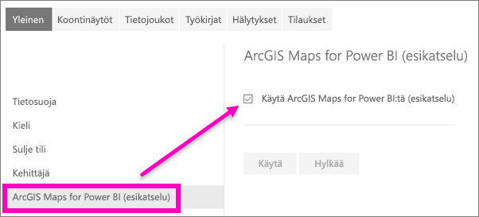

# Power BI -palvelun esikatselutoimintojen käyttäminen
## Mitä ovat *esikatseluominaisuudet*?
Kun teemme parannuksia Power B -palveluun, julkaisemme joitakin uusia toimintoja *esikatseluominaisuuksina*. Esikatseluominaisuuksia voidaan ottaa käyttöön ja poistaa käytöstä niitä kokeiltaessa.

## Etsi esikatseluominaisuudet ja ota ne käyttöön (tai poista käytöstä)
1. Avaa Asetukset-valikko valitsemalla Power BI-näytön oikeasta yläkulmasta hammaspyöräkuvake ja valitse **Asetukset**.
   
   .
2. Valitse **Yleiset** välilehti. Jos esikatseluominaisuudet ovat olemassa, näet joko **Esikatseluominaisuudet**-valinnan tai esikatseluominaisuudet vasemmanpuoleisessa luettelossa.  Tässä esimerkissä on käytössä ArcGIS Maps -esikatseluettelo. 
   
   
3. Valitse **Päällä**-valintanappi tai merkitse valintaruutu, jotta voit kokeilla uutta. Valitse **Käytä**.
4. Poista esikatselutoiminnot käytöstä edellä kuvattujen vaiheiden 1-3 mukaan ja valitse vaiheessa 3 **Pois käytöstä**, tai poista valintamerkki ja valitse **Käytä**.

Onko sinulla kysyttävää tai haluatko antaa palautetta? [Käy Power BI -yhteisön keskustelupalstalla](https://community.powerbi.com/t5/Navigation-Preview-Forum/bd-p/NavigationPreview).

