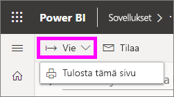
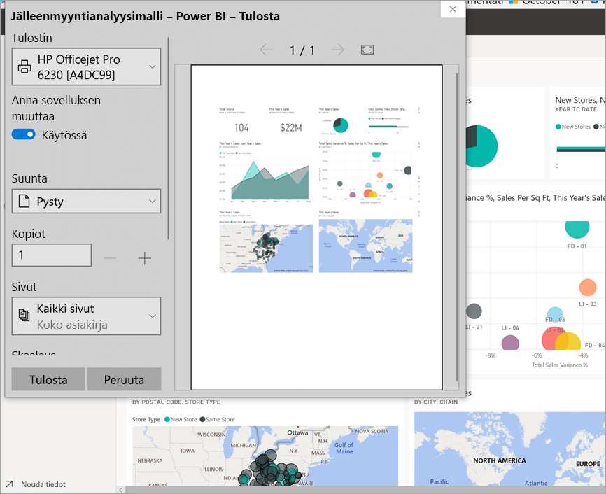
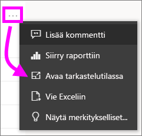
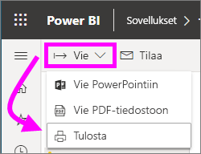

# Power BI -palvelusta tulostaminen

[!INCLUDE[consumer-appliesto-yynn](../includes/consumer-appliesto-yynn.md)]
## Mitä voit tulostaa
[!INCLUDE [power-bi-service-new-look-include](../includes/power-bi-service-new-look-include.md)]

Power BI -palvelusta voit tulostaa koko koontinäytön, koontinäytön yksittäisen ruudun, raporttisivun tai raportin visualisoinnin. Jos raportissasi on useampi kuin yksi sivu, sinun on tulostettava jokainen sivu erikseen. 

## Huomioitavaa tulostamisessa

Useimmat Power BI -koontinäytöt ja -raportit luodaan raportin *suunnittelijoiden* avulla, jolloin niitä voidaan käyttää verkossa ja ne näyttävät upeilta, kun niitä tarkastellaan useissa eri laitteissa. Kun tulostat raportin, selaimesi valvoo, miltä sisältö näyttää paperilla. 

Voit säätää tulostetta selainasetusten avulla, mutta et ehkä siltikään saa haluamaasi tulosta. Harkitse [viemistä PDF-muotoon](end-user-pdf.md) ensin ja sitten PDF-tiedoston tulostamista. 

## Selaimen tulostusasetusten säätäminen
Kun tulostat Power BI:stä, selaimesi avaa tulostusikkunan. Kunkin selaimen tulostusikkuna eroaa muista. Niissä kaikissa on kuitenkin samanlaisia asetuksia, joiden avulla voit muokata tulosteen ulkoasua. 

Seuraavassa on muutamia pikavinkkejä, joiden avulla voit muotoilla tulostetta.

   > 
1. Jos koontinäytön, raportin tai visualisoinnin leveys on suurempi kuin korkeus, harkitse **vaakasuuntaisen** asettelun käyttämistä. 

   

2. Jos haluat enemmän sisältöä tulostetulle sivulle, voit säätää esimerkiksi reunuksia ja skaalausta. 

    

Testaa selaimesi asetuksia, kunnes ulkoasu on halutunlainen. Joiden selainten asetuksen mahdollistavat jopa taustagrafiikan tulostamisen. 

## Koontinäytön tulostaminen
1. Avaa koontinäyttö, jonka haluat tulostaa.
2. Valitse vasemmasta yläkulmasta Vie ja valitse sitten **Tulosta tämä sivu**.
   
    

3. Selaimen tulostusikkuna avautuu. Valitse asetukset. Esimerkiksi jos koontinäytön leveys on suurempi kuin korkeus, voit halutessasi muuttaa asettelun **vaakasuuntaiseksi**. Valitse **Tulosta**.
   
    

## Koontinäytön yksittäisen ruudun tulostaminen
1. Avaa koontinäyttö [koko näytön tilaan](end-user-focus.md) valitsemalla yläreunan valikkopalkista koko näytön kuvake .

3. [Avaa ruutu tarkastelutilassa](end-user-focus.md) kuljettamalla osoitinta sen kohdalla kunnes **Enemmän vaihtoehtoja** (...) tulee näkyviin ja valitsemalla **Avaa tarkastelutilassa** tai kohdistuskuvake .
   
    

4. Vie hiiren osoitin ruudun kohdalle, jolloin näkyviin tulee asetusvalikko.
   
    

4. Valitse Tulosta-kuvake .     

5. Selaimen tulostusikkuna avautuu. Valitse asetukset. Jos esimerkiksi ruutu ei mahdu sivulle, haluat ehkä muuttaa skaalauksen 75 %:iin. Valitse **Tulosta**.

     

> [!TIP]
> Jos olet noudattanut kaikkia näitä vaiheita eikä ruutusi edelleenkään näy haluamallasi tavalla, kokeile seuraavaa.
> 1. Avaa tulostusikkuna ja tee tulostusasetuksiin muutoksia, joiden uskot parantavan tulostetta. Voit esimerkiksi muuttaa ulkoasua, reunuksia ja skaalausta. 
> 2. Valitse kuitenkin tulostamisen sijaan **Peruuta**. 
> 3. Käy läpi vaiheet 1–5 uudelleen. Ruutu mukautetaan uusiin tulostusikkunan asetuksiin ja on valmiina tulostamiseen.

## Raporttisivun tulostaminen
Raportteja voi tulostaa yhden sivun kerrallaan.

1. Avaa raportti ja valitse **Vie** > **Tulosta** kun haluat tulostaa nykyisen raporttisivun.
   
    
2. Selaimen tulostusikkuna avautuu.

3. Noudata tulostusvaiheita yllä olevassa **Koontinäytön tulostaminen** -kohdassa.
   

## Raportin yksittäisen visualisoinnin tulostaminen
1. [Avaa visualisointi tarkastelutilassa](end-user-focus.md) viemällä hiiren osoitin ruudun kohdalle ja valitsemalla kohdistuskuvake  sen oikeasta alakulmasta.

2. Valitse vasemmasta yläkulmasta **Vie** > **Tulosta**, kun haluat tulostaa visualisoinnin.

    

3. Noudata tulostusvaiheita yllä olevassa **Koontinäytön tulostaminen** -kohdassa.

## Huomioon otettavat seikat ja vianmääritys

* Kysymys: En voi tulostaa raportin kaikkia sivuja kerralla.    
* Vastaus: Totta. Raporttisivut voi tulostaa vain yksi sivu kerrallaan.
* Kysymys: En voi tulostaa PDF-muotoon.    
* Vastaus: Asetus tulee näkyviin vain silloin, jos olet ennalta määrittänyt selaimeen PDF-ohjaimen.    
* Kysymys: Se mitä näen, kun valitsen **Tulosta**, ei vastaa tässä esitettyjä kuvia.    
* Vastaus: Tulostusnäkymät vaihtelevat selaimen ja ohjelmistoversion mukaan.
* Kysymys: Tuloste ei skaalautunut oikein.  Koontinäyttö ei mahdu arkille. Muut skaalautumiseen ja paperin suuntaan liittyvät kysymykset.    
* Vastaus: Emme voi taata, että tulostettu kopio on täsmälleen samanlainen kuin Power BI ‑palvelussa näkyvä. Power BI ei voi hallita skaalausta, reunuksia, visuaalisia yksityiskohtia, paperin suuntausta ja kokoa. Kokeile mukauttaa selaimesi tulostusasetuksia. Voit mukauttaa esimerkiksi tulostussuuntaa (pysty- tai vaakasuunta), reunuksen kokoa ja skaalausta. Jos siitä ei ole apua, tutustu selaimesi ohjeisiin.      
* Kysymys: Kun tulostan koko näytön tilasta, en näe Tulosta-asetusta, kun viet hiiren osoittimen visualisoinnin päälle.   
* Vastaus: Palaa koontinäyttöön tai raporttiin oletusnäkymässä ja avaa visualisointi uudelleen tarkastelutilassa ja sitten koko näytön tilassa. 

## Seuraavat vaiheet
[Koontinäyttöjen ja raporttien jakaminen työtovereiden ja muiden kanssa](../collaborate-share/service-share-dashboards.md)

Onko sinulla kysyttävää? [Kokeile Power BI -yhteisöä](https://community.powerbi.com/)
