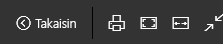

# Power BI -palvelusta tulostaminen
Power BI -palvelusta voit tulostaa koko koontinäytön, yksittäisen koontinäytön ruudun, raporttisivun tai raportin visualisoidun kohteen. Raportteja voi tulostaa vain yhden sivun kerrallaan – et voi tulostaa koko raportin kerralla.

> [!NOTE]
> Tulostus on käytettävissä vain Power BI -palvelussa, ei Power BI Desktopissa.
> 
> 

Katso videolta, miten Amanda tulostaa koontinäytön ja raportin. Kokeile sitten itse noudattamalla videon alapuolella olevia vaiheittaisia ohjeita.

<iframe width="560" height="315" src="https://www.youtube.com/embed/jtlLGRKBvXY" frameborder="0" allowfullscreen></iframe>

## Koontinäytön tulostaminen
1. Avaa koontinäyttö, jonka haluat tulostaa.
2. Valitse oikeasta yläkulmasta kolme pistettä (...) ja valitse **Tulosta koontinäyttö**.
   
    
3. Selaimen tulostusikkuna avautuu. Valitse haluamasi asetukset ja tulostuksen kohde ja valitse sitten **Tulosta**.
   
   > [!NOTE]
   > Tulostuksen valintaikkunan ulkoasu vaihtelee sen mukaan, mitä selainta käytät.
   > 
   
    

## Koontinäytön yksittäisen ruudun tulostaminen
1. [Avaa ruutu kohdistustilassa](end-user-focus.md) valitsemalla kolme pistettä ja valitsemalla sitten kohdistuskuvake .
   
    
2. Avaa ruutu [koko näytön tilaan](end-user-focus.md) valitsemalla yläreunan siirtymispalkista koko näytön kuvake  .
3. Vie hiiren osoitin ruudun kohdalle, jolloin näkyviin tulee asetusvalikko.
   
    
4. Valitse tulostuskuvake .     
   
   > [!NOTE]
   > Tulostuksen valintaikkunan ulkoasu vaihtelee sen mukaan, mitä selainta käytät.
   > 
   > 

## Raporttisivun tulostaminen
Raportteja voi tulostaa yhden sivun kerrallaan.

1. Avaa raportti joko luku- tai muokkausnäkymässä.
2. Tulosta senhetkinen raporttisivu valitsemalla **Tiedosto** > **Tulosta**.
   
    
3. Selaimen tulostusikkuna avautuu.
   
   > [!NOTE]
   > Tulostuksen valintaikkunan ulkoasu vaihtelee sen mukaan, mitä selainta käytät.
   > 
   > 

## Raportin yksittäisen visualisoinnin tulostaminen
1. [Avaa visualisointi kohdistustilassa](end-user-focus.md) viemällä hiiren osoitin ruudun kohdalle ja valitsemalla kohdistuskuvake  sen oikeasta alakulmasta.
2. Tee edellisen kohdan, *Raporttisivun tulostaminen*, vaiheet 2 ja 3.

## Huomioon otettavat seikat ja vianmääritys
* K: En löydä **Tulosta**-painiketta.    
* V: Jos käytät Power BI Desktopia, se ei tue tulostusta.  Tulostus toimii vain Power BI -palvelussa.
* K: En voi tulostaa raportin kaikkia sivuja kerralla.    
* V: Totta. Raporttisivut voi tulostaa vain yksi sivu kerrallaan.
* K: En voi tulostaa PDF-muotoon.    
* V: Asetus tulee näkyviin vain silloin, jos olet ennalta määrittänyt selaimeen PDF-ohjaimen.    
* K: Se mitä näen, kun valitsen **Tulosta**, ei vastaa tässä esitettyjä kuvia.    
* V: Tulostusnäkymät vaihtelevat selaimen ja ohjelmistoversion mukaan.
* K: Tuloste ei skaalautunut oikein.  Koontinäyttö ei mahdu arkille. Muut skaalautumiseen ja paperin suuntaan liittyvät kysymykset.    
* V: Emme voi taata, että tulostettu kopio on täsmälleen samanlainen kuin miten se näkyy Power BI ‑palvelussa. Power BI ei voi hallita skaalausta, reunuksia, visuaalisia yksityiskohtia, paperin suuntausta ja kokoa. Tämänkaltaisissa ongelmissa tutustu selaimesi ohjeisiin.      

## Seuraavat vaiheet
[Koontinäyttöjen ja raporttien jakaminen työtovereiden ja muiden kanssa](../service-share-dashboards.md)

Onko sinulla kysyttävää? [Kokeile Power BI -yhteisöä](http://community.powerbi.com/)

