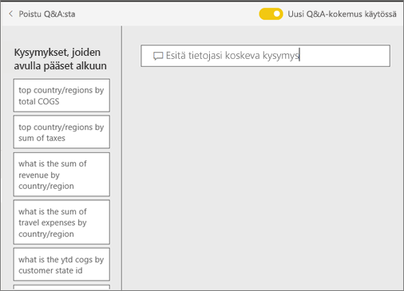

# Q&A Power BI -**kuluttajille**
## Mikä on Q&A?
Joskus nopein tapa saada vastauksia tiedoista on kysyä kysymyksiä luonnollisella kielellä. Esimerkiksi ”mikä oli viime vuoden kokonaismyynti”.

Q&A-toiminnolla voit tutkia tietojasi intuitiivisesti luonnollisella kielellä sekä saada vastauksia eri kaavioiden muodossa. Q&A eroaa hakukoneesta – Q&A antaa vain tuloksia Power BI:n tiedoista.

**Power BI:n Q&A** on saatavilla Pro- ja Premium-käyttöoikeuksille.  [Q&A-toimintoa Power BI:n mobiilisovelluksissa](mobile/mobile-apps-ios-qna.md) ja [Q&A-toimintoa Power BI Embeddedin kanssa](../developer/qanda.md) käsitellään erillisissä artikkeleissa. Tällä hetkellä **Power BI:n Q&A** tukee vain vastaamista englanniksi luonnollisella kielellä esitettyihin kysymyksiin, tosin käytettävissä on espanjalle esikatselu, jonka Power BI:n järjestelmänvalvoja voi ottaa käyttöön.

Kysymyksen esittäminen on vasta alkua.  Toivottavasti tämä artikkeli auttaa sinua tietojen tutkimisessa ja kysymysten keksimisessä. Kysymyksillä voit löytää uusia tietoja, keskittyä yksityiskohtiin ja tarkastella kokonaisuutta laajemmasta näkökulmasta. Tulet yllättymään iloisesti löytämistäsi merkityksellisistä tiedoista ja muusta.

Kokemus on todella interaktiivinen … ja nopea! Muistissa oleva tallennustila tarjoaa vastauksen lähes välittömästi.

## Missä voin käyttää Q&A:ta?
Q&A löytyy Power BI -palvelun koontinäytöistä ja Power BI -mobiilisovelluksen koontinäytön alareunasta. Jos suunnittelija ei ole antanut sinulle muokkausoikeuksia, pystyt ainoastaan tutkimaan tietoja Q&A-toiminnon avulla, mutta et voi tallentaa sen avulla luotuja visualisointeja.

## Q&A-toiminnon käyttäminen koontinäytössä Power BI -palvelussa
Power BI -palvelussa (app.powerbi.com) koontinäyttö sisältää ruutuja, jotka on kiinnitetty yhdestä tai useammasta tietojoukosta. Voit siten esittää kysymyksiä kaikista näiden tietojoukkojen sisältämistä tiedoista. Voit näyttää koontinäytön luomiseen käytetyt raportit ja tietojoukot valitsemalla **Näytä aiheeseen liittyvät** valikkoriviltä.

## Miten pääsen alkuun?
Tutustu ensin sisältöön. Tutustu koontinäytön ja raportin visualisointeihin. Selvitä, mitkä tietotyypit ja -alueet ovat käytettävissäsi. 

Esimerkki:

* Jos visualisointien akselien otsikot ja arvot ovat ”myynti”, ”tili”, ”kuukausi” ja ”mahdollisuudet”, voit esittää esimerkiksi kaikessa rauhassa seuraavanlaisia kysymyksiä: ”Millä *tilillä* on suurin *mahdollisuus* tai näytä *myynti* kuukauden mukaan palkkikaaviona”.

* Jos sinulla on sivuston suorituskykytietoja Google Analyticsissä, voit kysyä Q&A:lta verkkosivulla käytetystä ajasta, yksilöllisten vierailujen määrästä ja käyttäjien sitoutumisesta. Jos haluat demografisia tietoja, voit esittää kysymyksiä esimerkiksi iästä ja kotitalouden tuloista sijainnin mukaan.

Kun olet tutustunut tietoihin, suuntaa takaisin koontinäyttöön ja aseta kohdistin kysymysruutuun. Q&A-näyttö avautuu.

 

Jo ennen kuin alat kirjoittaa, Q&A näyttää uuden näytön ehdotuksilla, jotka voivat olla avuksi kysymyksen muodostamisessa. Näet lauseet ja kysymykset, jotka sisältävät pohjana olevien tietojoukkojen taulukoiden nimet, ja saatat jopa nähdä tietojoukon omistajan luomat *suositellut** kysymykset.

Voit valita näistä minkä tahansa niiden lisäämiseksi kysymysruutuun ja sitten tarkentaa niitä tietyn vastauksen löytämiseksi. 

Q&A käyttää myös kehotteita, automaattista täydennystä ja visuaalisia vihjeitä, kun tarvitset apua kysymysten muodostamisessa. 

 

### Mitä visualisointia Q&A käyttää?
Q&A valitsee parhaan visualisoinnin näytettyjen tietojen perusteella. Joskus pohjana oleva tietojoukko on määritelty tiettynä tyyppinä tai luokkana, jolloin Q&A tietää missä muodossa tiedot kannattaa näyttää. Esimerkiksi jos tiedot on määritetty päivämäärä-tyypiksi, ne näytetään todennäköisesti viivakaaviona. Kaupungiksi luokitellut tiedot näytetään todennäköisesti karttana.

Voit myös kertoa Q&A:lle, mitä visualisointia haluat käyttää, lisäämällä sen kysymykseen. Muista kuitenkin, että Q&A ei ehkä voi aina näyttää tietoja pyytämästäsi visualisointityypistä. Q&A näyttää sinulle luettelon sopivista visualisointityypeistä.

## Huomioon otettavat seikat ja vianmääritys
**Kysymys**: En näe Q&A:ta tässä raporttinäkymässä.    
**Vastaus 1**: Jos kysymysruutua ei näy, tarkista ensin asetuksesi. Valitse hammasrataskuvake Power BI -työkalurivin oikeasta yläkulmasta.   

Valitse sitten **Asetukset** > **Koontinäytöt**. Varmista, että **Näytä Q&A-hakuruutu tässä koontinäytössä** -vaihtoehdon vieressä on valintamerkki.    
  

**Vastaus 2**: Raporttinäkymän *suunnittelija* tai järjestelmänvalvoja on saattanut poistaa Q&A:n käytöstä. Kysy, voitko ottaa sen takaisin käyttöön.   

**Kysymys**: En saa haluttuja tuloksia, kun kirjoitan kysymyksen.    
**Vastaus**: Ota yhteys raporttinäkymän *suunnittelijaan*. Suunnittelija voi auttaa parantamaan Q&A:n tuloksia monin eri tavoin. Suunnittelija voi esimerkiksi muuttaa tietojoukon sarakkeessa käytettäviä termejä helpommin ymmärrettäviksi (`CustFN` --> `CustomerFirstName`). Koska suunnittelija tuntee tietojoukon todella hyvin, hän voi myös keksiä sopivia kysymyksiä ja lisätä ne Q&A-pohjaan.

## Seuraavat vaiheet
[Q&A-vinkkejä Power BI:n käyttäjille](end-user-q-and-a.md)
