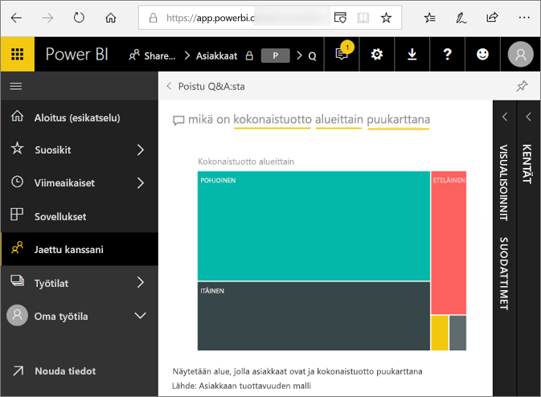
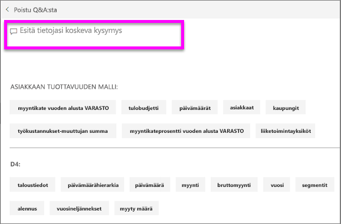
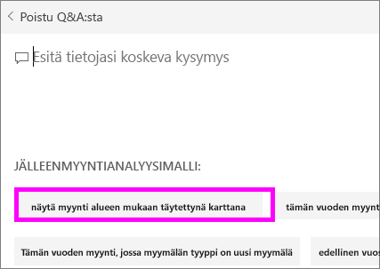

# Q&A Power BI -**kuluttajille**
## Mikä on Q&A?
Joskus nopein tapa saada vastauksia tiedoista on kysyä kysymyksiä luonnollisella kielellä. Esimerkiksi ”mikä oli viime vuoden kokonaismyynti”.  
Q&A-toiminnolla voit tutkia tietojasi intuitiivisesti luonnollisella kielellä sekä saada vastauksia eri kaavioiden muodossa. Q&A eroaa hakukoneesta – Q&A antaa vain tuloksia Power BI:n tiedoista.

**Power BI:n Q&A** tukee vastaamista vain englanniksi kysyttyihin, luonnollisella kielellä esitettyihin kyselyihin. Espanjan kielelle löytyy esikatseluversio, jonka Power BI -järjestelmänvalvojasi voi ottaa käyttöön.

**Power BI:n Q&A** on saatavilla Pro- ja Premium-käyttöoikeuksille. 
>

Kysymyksen esittäminen on vasta alkua.  Toivottavasti tämä artikkeli auttaa sinua tietojen tutkimisessa ja kysymysten keksimisessä. Kysymyksillä voit löytää uusia tietoja, keskittyä yksityiskohtiin ja tarkastella kokonaisuutta laajemmasta näkökulmasta. Tulet yllättymään iloisesti löytämistäsi merkityksellisistä tiedoista ja muusta.

Kokemus on todella interaktiivinen … ja nopea! Muistissa oleva tallennustila tarjoaa vastauksen lähes välittömästi.

## Missä voin käyttää Q&A:ta?
Q&A löytyy Power BI -palvelun koontinäytöistä, Power BI -mobiilisovelluksen koontinäytön alareunasta ja Power BI Embeddedin visualisointien yläpuolelta. Jos suunnittelija ei ole antanut sinulle muokkausoikeuksia, pystyt ainoastaan tutkimaan tietoja Q&A-toiminnon avulla, mutta et voi tallentaa sen avulla luotuja visualisointeja.

## Miten Q&A tietää vastaukset kysymyksiin?
Q&A etsii vastauksia kaikista koontinäyttöön liittyvistä tietojoukoista. Jos tietojoukolla on ruutu koontinäytössä, Q&A käyttää kyseistä tietojoukkoa vastauksien etsimiseen. 

## Miten pääsen alkuun?
Tutustu ensin sisältöön. Tutustu koontinäytön ja raportin visualisointeihin. Selvitä, mitkä tietotyypit ja -alueet ovat käytettävissäsi. Suuntaa sitten takaisin koontinäyttöön ja aseta kohdistin kysymysruutuun. Q&A-näyttö avautuu.

 

* Jos visualisointien akselien otsikot ja arvot ovat ”myynti”, ”tili”, ”kuukausi” ja ”mahdollisuudet”, voit esittää esimerkiksi seuraavanlaisia kysymyksiä: ”Millä *tilillä* on suurin *mahdollisuus* tai näytä *myynti* kuukauden mukaan palkkikaaviona”.

* Jos sinulla on sivuston suorituskykytietoja Google Analyticsissä, voit kysyä Q&A:lta verkkosivulla käytetystä ajasta, yksilöllisten vierailujen määrästä ja käyttäjien sitoutumisesta. Jos haluat demografisia tietoja, voit esittää kysymyksiä esimerkiksi iästä ja kotitalouden tuloista sijainnin mukaan.

Näytön alareunasta löytyy muita hyödyllisiä kohteita. Q&A näyttää jokaisen tietojoukon kohdalla avainsanoja ja joskus myös mallikysymyksiä tai kysymysehdotuksia. Kun valitset jonkin näistä, se lisätään kysymysruutuun. 

Q&A käyttää myös kehotteita, automaattista täydennystä ja visuaalisia vihjeitä, kun tarvitset apua kysymysten muodostamisessa. 

 

### Mitä visualisointia Q&A käyttää?
Q&A valitsee parhaan visualisoinnin näytettyjen tietojen perusteella. Joskus pohjana oleva tietojoukko on määritelty tiettynä tyyppinä tai luokkana, jolloin Q&A tietää missä muodossa tiedot kannattaa näyttää. Esimerkiksi jos tiedot on määritetty päivämäärä-tyypiksi, ne näytetään todennäköisesti viivakaaviona. Kaupungiksi luokitellut tiedot näytetään todennäköisesti karttana.

Voit myös kertoa Q&A:lle mistä visualisoinnista haluat hakea lisäämällä sen kysymykseen. Muista kuitenkin, että Q&A ei ehkä voi näyttää tietoja pyytämästäsi visualisointityypistä. Q&A näyttää sinulle luettelon sopivista visualisointityypeistä.

## Huomioon otettavat seikat ja vianmääritys
**Kysymys**: En näe Q&A:ta tässä raporttinäkymässä.    
**Vastaus 1**: Jos kysymysruutua ei näy, tarkista ensin asetuksesi. Valitse hammasrataskuvake Power BI -työkalurivin oikeasta yläkulmasta.   

Valitse sitten **Asetukset** > **Koontinäytöt**. Varmista, että **Näytä Q&A-hakuruutu tässä koontinäytössä** -vaihtoehdon vieressä on valintamerkki.
  

**Vastaus 2**: Raporttinäkymän *suunnittelija* tai järjestelmänvalvoja on saattanut poistaa Q&A:n käytöstä. Kysy, voitko ottaa sen takaisin käyttöön.   

**Kysymys**: En saa haluttuja tuloksia, kun kirjoitan kysymyksen.    
**Vastaus**: Ota yhteys raporttinäkymän *suunnittelijaan*. Suunnittelija voi auttaa parantamaan Q&A:n tuloksia monin eri tavoin. Suunnittelija voi esimerkiksi muuttaa tietojoukon sarakkeessa käytettäviä termejä helpommin ymmärrettäviksi (`CustFN` --> `CustomerFirstName`). Koska suunnittelija tuntee tietojoukon todella hyvin, hän voi myös keksiä sopivia kysymyksiä ja lisätä ne Q&A-pohjaan.

## Seuraavat vaiheet

