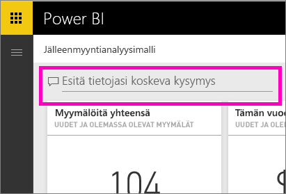
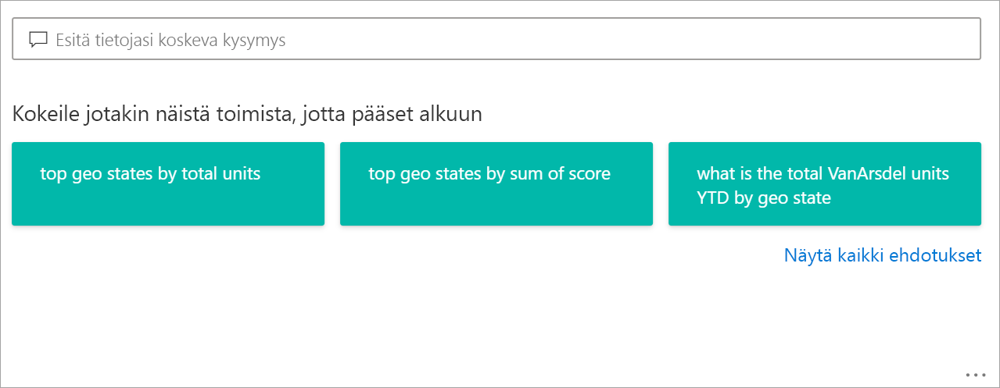
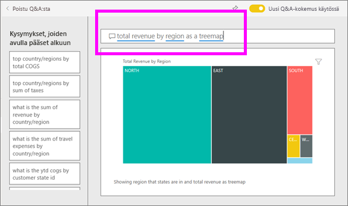
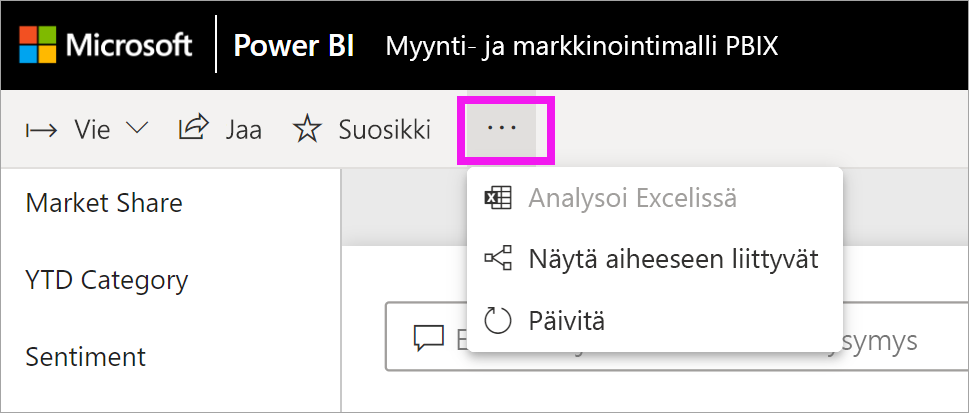
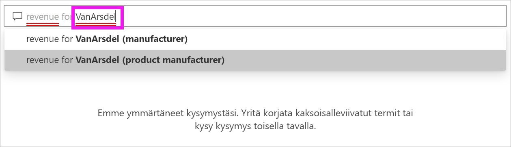
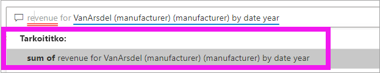
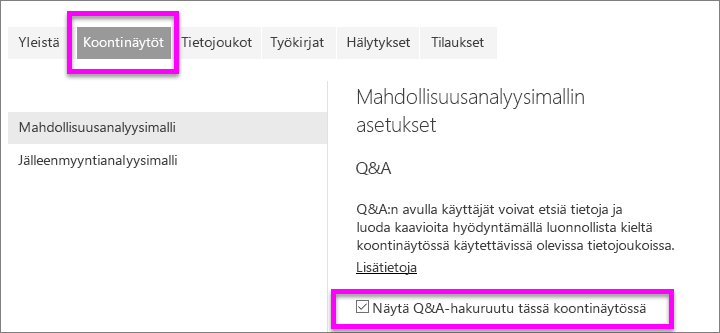
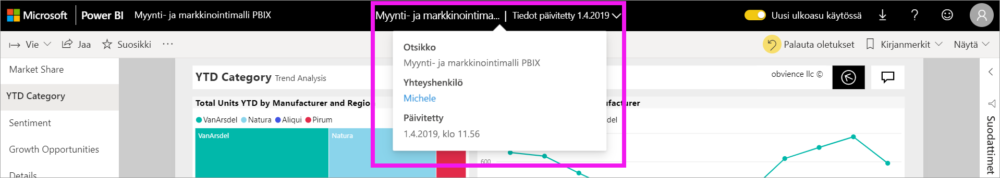

# Q&A Power BI -kuluttajille

[!INCLUDE[consumer-appliesto-yyny](../includes/consumer-appliesto-yyny.md)]

[!INCLUDE [power-bi-service-new-look-include](../includes/power-bi-service-new-look-include.md)]

## Mikä on Q&A?
Joskus nopein tapa saada vastauksia tiedoista on kysyä kysymyksiä luonnollisella kielellä. Esimerkiksi ”mikä oli viime vuoden kokonaismyynti”.

Q&A-toiminnolla voit tutkia tietojasi intuitiivisesti luonnollisella kielellä sekä saada vastauksia eri kaavioiden muodossa. Q&A eroaa hakukoneesta – Q&A antaa vain tuloksia Power BI:n tiedoista.

## Mitä visualisointia Q&A käyttää?
Q&A valitsee parhaan visualisoinnin näytettyjen tietojen perusteella. Joskus pohjana oleva tietojoukko on määritelty tiettynä tyyppinä tai luokkana, jolloin Q&A tietää missä muodossa tiedot kannattaa näyttää. Esimerkiksi jos tiedot on määritetty päivämäärä-tyypiksi, ne näytetään todennäköisesti viivakaaviona. Kaupungiksi luokitellut tiedot näytetään todennäköisesti karttana.

Voit myös kertoa Q&A:lle, mitä visualisointia haluat käyttää, lisäämällä sen kysymykseen. Muista kuitenkin, että Q&A ei ehkä voi aina näyttää tietoja pyytämästäsi visualisointityypistä. Q&A näyttää sinulle luettelon sopivista visualisointityypeistä.

## Missä voin käyttää Q&A:ta?
Q&A löytyy Power BI -palvelun koontinäytöistä ja Power BI -mobiilisovelluksen koontinäytön alareunasta. Jos suunnittelija ei ole antanut sinulle muokkausoikeuksia, pystyt ainoastaan tutkimaan tietoja Q&A-toiminnon avulla, mutta et voi tallentaa sen avulla luotuja visualisointeja.

Q&A näkyy myös raporteissa, jos raportin *suunnittelija* on lisännyt [Q&A-visualisoinnin](../visuals/power-bi-visualization-q-and-a.md).   

## Q&A koontinäytöissä

**Power BI:n Q&A** on saatavilla Pro- ja Premium-käyttöoikeuksille.  [Q&A-toimintoa Power BI:n mobiilisovelluksissa](mobile/mobile-apps-ios-qna.md) ja [Q&A-toimintoa Power BI Embeddedin kanssa](../developer/embedded/qanda.md) käsitellään erillisissä artikkeleissa. Tällä hetkellä **Power BI:n Q&A** tukee vain vastaamista englanniksi luonnollisella kielellä esitettyihin kysymyksiin, tosin käytettävissä on espanjalle esikatselu, jonka Power BI:n järjestelmänvalvoja voi ottaa käyttöön.

Kysymyksen esittäminen on vasta alkua.  Toivottavasti tämä artikkeli auttaa sinua tietojen tutkimisessa ja kysymysten keksimisessä. Kysymyksillä voit löytää uusia tietoja, keskittyä yksityiskohtiin ja tarkastella kokonaisuutta laajemmasta näkökulmasta. Tulet yllättymään iloisesti löytämistäsi merkityksellisistä tiedoista ja muusta.

Kokemus on todella interaktiivinen … ja nopea! Muistissa oleva tallennustila tarjoaa vastauksen lähes välittömästi.

## Q&A-toiminnon käyttäminen koontinäytössä Power BI -palvelussa
Power BI -palvelussa (app.powerbi.com) koontinäyttö sisältää ruutuja, jotka on kiinnitetty yhdestä tai useammasta tietojoukosta. Voit siten esittää kysymyksiä kaikista näiden tietojoukkojen sisältämistä tiedoista. Voit näyttää koontinäytön luomiseen käytetyt raportit ja tietojoukot valitsemalla **Näytä aiheeseen liittyvät** avattavasta **Lisää toimintoja** -valikosta.

## Miten pääsen alkuun?
Tutustu ensin sisältöön. Tutustu koontinäytön ja raportin visualisointeihin. Selvitä, mitkä tietotyypit ja -alueet ovat käytettävissäsi. 

Esimerkki:

* Jos visualisointien akselien otsikot ja arvot ovat ”myynti”, ”tili”, ”kuukausi” ja ”mahdollisuudet”, voit esittää esimerkiksi kaikessa rauhassa seuraavanlaisia kysymyksiä: ”Millä *tilillä* on suurin *mahdollisuus* tai näytä *myynti* kuukauden mukaan palkkikaaviona”.

* Jos sinulla on sivuston suorituskykytietoja Google Analyticsissä, voit kysyä Q&A:lta verkkosivulla käytetystä ajasta, yksilöllisten vierailujen määrästä ja käyttäjien sitoutumisesta. Jos haluat demografisia tietoja, voit esittää kysymyksiä esimerkiksi iästä ja kotitalouden tuloista sijainnin mukaan.

Kun olet tutustunut tietoihin, suuntaa takaisin koontinäyttöön ja aseta kohdistin kysymysruutuun. Q&A-näyttö avautuu.

 

Jo ennen kuin alat kirjoittaa, Q&A näyttää uuden näytön ehdotuksilla, jotka voivat olla avuksi kysymyksen muodostamisessa. Näet lauseet ja kysymykset, jotka sisältävät pohjana olevien tietojoukkojen taulukoiden nimet, ja saatat jopa nähdä tietojoukon omistajan luomat *suositellut* kysymykset.

Voit valita näistä minkä tahansa niiden lisäämiseksi kysymysruutuun ja sitten tarkentaa niitä tietyn vastauksen löytämiseksi. 

 

Power BI käyttää myös ominaisuuksia, kuten kehotteita, automaattista täydennystä ja visuaalisia vihjeitä, kun tarvitset apua kysymysten muodostamisessa. Power BI tarjoaa ohjeita koontinäyttöjen ja raporttien Q&A:ssa sekä Q&A-visualisoinneissa. Käsittelemme näitä ominaisuuksia yksityiskohtaisesti alla olevassa osiossa [Q&A-visualisoinnin luominen kirjoittamalla luonnollisen kielen kysely](#create-a-qa-visual-by-typing-a-natural-language-query)

<!--  -->

## Q&A-visualisointi Power BI -raporteissa

Q&A-visualisoinnin avulla voit esittää kysymyksiä käyttämällä luonnollista kieltä ja saada vastauksia visualisoinnin muodossa. Q&A-visualisointi käyttäytyy kuin mikä tahansa muu raportin visualisointi, joten se voidaan ristiinsuodattaa/ristiinkorostaa ja se tukee myös kirjanmerkkejä ja kommentteja. 

Q&A-visualisoinnin tunnistaa sen yläosassa olevasta kysymysruudusta. Siihen voit kirjoittaa kysymyksiä luonnollisella kielellä. Q&A-visualisointia voidaan käyttää toistuvasti tietoihisi liittyvien kysymysten esittämiseen. Kun poistut raportista, Q&A-visualisointi palautuu oletusarvoonsa. 

## Q&A:n käyttäminen 
Jos haluat käyttää Q&A:ta koontinäytössä tai Q&A-visualisointia raportissa, valitse jokin ehdotetuista kysymyksistä tai kirjoita oma luonnollisen kielen kysymys. 

### Luo Q&A-visualisointi käyttämällä ehdotettua kysymystä

Olemme tässä valinneet **suosituimmat maantieteelliset alueet yksiköiden kokonaismäärän mukaan**. Power BI tekee parhaansa valitakseen käytettävän visualisointityypin. Tässä tapauksessa kyseessä on kartta.

Voit kuitenkin määrittää Power BI:n käyttämään tiettyä visualisointityyppiä lisäämällä sen luonnollisen kielen kyselyyn. Muista, että kaikki visualisointityypit eivät toimi tai ole järkeviä tietojesi kanssa. Nämä tiedot eivät esimerkiksi tuota mielekästä pistekaaviota. Ne toimivat kuitenkin täytettynä karttana.

### Q&A-visualisoinnin luominen kirjoittamalla luonnollisen kielen kysely

Jos et ole varma, minkä tyyppisiä kysymyksiä haluat esittää tai mitä termejä haluat käyttää, laajenna **Näytä kaikki ehdotukset** tai selaa muita raportin visualisointeja. Näin voit tutustua tietojoukon ehtoihin ja sisältöön.

1. Kirjoita kysymyksesi Q&A-kenttään käyttäen luonnollista kieltä. Power BI:n automaattinen täydennys, visuaaliset elementit ja palaute auttavat kysymyksen kirjoittamisessa.

    **Automaattinen täydennys** – kun kirjoitat kysymyksesi, Power BI:n Q&A näyttää oleellisia ja tilannekohtaisia tuloksia, joiden avulla voit nopeasti parantaa tuottavuuttasi käyttäen luonnollista kieltä. Saat kirjoittaessasi välittömästi palautetta ja tuloksia. Kokemus on samankaltainen kuin hakukoneeseen kirjoittaminen.

    Tässä esimerkissä haluamme käyttää viimeistä ehdotusta. 

    

    **Punainen/sininen alleviivaus** – alleviivattujen sanojen avulla Power BI Q&A näyttää, mitä sanoja Power BI tunnisti tai ei tunnistanut. Yhtenäinen sininen alleviivaus osoittaa, että Power BI tunnisti sanan. Alla olevassa esimerkissä näkyy, että Q&A on tunnistanut sanan **myymälä**.

    

    Valitse sinisellä alleviivattu sana ehdotettuja kysymyksiä sisältävän avattavan luettelon näyttämiseksi. 

    

    Usein Q&A:han kirjoittamasi sana merkitään punaisella alleviivauksella. Punaisella alleviivauksella voidaan ilmaista kahta eri ongelmatilannetta. Ensimmäinen ongelmatyyppi on alhainen luotettavuus. Jos kirjoitat epämääräisen tai moniselitteisen sanan, kenttä alleviivataan punaisella. Esimerkki tästä on sana Sijainti. Useat kentät voivat sisältää sanan Sijainti, joten järjestelmä kehottaa sinua valitsemaan tarkoittamasi kentän lisäämällä punaisen alleviivauksen. Tässä esimerkissä Power BI kehottaa valitsemaan kentän, jota haluat käyttää kohteessa VanArsdel.
    
    
    
    Toinen esimerkki alhaisesta luotettavuudesta on, jos kirjoitat sanan "alue", mutta sarake, jota se vastaa, on nimeltään "piirikunta". Power BI:n Q&A tunnistaa sanoja, jotka tarkoittavat samaa asiaa, Bing- ja Office-integraatioiden ansiosta. Q&A alleviivaa sanan punaisella, jotta tiedät, että se ei ole suora vastaavuus.

    

    Toinen ongelmatyyppi on, kun Q&A ei tunnista sanaa lainkaan. Esimerkiksi jos käytät sanaa "maantiede", vaikka sitä ei löydy mistään tiedoista. Sana löytyy englanninkielisestä sanastosta, mutta Q&A merkitsee sen punaisella alleviivauksella. Power BI Q&A ei voi luoda visualisointia ja ehdottaa, että pyydät raportin suunnittelijaa lisäämään termin.

    

    **Ehdotukset** – kun kirjoitat kysymystä lisää, Power BI ilmoittaa, ettei se ymmärrä kysymystä, ja yrittää auttaa. Alla olevassa esimerkissä Power BI kysyy "Tarkoititko..." ja ehdottaa eri tapaa esittää kysymys käyttämällä tietojoukkosi terminologiaa. 

    

    Kun olet valinnut Power BI:n korjauksen, tulokset näytetään viivakaaviona. 

    

    Voit kuitenkin muuttaa viivankaavion toiseksi visualisointityypiksi.  

    

## Huomioon otettavat seikat ja vianmääritys

**Kysymys**: En näe Q&A:ta tässä raporttinäkymässä.    
**Vastaus 1**: Jos kysymysruutua ei näy, tarkista ensin asetuksesi. Valitse hammasrataskuvake Power BI -työkalurivin oikeasta yläkulmasta.   

Valitse sitten **Asetukset** > **Koontinäytöt**. Varmista, että **Näytä Q&A-hakuruutu tässä koontinäytössä** -vaihtoehdon vieressä on valintamerkki.    
  

**Vastaus 2**: Joskus et voi käyttää asetuksia. Jos koontinäytön *suunnittelija* tai järjestelmänvalvojasi on poistanut Q&A:n käytöstä, tiedustele häneltä, voiko sen ottaa uudelleen käyttöön.   

**Kysymys**: En saa haluttuja tuloksia, kun kirjoitan kysymyksen.    
**Vastaus**: Valitse, miten haluat ottaa yhteyttä raportin tai koontinäytön omistajaan. Voit tehdä tämän suoraan Q&A-koontinäytön sivulta tai Q&A-visualisoinnista. Voit myös etsiä omistajan Power BI:n otsikosta.  Suunnittelija voi auttaa parantamaan Q&A:n tuloksia monin eri tavoin. Suunnittelija voi esimerkiksi muuttaa tietojoukon sarakkeessa käytettäviä termejä helpommin ymmärrettäviksi (`CustFN` --> `CustomerFirstName`). Koska suunnittelija tuntee tietojoukon todella hyvin, hän voi myös keksiä sopivia kysymyksiä ja lisätä ne Q&A:n ehdotettuihin kysymyksiin.

## Tietosuoja

Microsoft voi käyttää kysymyksiäsi Power BI:n parantamiseen. Katso lisätietoja[Microsoftin tietosuojatiedoista](https://go.microsoft.com/fwlink/?LinkId=521839).

## Seuraavat vaiheet
Lisätietoja siitä, miten raportin *suunnittelija* luo ja hallinnoi Q&A-visualisointeja, on artikkelissa [Q&A-visualisointityyppi](../visuals/power-bi-visualization-q-and-a.md).
