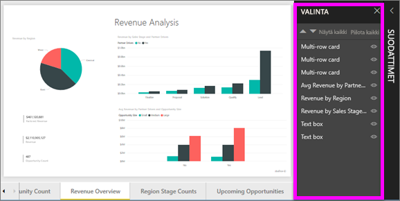

# Pikaopas: Tutustu *kuluttajille suunnattuihin* Power BI -ominaisuuksiin
Tässä pikaoppaassa opit käyttämään Power BI:tä löytääksesi tietopohjaisia merkityksellisiä liiketoimintatietoja. Tämä artikkeli ei ole tarkoitettu syvälliseksi ohjeeksi, vaan se tarjoaa lyhyen katsauksen **kuluttajille** suunnattuihin Power BI -toimintoihin.

Jos et ole rekisteröitynyt Power BI:hin, [rekisteröidy ilmaiseen kokeiluversioon](https://app.powerbi.com/signupredirect?pbi_source=web) ennen aloittamista.

## Mikä Power BI on? 
Power BI on kokoelma ohjelmistopalveluja, sovelluksia ja yhdistimiä, jotka yhdessä muuntavat toisiinsa liittymättömistä lähteistä peräisin olevan tiedon johdonmukaisiksi, visuaalisesti vaikuttaviksi ja vuorovaikutteisiksi näkemyksiksi. Power BI:n avulla voit helposti muodostaa yhteyden tietolähteisiin, jotka voivat olla lähes mitä tahansa yksinkertaisesta Excel-laskentataulukosta kokoelmaan eri tietolähteistä peräisin olevia tietoja. Voit löytää ja visualisoida tärkeät tiedot sekä jakaa tulokset kaikille tarvittaville tahoille. 

## Lukunäkymä
Lukunäkymä on saatavilla Power BI:ssä raportin *kuluttajille*. Kun työtoverisi jakaa raportin, koontinäytön tai sovelluksen kanssasi, voit tutkia ja käsitellä raporttia lukunäkymässä. 

Avaa Power BI -palvelu selaimessa tai mobiililaitteessa. Sinä ja työkaverisi käsittelette samoja luotettuja sovelluksia, koontinäyttöjä ja raportteja, jotka päivittyvät automaattisesti, joten käytössänne on aina uusin sisältö.   

Sisältö ei ole staattinen, joten voit syventyä siihen ja etsiä trendejä, merkityksellisiä tietoja ja muita liiketoimintatietoja. Voit osittaa ja käsitellä sisältöä ja jopa esittää kysymyksiä omin sanoin. Voit myös ottaa rennosti ja antaa tietojesi löytää sinulle kiinnostavia merkityksellisiä tietoja, lähettää sinulle ilmoituksia tietojen muuttuessa ja lähettää sähköpostitse raportteja määrittämäsi aikataulun mukaisesti. Kaikki tietosi milloin tahansa ja millä tahansa laitteella, pilvipalvelussa tai paikallisesti. 

Perehdymme näihin ja muihin ominaisuuksiin myöhemmin.

## Power BI -sisältö
Sisältö-termillä tarkoitetaan Power BI:ssä raportteja, koontinäyttöjä ja sovelluksia. Nämä ovat rakennelohkoja, joita käytät tietojesi tutkimiseen ja liiketoimintapäätösten tekemiseen. 

> [!NOTE]
> Koontinäyttöjä, raportteja ja sovelluksia voi tarkastella ja jakaa myös mobiililaitteissa.

###  Sovellukset

*Sovellus* on Power BI:n sisältötyyppi, joka kokoaa toisiinsa liittyvät koontinäytöt ja raportit yhteen paikkaan. Sovelluksessa voi olla yksi tai useampia koontinäyttöjä ja yksi tai useampia raportteja, jotka on koottu yhteen. Power BI:n *suunnittelijat* luovat sovellukset ja jakavat ne sinun kaltaisillesi *kuluttajille*. 

Yksi tapa tarkastella sovelluksiasi on valita **Sovellukset** siirtymispalkista ja valita avattava sovellus.

Jos haluat lisätietoja sovellusten tarkastelemisesta, lue artikkeli [Power BI -sovellukset](end-user-apps.md)

### Raportit

Power BI -raportti on usean perspektiivin tietojoukkonäkymä, jonka visualisoinnit edustavat eri havaintoja ja merkityksellisiä tietoja tietojoukosta. Raportilla voi olla yksittäinen visualisointi tai sivuja, jotka ovat täynnä visualisointeja. Power BI:n *suunnittelijat* luovat raportit ja jakavat raportit sinun kaltaisillesi *kuluttajille*.

Jos haluat tietoja raporttien tarkastelemisesta, lue artikkeli [Power BI -raportit](end-user-reports.md)

### Koontinäytöt

Power BI -koontinäyttö on yksi sivu, jota kutsutaan usein pohjaksi ja jossa käytetään visualisointeja tarinan kertomista varten. Koska se on rajoitettu vain yhteen sivuun, hyvin suunniteltu koontinäyttö sisältää vain tarinan tärkeimmät elementit.

Koontinäytössä näkyviä visualisointeja kutsutaan ruuduiksi, ja raporttien *suunnittelijat* kiinnittävät ne koontinäyttöön. Valitsemalla ruudun pääset useimmiten sille raporttisivulle, jossa visualisointi on luotu. 

Jos haluat tietoja koontinäyttöjen tarkastelemisesta, lue artikkeli [Power BI -koontinäytöt](end-user-dashboards.md)
 
## Vuorovaikuta Power BI -palvelussa

### Tee yhteistyötä työtovereiden kanssa
Ohita sähköposti. Lisää henkilökohtainen kommentti tai aloita keskustelu koontinäytöstä työtovereidesi kanssa suoraan koontinäytössä. Kommentti-ominaisuus on vain yksi tapa, jolla voit tehdä yhteistyötä muiden kanssa. 

Lisätietoja [kommentoinnista](end-user-comment.md)

### Rentoudu ja anna Power BI:n työskennellä puolestasi
Kaksi tapaa, joilla Power BI -palvelu tekee työtä puolestasi, ovat tilaukset ja hälytykset. 

#### Koontinäytön (tai raportin) tilaaminen
Sinun ei tarvitse avata Power BI:tä koontinäytön seuraamiseksi.  Voit sen sijaan tehdä tilauksen, niin Power BI lähettää sinulle sähköpostilla koontinäytön tilannevedoksen haluamanasi ajankohtana. 

.

 Lisätietoja [Power BI -tilauksista](end-user-subscribe.md)

#### Hälytysten vastaanotto tietojen saavuttaessa kynnysarvon
Tietosi ovat reaaliaikaisia, ja visualisoinnit päivittyvät automaattisesti niiden mukaan. Jos haluat saada ilmoituksen, kun tiedot ylittävät tai alittavat asettamasi kynnysarvon, käytä tietohälytyksiä. Hälytykset toimivat mittareissa, suorituskykyilmaisimissa ja korteissa.    

Power BI lähettää sinulle sähköpostiviestin, kun arvo ylittää tai alittaa asettamasi rajan.  

Lisätietoja [Power BI -hälytyksistä](end-user-alerts.md)

### Käytä Q&A-toimintoa esittääksesi kysymyksiä luonnollisella kielellä
Joskus nopein tapa saada vastauksia tiedoista on esittää kysymyksiä luonnollisella kielellä. Q&A-kysymysruutu on käytettävissä koontinäytön yläreunassa. Esimerkiksi ”näytä suuri mahdollisuuksien määrä myyntivaiheen mukaan suppilona”. 

Lisätietoja [Power BI Q&A:sta](end-user-q-and-a.md)

### Näytä tietoja visualisoinnissa
Visualisoinnit koostuvat arvopisteistä, ja pitämällä hiiriosoitinta arvopisteen kohdalla voit tarkastella sen tietoja.

### Koontinäytön lisääminen suosikkeihin
Kun lisäät sisällön *suosikkeihin*, voit käyttää sitä siirtymispalkista. Siirtymispalkki on näkyvissä lähes kaikissa Power BI:n alueissa. Suosikkeja ovat yleensä koontinäytöt, raporttisivut ja sovellukset, joita käytät useimmin.

Valitse Power BI -palvelun oikeassa yläkulmassa **Suosikki** tai, jos se ei ole näkyvissä, valitse **Lisää vaihtoehtoja** (...) ja valitse avattavasta valikosta **Suosikki**. 
   

Tutustu muihin avattavassa valikossa käytettävissä oleviin toimintoihin.  Emme käsittele kaikkia näitä tässä artikkelissa, mutta käsittelemme niitä muissa artikkeleissa.  Lisätietoja saat Power BI:n sisällysluettelon tai **haku**kentän avulla. 

Lisätietoja [suosikeista ja esitellyistä kohteista](end-user-favorite.md)

### Muuta näytön dimensioita
Raportteja tarkastellaan useissa eri laitteissa, joissa on erikokoisia näyttöjä ja erilaisia kuvasuhteita.  Oletusarvon mukainen hahmontaminen ei välttämättä toimi oikein laitteessasi.  

Jos haluat muuttaa säätöjä, valitse valikkorivin oikeassa yläkulmassa **Näytä** ja valitse jokin näyttövaihtoehdoista. 

### Katso, miten sivun kaikki visualisoinnit ovat yhteydessä toisiinsa
Ristiinsuodata ja ristiinkorosta raporttisivun toisiinsa liittyviä visualisointeja. Yhden raporttisivun visualisoinnit ovat kaikki yhdistetty toisiinsa.  Tämä tarkoittaa sitä, että jos valitset yhden tai useamman arvon yhdessä visualisoinnissa, muut samaa arvoa käyttävät visualisoinnit muuttuvat valintasi perusteella.

> 

Lisätietoja [visualisonnin vuorovaikutuksista](end-user-interactions.md)

<!-- ###  Open the **Selection** pane
Easily navigate between the visualizations on the report page. 

1. Select **View > Selection pane** to open the Selection pane. Toggle **Selection pane** to On.

    

2. The Selection pane opens on your report canvas. Select a visual from the list to make it active.

     -->

### Lähennä yksittäisissä visualisoinneissa
Osoita visualisointia ja napsauta **Tarkastelutila**-kuvaketta. Kun tarkastelet visualisointia tarkastelutilassa, se laajentaa koko raportin pohjan täyttämiseksi alla kuvatulla tavalla.

<!-- To display that same visualization without the distraction of menubars, filter pane, and other chrome -- select the **Full Screen** icon from the top menubar    .

 -->

Lisätietoja [kohdistustilasta ja koko näytön tilasta](end-user-focus.md)

### Visualisoinnin lajitteleminen
Raporttisivun visualisoinnit voidaan lajitella ja muutokset tallentaa. 

Aktivoi visualisointi pitämällä hiiriosoitinta sen kohdalla ja valitse **Lisää vaihtoehtoja** (...), jolloin lajitteluvaihtoehdot tulevat näkyviin.

 

Lisätietoja [visualisointien lajittelusta](end-user-search-sort.md)

### Näytä visualisoinnin lähdetiedot
Power BI:n visualisointi rakentuu pohjana olevien tietojoukkojen tiedoista. Jos olet kiinnostunut taustatoiminnoista, Power BI:n avulla voit *tarkastella* visualisoinnin luomiseen käytettyjä tietoja. Kun valitset **Näytä tiedot**, Power BI näyttää tiedot visualisoinnin alla (tai vieressä).

Kun visualisointi on aktiivisena, valitse **Lisää vaihtoehtoja** (...) ja valitse **Näytä tiedot**.
   
   

### Tietojen vieminen Exceliin
Sen lisäksi, että voit näyttää visualisoinnin luomiseen käytettävät tiedot, voit myös viedä kyseiset tiedot ja tarkastella niitä Microsoft Excelissä. Kun viet Exceliin, luot erillisen laskentataulukkotiedoston, joka ei ole osa Power BI:tä. Excel-tiedostoon tekemäsi muutokset eivät vaikuta Power BI:ssä oleviin tietoihin. Jos haluat tarkastella tietoja lähemmin tai käyttää niitä toisessa sovelluksessa tai muuhun tarkoitukseen, Power BI tarjoaa sinulle tämän joustavuuden.

<!-- Exporting isn’t limited to individual visuals; you can export entire reports to PowerPoint or PDF to share with your colleagues.

 -->

Tämä on vain lyhyt yleiskuvaus siitä, mitä *kuluttajat* voivat tehdä Power BI -palvelussa.  

## Resurssien tyhjentäminen
- Jos olet yhdistänyt sovelluksen, avaa Sovellukset-sisällysluettelo valitsemalla vasemmasta siirtymispalkista **Sovellukset**. Pidä osoitinta poistettavan sovelluksen päällä ja valitse roskakorikuvake.

- Jos toit tai yhdistit Power BI -näyteraportin, avaa vasemmasta siirtymispalkista **Oma työtila**. Käytä ylhäällä olevia välilehtiä ja etsi koontinäyttö, raportti ja tietojoukko, ja valitse sitten roskakorikuvake kunkin kohdalla.

## Seuraavat vaiheet
[Power BI kuluttajille](end-user-consumer.md)

